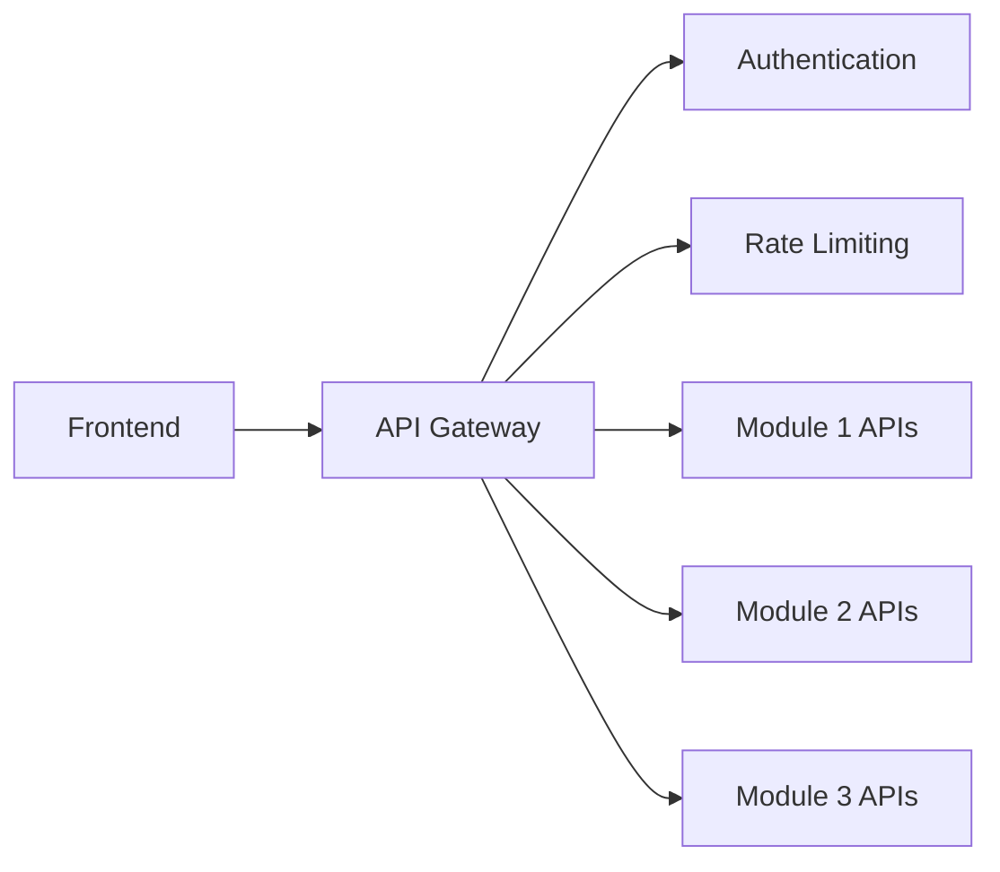

# PeerMesh Architecture Integration for Knowledge Graph Lab

**Date**: September 7, 2025 17:30  
**Tool**: Claude Code  
**Purpose**: Document PeerMesh architectural patterns applicable to KGL modular design

---

## Executive Summary

The PeerMesh documentation reveals sophisticated architectural patterns for modular system design and API abstraction that directly inform the Knowledge Graph Lab's approach to demonstrating modular architecture. These patterns provide a foundation for creating truly composable, interoperable modules.

---

## Key PeerMesh Architectural Concepts

### 1. **Four-Layer Architecture Pattern**

```
┌─────────────────────────────────────────────────────────┐
│                DISTRIBUTION LAYER                       │
│        (Runtime Flavors & Curated Bundles)             │
├─────────────────────────────────────────────────────────┤
│                CONFIGURATION LAYER                      │
│           (User Control & Preferences)                  │
├─────────────────────────────────────────────────────────┤
│                COMPONENT LAYER                          │
│        (Modules, Plugins, Widgets)                     │
├─────────────────────────────────────────────────────────┤
│              ARCHITECTURAL FOUNDATION                   │
│       (Distributed Networking & Data Sovereignty)      │
└─────────────────────────────────────────────────────────┘
```

**KGL Application**: Our 4 intern modules represent the **Component Layer**, with the shared infrastructure as the **Architectural Foundation**.

### 2. **Three-Tier Component System**

#### **MODULES** (Headless Engines)
- **Purpose**: Core business logic and data processing
- **Characteristics**: No user interface, expose APIs, handle data
- **Example**: Payment processing engine, user authentication system

#### **PLUGINS** (Complete Features)
- **Purpose**: Full user-facing features with interfaces and workflows  
- **Characteristics**: Has user interface, uses Modules, hosts Widgets
- **Example**: Social feed, creator dashboard, marketplace

#### **WIDGETS** (UI Components)
- **Purpose**: Small, user-placeable interface elements
- **Characteristics**: Embeddable UI pieces, configurable in slots
- **Example**: Subscribe button, status display, mini-calendar

**KGL Application**: 
- **Module 1** (Ingestion) = PeerMesh **MODULE** (headless data processing)
- **Module 2** (Knowledge Graph) = PeerMesh **MODULE** (headless AI/data engine)
- **Module 3** (Reasoning) = PeerMesh **MODULE** (headless content synthesis)
- **Module 4** (Frontend) = PeerMesh **PLUGIN** (complete user interface feature)

---

## API Abstraction Layer Patterns

### **Capability Family Organization** 
*From Lightning Network API Analysis*

**Pattern**: Group related functionality into families with consistent interfaces:
```yaml
/payment/*        - All payment processing operations
/communication/*  - Real-time events and messaging  
/identity/*       - Authentication and authorization
/content/*        - UI rendering and customization
/system/*         - Provider management and health
```

**KGL Application**: Organize KGL APIs by capability families:
```yaml
/ingestion/*      - Data collection and normalization
/knowledge/*      - Entity management and graph operations
/reasoning/*      - Content synthesis and intelligence  
/publishing/*     - Multi-channel content distribution
/system/*         - Module health and configuration
```

### **Provider Abstraction Strategy**

**Pattern**: Support multiple implementations behind unified APIs:
```yaml
provider_config:
  name: "lnd|cln|eclair"  # Multiple Lightning implementations
  api_type: "grpc|jsonrpc|rest"
  authentication: "macaroon|rune|basic_auth"
```

**KGL Application**: Enable multiple AI and data providers:
```yaml
provider_config:
  ai_provider: "openai|anthropic|local_ollama"
  vector_db: "qdrant|chroma|pinecone"
  scraper: "playwright|selenium|requests"
```

### **Performance Targets & Service Level Objectives**

**Pattern**: Define specific performance requirements for each endpoint:
```yaml
POST /payment/process
  performance_target: "< 2 seconds (95% of payments)"
  
POST /payment/invoice
  performance_target: "< 50ms invoice creation"
```

**KGL Application**: Set realistic performance targets for each module:
```yaml
POST /ingestion/process
  performance_target: "< 5 seconds per URL"
  
GET /knowledge/entities
  performance_target: "< 200ms for queries"
  
POST /reasoning/digest
  performance_target: "< 10 seconds generation"
```

---

## Configuration Layer Implementation for KGL

### **User Control Without Code Changes**

**PeerMesh Principle**: Users control their experience through dashboards without coding knowledge.

**KGL Implementation**: Create configuration interface for interns to:
- Switch between AI providers (OpenAI ↔ Local Ollama ↔ Anthropic)
- Enable/disable different data sources
- Configure content generation templates
- Adjust research topic priorities

### **Real-time Feature Activation**

**Pattern**: Features activate/deactivate instantly based on user preferences.

**KGL Application**: 
- Modules can be enabled/disabled without system restart
- AI features fallback gracefully when providers unavailable
- Data sources can be added/removed dynamically

---

## Modular Roadmap Architecture 

### **Small Module Definition Strategy**

**Insight**: PeerMesh defines "small modules" within larger components for granular progress tracking.

**KGL Roadmap Application**:

#### **Module 1: Ingestion → Small Modules**
1. **Web Scraper Module** (basic HTML extraction)
2. **API Adapter Module** (Perplexity, RSS integration)  
3. **Data Normalization Module** (content cleaning and structuring)
4. **Rate Limiting Module** (ethical scraping compliance)
5. **Source Discovery Module** (automatic source identification)

#### **Module 2: Knowledge Graph → Small Modules**
1. **Entity Extraction Module** (NER from content)
2. **Entity Resolution Module** (deduplication and linking)
3. **Relationship Mapping Module** (connection discovery)
4. **Graph Storage Module** (SQLite + vector database)
5. **Research Queue Module** (priority-based task management)

#### **Module 3: Reasoning → Small Modules** 
1. **Topic Clustering Module** (content categorization)
2. **Priority Scoring Module** (importance assessment)
3. **Content Synthesis Module** (digest generation)
4. **Template Engine Module** (multi-format output)
5. **Personalization Module** (user-specific customization)

#### **Module 4: Frontend → Small Modules**
1. **Authentication Module** (user management)
2. **Knowledge Explorer Module** (entity browsing interface)
3. **Publishing Dashboard Module** (content creation interface)
4. **Configuration Panel Module** (system settings UI)
5. **Real-time Updates Module** (WebSocket integration)

### **Serial Progression Strategy**

**Pattern**: Each module progresses serially through roadmap tiers while working in parallel with others.

```
Week 3-4: All modules work on Small Module #1
Week 5-6: All modules work on Small Module #2  
Week 7-8: All modules work on Small Module #3
etc.
```

**Benefits**:
- Clear milestone alignment across all modules
- Easier integration testing at each tier
- Natural MVP identification points
- Granular progress tracking

---

## Integration Pattern Implementation

### **API Gateway Pattern** (Optional Tier 2)

**PeerMesh Pattern**: Central API gateway for routing, authentication, and provider management.

**KGL Implementation**:


### **Circuit Breaker & Fallback Patterns**

**PeerMesh Principle**: Graceful degradation when services unavailable.

**KGL Implementation**:
```python
def get_ai_response(prompt):
    try:
        return openai_provider.generate(prompt)
    except OpenAIError:
        try:
            return anthropic_provider.generate(prompt)
        except AnthropicError:
            return local_ollama.generate(prompt)
    except AllProvidersDown:
        return fallback_template_response()
```

---

## Recommendations for KGL Architecture

### **1. Adopt PeerMesh Component Classification**
- Redesignate modules using PeerMesh terminology
- Create clear API boundaries between headless engines and UI components
- Plan for widget extraction from the frontend module

### **2. Implement Capability Family Organization**
- Organize all APIs using capability families
- Create consistent request/response patterns
- Define clear performance targets

### **3. Build Configuration Layer**
- Create admin dashboard for switching providers
- Enable feature toggling without code changes  
- Implement user preference management

### **4. Design for Provider Abstraction**
- Make AI providers swappable through configuration
- Abstract data source types behind common interfaces
- Enable multiple deployment configurations (local, cloud, hybrid)

### **5. Create Small Module Roadmap**
- Break each large module into 4-5 small modules
- Define serial progression through roadmap tiers
- Enable granular milestone tracking

---

## Next Steps for Integration

1. **Revise Module Specifications**: Update using PeerMesh component patterns
2. **Design API Capability Families**: Create consistent endpoint organization
3. **Create Provider Abstraction Layer**: Enable swappable implementations
4. **Build Configuration Dashboard**: User control without code changes
5. **Define Small Module Roadmap**: Granular progression tracking

---

*This integration of PeerMesh patterns will make the Knowledge Graph Lab a true demonstration of modular, composable architecture rather than just four separate applications.*