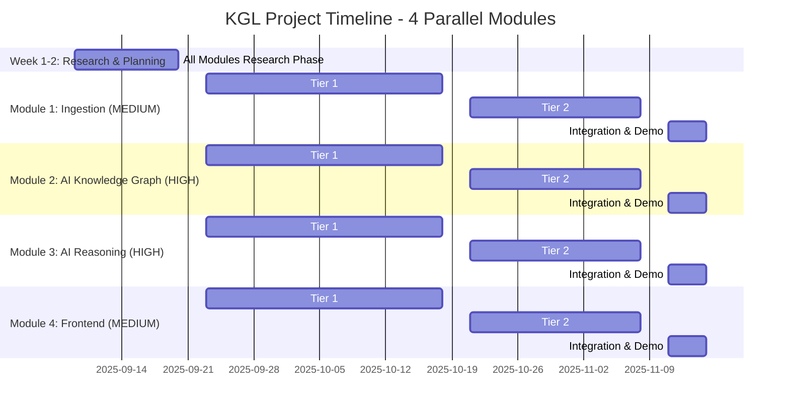
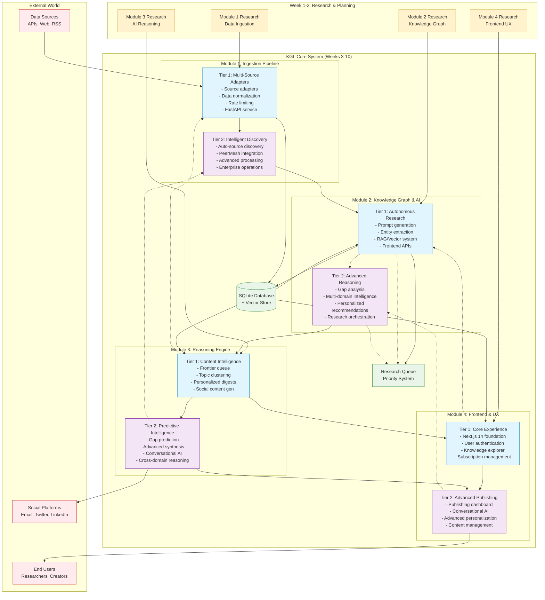
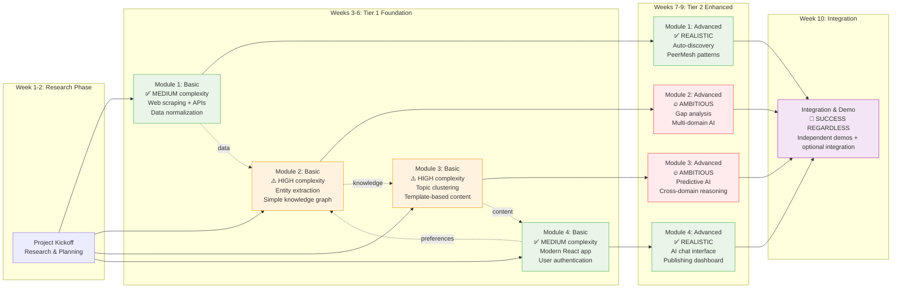
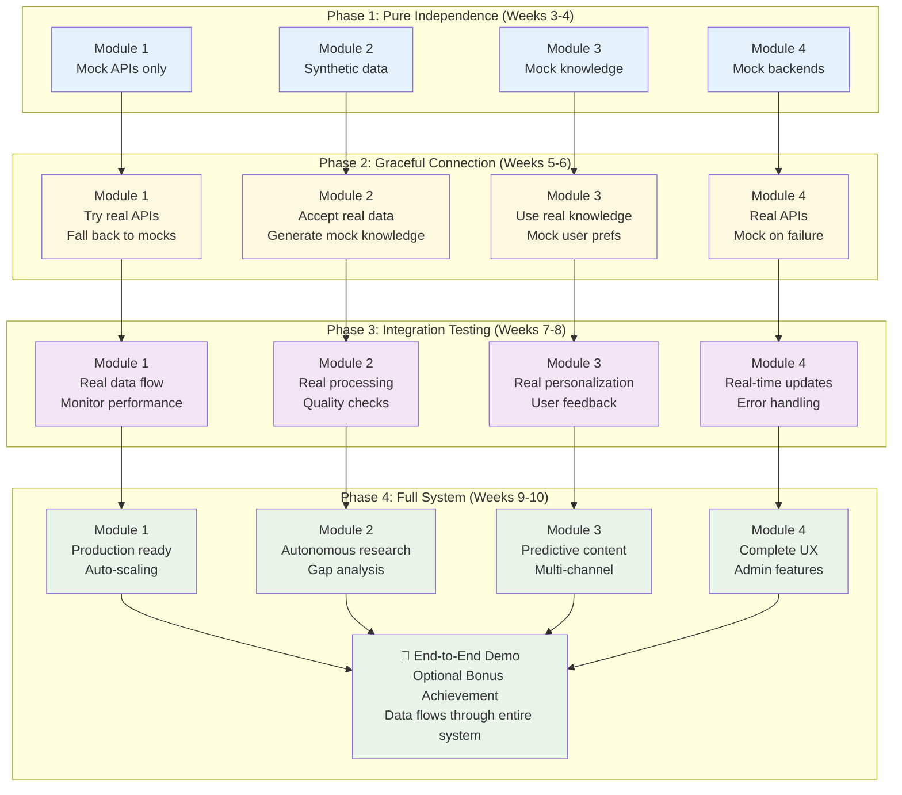

# Knowledge Graph Lab - Visual Project Roadmap

**Date**: September 7, 2025 19:45  
**Tool**: Claude Code  
**Purpose**: Visual Mermaid roadmap showing 4 parallel modules with progression and dependencies

---

## 🗺️ Complete Project Roadmap

### 10-Week Timeline with 4 Parallel Modules



## 🏗️ Module Architecture & Dependencies

### System Overview with Data Flow


## 🚦 Complexity & Risk Assessment

### Module Complexity Matrix
```mermaid
quadrantChart
    title Module Complexity vs Time Investment
    x-axis Low Complexity --> High Complexity
    y-axis Low Time --> High Time
    quadrant-1 High Risk (Reduce Scope)
    quadrant-2 Stretch Goals
    quadrant-3 Safe Bets
    quadrant-4 Right-Sized Challenge
    
    Module 1 Ingestion: [0.4, 0.6]
    Module 4 Frontend: [0.5, 0.7]
    Module 2 Knowledge Graph: [0.8, 0.8]
    Module 3 Reasoning: [0.9, 0.85]
```

### Progressive Complexity Roadmap


## 📋 Weekly Milestone Checkpoints

### Checkpoint Gate System
```mermaid
journey
    title 10-Week Journey with Checkpoints
    section Week 1-2: Research
      Research Brief Complete: 5: All Modules
      Technology Choices Validated: 5: All Modules
      Mock Data Strategy Ready: 5: All Modules
    
    section Week 4: Tier 1 Checkpoint
      Module 1: Basic ingestion working: 5: M1
      Module 2: Entity extraction demo: 3: M2
      Module 3: Content generation demo: 3: M3  
      Module 4: User interface working: 5: M4
    
    section Week 6: Tier 1 Complete
      Module 1: Full pipeline demo: 5: M1
      Module 2: Knowledge graph ready: 4: M2
      Module 3: Digest generation working: 4: M3
      Module 4: Complete user flows: 5: M4
    
    section Week 8: Tier 2 Progress  
      Module 1: Advanced features: 5: M1
      Module 2: AI reasoning working: 3: M2
      Module 3: Personalization ready: 3: M3
      Module 4: Publishing dashboard: 5: M4
    
    section Week 10: Demo Ready
      All modules: Independent demos: 5: All Modules
      Integration: Optional bonus: 2: System
      Success achieved: Portfolio ready: 5: All Modules
```

## 🔗 Integration Strategy

### Progressive Integration Approach


## 🎯 Success Metrics Dashboard

### Module Success Criteria
```mermaid
gitgraph
    commit id: "Project Start"
    
    branch Module-1-Ingestion
    checkout Module-1-Ingestion
    commit id: "✅ Multi-source adapters"
    commit id: "✅ Data normalization"
    commit id: "✅ Rate limiting"
    commit id: "✅ Auto-discovery"
    
    branch Module-2-Knowledge
    checkout Module-2-Knowledge
    commit id: "⚠️ Entity extraction"
    commit id: "⚠️ Knowledge graph"
    commit id: "🔥 Gap analysis"
    commit id: "🔥 Multi-domain AI"
    
    branch Module-3-Reasoning  
    checkout Module-3-Reasoning
    commit id: "⚠️ Topic clustering"
    commit id: "⚠️ Content generation"
    commit id: "🔥 Predictive AI"
    commit id: "🔥 Cross-domain logic"
    
    branch Module-4-Frontend
    checkout Module-4-Frontend  
    commit id: "✅ React foundation"
    commit id: "✅ User experience"
    commit id: "✅ Publishing tools"
    commit id: "✅ AI integration"
    
    checkout main
    merge Module-1-Ingestion
    merge Module-2-Knowledge
    merge Module-3-Reasoning
    merge Module-4-Frontend
    commit id: "🎯 Demo Day Success"
```

---

## 📊 Legend & Risk Indicators

**Complexity Levels:**
- ✅ **REALISTIC**: Well-scoped for 10-week timeline
- ⚠️ **CHALLENGING**: Ambitious but achievable with AI assistance  
- 🔥 **AMBITIOUS**: Stretch goals that may require scope reduction

**Success Philosophy:**
- **Primary Success**: 4 independent module demonstrations
- **Secondary Success**: AI-assisted development patterns proven
- **Bonus Success**: End-to-end integration working

**Risk Mitigation:**
- Mock data enables independence regardless of integration complexity
- 2-tier system allows graceful scope reduction
- Each module provides individual portfolio value
- Success measured by learning and architectural demonstration

---

*This roadmap ensures project success through parallel development, progressive complexity, and independence-first strategy while maintaining ambitious learning goals.*