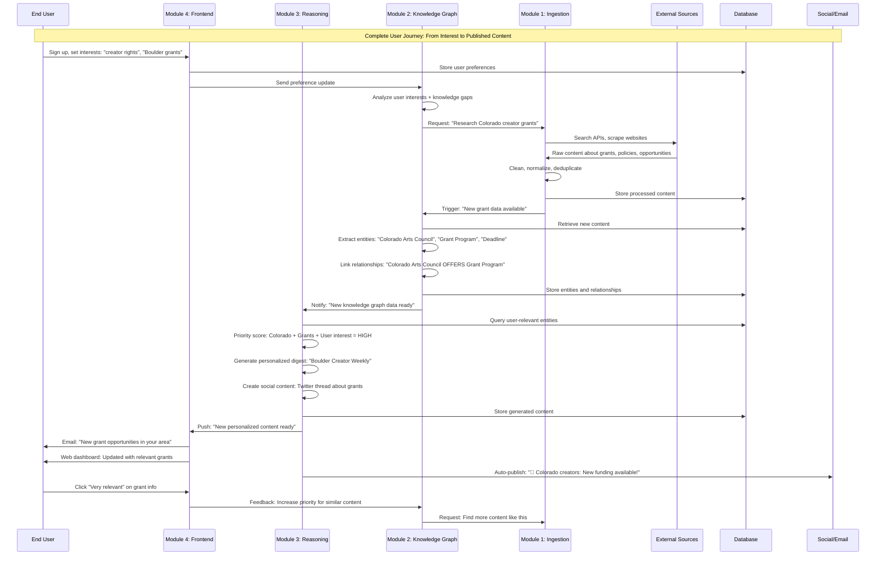
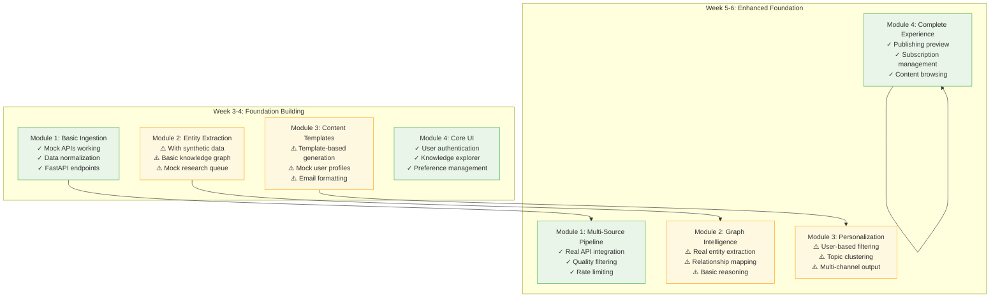
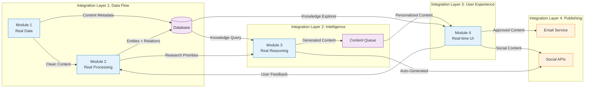
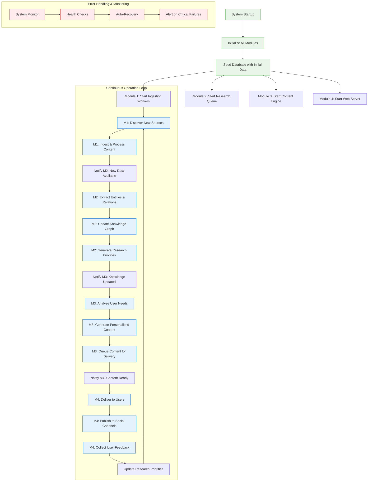
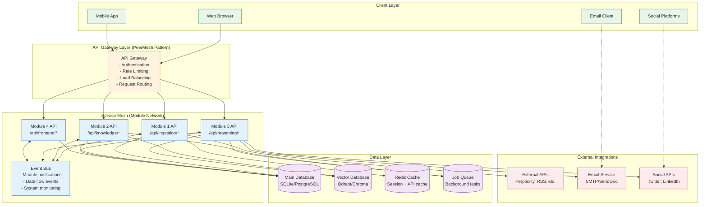
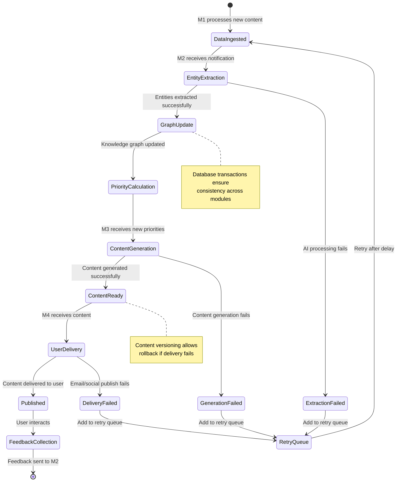
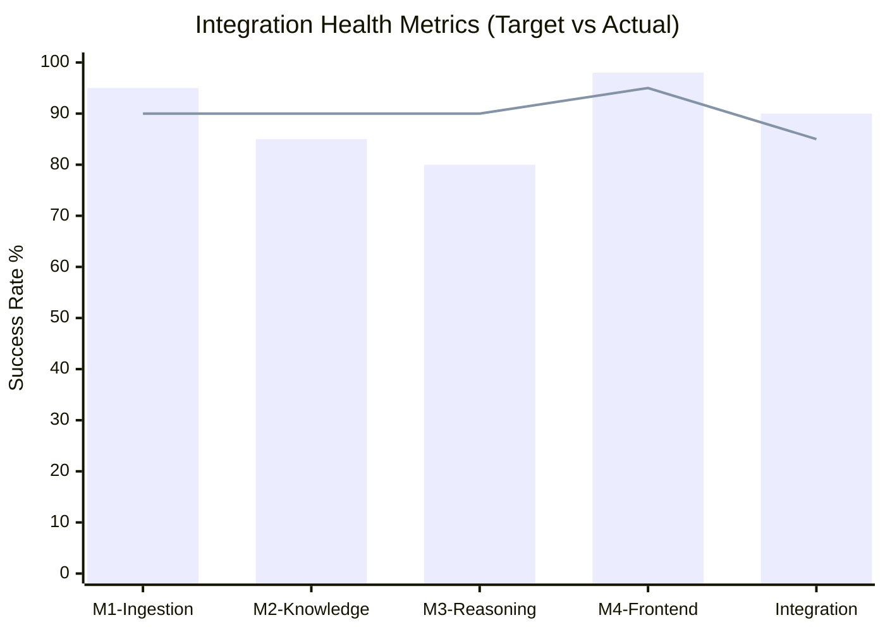
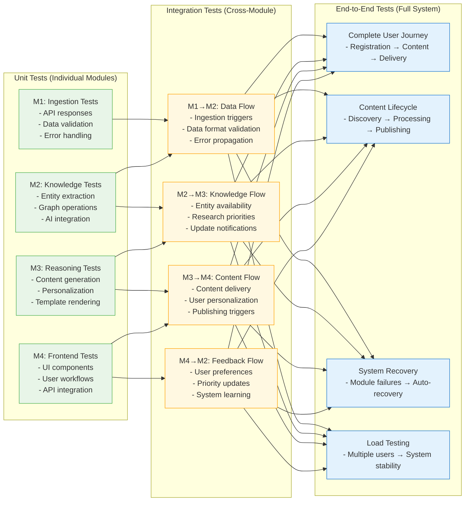
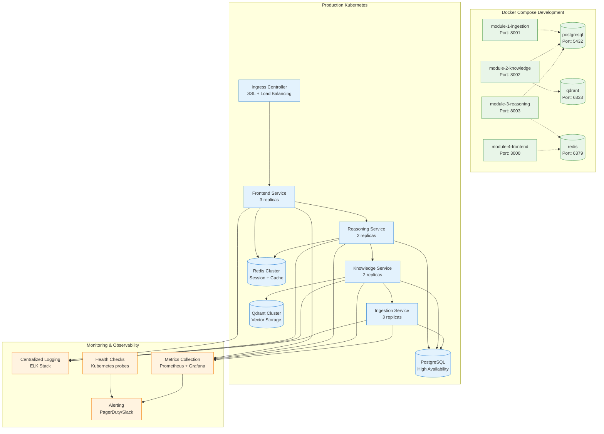

# Knowledge Graph Lab - Complete Integration Roadmap

**Date**: September 7, 2025 20:15  
**Tool**: Claude Code  
**Purpose**: End-to-end integration roadmap showing how all 4 modules work together as a unified system

---

## 🌐 Complete System Integration Overview

### End-to-End Data Flow: Real-World Usage Scenario

## 🔄 Integration Phases & Timeline

### Phase 1: Independent Development (Weeks 3-6)

### Phase 2: Progressive Integration (Weeks 7-8)

### Phase 3: Full System Integration (Weeks 9-10)

## 🏗️ Integration Architecture Deep Dive

### API Gateway & Service Mesh (Advanced Integration)

### Data Synchronization & Consistency

## 🎯 Integration Success Metrics

### System Performance Dashboard

**Key Performance Indicators:**
- **Data Flow Latency**: Source → User delivery < 10 minutes
- **System Uptime**: 99%+ availability during business hours
- **Integration Success Rate**: 90%+ successful end-to-end flows
- **User Satisfaction**: Content relevance score > 4.0/5.0
- **Resource Efficiency**: Each module handles expected load independently

### Integration Testing Strategy

## 🛠️ Deployment & Operations Integration

### Container Orchestration Strategy

## 📈 Integration Maturity Levels

### Level 0: Independent Modules (Week 6)
- ✅ Each module works with mock data
- ✅ APIs defined but not connected
- ✅ Individual demos successful

### Level 1: Basic Integration (Week 7)
- ✅ Module 1 → Module 2 data flow working
- ✅ Database shared between modules
- ⚠️ Manual triggers for testing

### Level 2: Automated Integration (Week 8)
- ✅ Event-driven communication between modules
- ✅ Module 2 → Module 3 intelligence flow
- ✅ Basic error handling and retries

### Level 3: User-Facing Integration (Week 9)
- ✅ Module 3 → Module 4 content delivery
- ✅ User interactions affect system behavior
- ✅ End-to-end workflows functional

### Level 4: Production Integration (Week 10)
- 🎯 Full system demonstration
- 🎯 Performance monitoring
- 🎯 Graceful failure handling
- 🎯 User feedback loops active

---

## 🎯 Integration Success Definition

**Primary Success**: All 4 modules can demonstrate **independent value** while showing **clear connection points**

**Secondary Success**: **2-3 integration flows** working end-to-end (e.g., User preference → Research priority → Content generation)

**Bonus Success**: **Complete system integration** with real-time data flowing from source discovery through user delivery

**Failure Prevention**: **Independence strategy** ensures project success even if integration proves too complex within 10-week timeline

---

*This roadmap shows how all modules work together as a unified intelligent knowledge system while maintaining the independence that ensures project success regardless of integration complexity.*