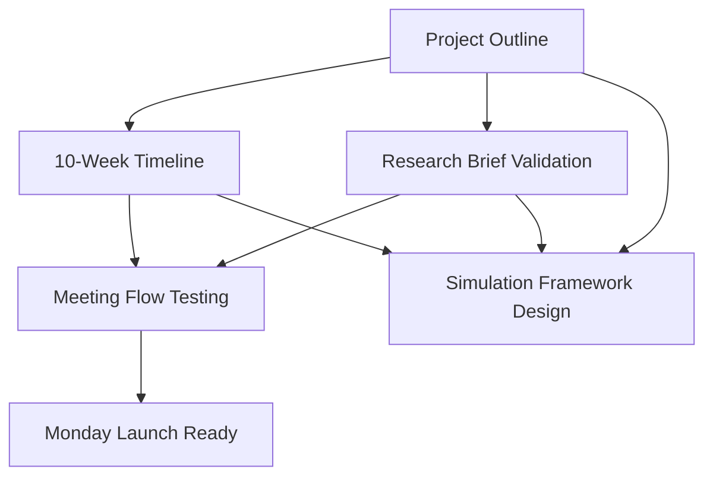

# Parallel Execution Strategy for Monday Readiness
## Dependency-Aware Multi-Agent Coordination

**Date**: September 8, 2025 17:30  
**Tool**: Claude Code  
**Purpose**: Optimal parallel/serial task execution strategy for Monday intern launch preparation

---

## 🔍 Dependency Analysis

### Critical Path Dependencies Identified


### Parallel Opportunities Matrix
| Task | Dependencies | Can Start | Duration | Parallel With |
|------|-------------|-----------|----------|---------------|
| Project Outline | None | Immediate | 2 hours | Research Analysis, Meeting Prep |
| Timeline Creation | Project Outline | After Phase 1 | 1 hour | Research Validation |
| Research Brief Validation | Project Outline | After Phase 1 | 30 min | Timeline Creation |
| Meeting Flow Testing | Timeline + Research | After Phase 2 | 30 min | Materials Prep |
| Meeting Materials Prep | Project Outline | After Phase 1 | 45 min | Timeline Creation |
| Simulation Framework | All above | After Phase 3 | 2 hours | Documentation Review |

---

## 🚀 Four-Phase Execution Plan

### Phase 1: Foundation + Independent Tasks (2 hours parallel)
**Parallel Block 1A**: Core foundation work that everything depends on
**Parallel Block 1B**: Independent analysis that doesn't depend on decisions

#### Agent Alpha: Project Outline Creation (Critical Path)
**Duration**: 2 hours  
**Dependencies**: None  
**Output**: Complete project-outline.md

#### Agent Beta: Research Infrastructure Analysis (Parallel)
**Duration**: 2 hours  
**Dependencies**: None (analyzing existing materials)  
**Output**: Research brief completeness audit + meeting logistics preparation

### Phase 2: Dependent Content Creation (1 hour parallel)
**Requires**: Phase 1 completion  
**Parallel Block 2**: All tasks depend on project outline but not each other

#### Agent Gamma: Timeline Compilation  
**Duration**: 1 hour  
**Dependencies**: Project Outline complete  
**Output**: 10-week detailed timeline document

#### Agent Delta: Research Brief Integration
**Duration**: 1 hour  
**Dependencies**: Project Outline + Research Analysis  
**Output**: Validated research briefs aligned with project direction

### Phase 3: Integration & Testing (45 minutes parallel)
**Requires**: Phase 2 completion  
**Parallel Block 3**: Integration tasks that can run simultaneously

#### Agent Alpha: Meeting Flow Testing
**Duration**: 30 minutes  
**Dependencies**: Timeline + Research Briefs  
**Output**: Meeting agenda validation + flow testing

#### Agent Beta: Materials Finalization  
**Duration**: 45 minutes  
**Dependencies**: All Phase 2 outputs  
**Output**: Complete meeting materials package

### Phase 4: Simulation Framework (2 hours parallel)
**Requires**: Phase 3 completion  
**Parallel Block 4**: Forward-looking work based on established foundation

#### Agent Gamma: 10-Week Simulation Design
**Duration**: 2 hours  
**Dependencies**: All Monday materials complete  
**Output**: Complete simulation framework for execution next week

#### Agent Delta: Documentation Organization
**Duration**: 2 hours  
**Dependencies**: All Phase 3 outputs  
**Output**: Organized knowledge base for ongoing project management

---

## 🤖 Detailed Agent Assignments

### Phase 1A: Agent Alpha - Project Outline (Critical Path)
**Start**: Immediate  
**Duration**: 2 hours  
**Priority**: CRITICAL - Everything else waits for this

**Sub-Agent Task**: Create comprehensive project outline using strategic foundation work  
**Output Required**: Complete project-outline.md ready for intern consumption

### Phase 1B: Agent Beta - Research Infrastructure (Parallel)
**Start**: Immediate (parallel with Alpha)  
**Duration**: 2 hours  
**Priority**: HIGH - Enables Phase 2 efficiency

**Sub-Agent Task**: Analyze and prepare all research-related infrastructure  
**Output Required**: Research audit + meeting logistics framework

### Phase 2A: Agent Gamma - Timeline Creation (Dependent)
**Start**: After Phase 1 completion  
**Duration**: 1 hour  
**Priority**: HIGH - Required for Phase 3

**Sub-Agent Task**: Create detailed 10-week timeline based on completed project outline  
**Output Required**: Week-by-week progression document

### Phase 2B: Agent Delta - Research Integration (Dependent)
**Start**: After Phase 1 completion  
**Duration**: 1 hour  
**Priority**: HIGH - Required for Phase 3

**Sub-Agent Task**: Validate and integrate research briefs with project direction  
**Output Required**: Aligned research brief package

### Phase 3A: Agent Alpha - Meeting Testing (Integration)
**Start**: After Phase 2 completion  
**Duration**: 30 minutes  
**Priority**: MEDIUM - Quality assurance

**Sub-Agent Task**: Test complete meeting flow with all materials  
**Output Required**: Meeting readiness validation

### Phase 3B: Agent Beta - Materials Finalization (Integration)
**Start**: After Phase 2 completion  
**Duration**: 45 minutes  
**Priority**: MEDIUM - Polish and completeness

**Sub-Agent Task**: Finalize all meeting materials and presentation flow  
**Output Required**: Complete Monday meeting package

### Phase 4A: Agent Gamma - Simulation Framework (Future Planning)
**Start**: After Phase 3 completion  
**Duration**: 2 hours  
**Priority**: LOW - Next week preparation

**Sub-Agent Task**: Design 10-week simulation methodology and framework  
**Output Required**: Complete simulation strategy document

### Phase 4B: Agent Delta - Documentation (Knowledge Management)
**Start**: After Phase 3 completion  
**Duration**: 2 hours  
**Priority**: LOW - Process optimization

**Sub-Agent Task**: Organize all documentation for ongoing project management  
**Output Required**: Knowledge management system for project continuation

---

## 📋 Sub-Agent Coordination Protocol

### Communication Standards
- **Status Updates**: Every 30 minutes during active phases
- **Dependency Notifications**: Immediate when phase completes
- **Blocker Escalation**: Immediate when dependencies break
- **Output Validation**: Each agent verifies input requirements before starting

### Quality Requirements for All Sub-Agents
- **Complete Markdown Documents**: Every output must be publication-ready
- **Comprehensive Content**: No placeholders or TODO items in final outputs  
- **Cross-Reference Integration**: All documents must reference related materials
- **Validation Checklists**: Each agent provides completion verification

### Handoff Protocols
- **Phase 1 → Phase 2**: Project outline completion triggers immediate Phase 2 launch
- **Phase 2 → Phase 3**: Both timeline and research integration must complete
- **Phase 3 → Phase 4**: All Monday materials validated before future planning
- **Emergency Protocols**: If critical path blocks, all dependent work pauses

---

## ⏱️ Timeline Execution Schedule

### Tonight (September 8, 2025)
```
17:30-19:30  Phase 1 (2 hours parallel)
  Agent Alpha: Project Outline Creation
  Agent Beta: Research Infrastructure Analysis

19:30-20:30  Phase 2 (1 hour parallel) 
  Agent Gamma: Timeline Compilation
  Agent Delta: Research Brief Integration

20:30-21:15  Phase 3 (45 minutes parallel)
  Agent Alpha: Meeting Flow Testing  
  Agent Beta: Materials Finalization

21:15-23:15  Phase 4 (2 hours parallel) - OPTIONAL
  Agent Gamma: Simulation Framework Design
  Agent Delta: Documentation Organization
```

### Monday Morning Buffer
- **8:00-10:00 AM**: Final review and any last-minute adjustments
- **10:00 AM**: Intern meeting launch with complete materials

---

## 🎯 Success Criteria by Phase

### Phase 1 Success Criteria
- [ ] **Project Outline**: Complete 2-page document ready for intern consumption
- [ ] **Research Infrastructure**: All research briefs validated and meeting logistics prepared
- [ ] **Quality Check**: Both outputs reviewed and approved for Phase 2 handoff

### Phase 2 Success Criteria  
- [ ] **Timeline**: Detailed 10-week progression aligned with project outline
- [ ] **Research Integration**: All research briefs aligned with project direction
- [ ] **Consistency Check**: Timeline and research briefs tell coherent story

### Phase 3 Success Criteria
- [ ] **Meeting Readiness**: Complete agenda tested and validated
- [ ] **Materials Package**: All intern-facing documents finalized and organized
- [ ] **Launch Confidence**: 100% confidence in Monday meeting success

### Phase 4 Success Criteria (Optional Tonight)
- [ ] **Simulation Framework**: Complete methodology for 10-week experience analysis  
- [ ] **Documentation System**: Organized knowledge base for ongoing management
- [ ] **Process Replication**: Framework documented for future project use

---

## 🚨 Risk Mitigation Strategy

### Critical Path Risks
- **Project Outline Delay**: If Phase 1A exceeds 2 hours, all subsequent phases shift
- **Dependency Breaks**: If outline doesn't provide needed decisions, Phase 2 blocks
- **Quality Issues**: If outputs aren't complete, integration phases fail

### Mitigation Protocols
- **Time Boxing**: Hard stops at phase boundaries to prevent cascade delays
- **Quality Gates**: Each phase has mandatory validation before handoff
- **Rollback Plans**: If integration fails, revert to previous phase for fixes
- **Alternative Paths**: Backup approaches if primary strategy encounters blockers

### Escalation Procedures
- **30-minute rule**: If any agent is blocked for 30+ minutes, escalate immediately
- **Quality issues**: If output doesn't meet requirements, pause dependent work
- **Timeline slippage**: If critical path delays, adjust scope rather than extend deadline

---

## 📊 Expected Outcomes

### Monday Launch Readiness (Phases 1-3)
- **Complete Project Description**: Unified vision all interns understand
- **Clear Research Framework**: Each intern knows exactly what to research  
- **Realistic Timeline**: 10-week progression with clear milestones
- **Professional Meeting**: Smooth 60-minute kickoff experience

### Process Documentation (Phase 4)
- **Simulation Framework**: Ready for 10-week experience analysis
- **Knowledge Management**: Organized system for ongoing project coordination  
- **Replication Methodology**: Process documented for future similar projects

### Strategic Value Delivered
- **Immediate**: Monday intern launch success with professional execution
- **Short-term**: Week 1 research success through clear framework  
- **Long-term**: Complete 10-week program success through simulation-based optimization

---

**Next Step**: Launch Phase 1 parallel execution with Agent Alpha (Project Outline) and Agent Beta (Research Infrastructure) simultaneously.

[NEXT_ACTION: Execute Phase 1 parallel launch with dependency-aware coordination | PRIORITY: 1]