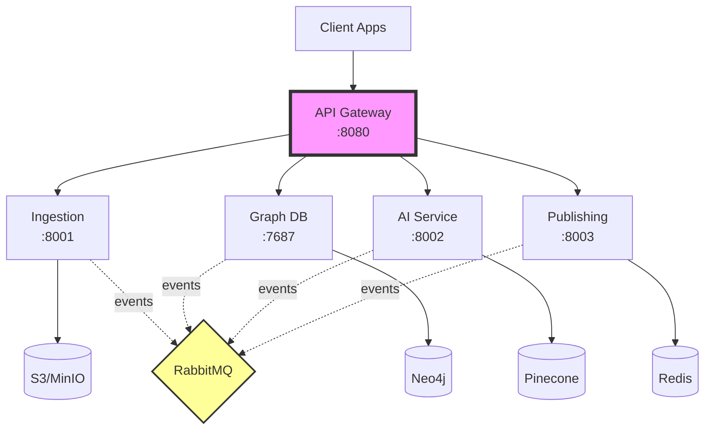

# System Architecture

## System Components

Knowledge Graph Lab uses a microservices architecture designed for scalability and maintainability:

### 1. Data Ingestion Service
- Manages scheduled data collection from diverse sources
- Implements respectful rate limiting for external APIs
- Normalizes various content formats into structured data
- Ensures data quality through deduplication
- Coordinates with other services through event-driven patterns

### 2. AI Processing Service
- Extracts meaningful entities from normalized content
- Identifies and maps relationships between entities
- Applies confidence scoring to extracted information
- Leverages modern language models for understanding
- Maintains processing pipeline for continuous improvement

### 3. Graph Database Layer
- Stores interconnected entities and relationships
- Optimizes for complex relationship queries
- Ensures data consistency and reliability
- Provides flexible query interfaces for services
- Scales to handle growing knowledge networks

### 4. API Gateway
- Manages authentication and authorization
- Routes requests to appropriate services
- Implements intelligent caching strategies
- Provides unified interface for client applications
- Monitors and manages service health

### 5. Publishing Service
- Personalizes content delivery based on user preferences
- Manages multi-channel distribution strategies
- Schedules and optimizes delivery timing
- Adapts content format for different channels
- Tracks engagement and delivery success

## Data Flow

The system processes information through a coordinated pipeline:

1. **Discovery**: Continuous monitoring of configured sources for new content
2. **Processing**: Intelligent extraction of entities and relationships from content
3. **Storage**: Structured storage in the knowledge graph with quality scoring
4. **Query**: Efficient retrieval of relevant information based on user needs
5. **Distribution**: Personalized delivery of insights through preferred channels

The pipeline ensures timely processing while maintaining data quality and relevance throughout the flow.

## Technology Categories

### Service Foundation
The system leverages modern programming languages and containerization technologies to ensure consistent deployment and scaling across environments.

### Data Storage Strategy
The architecture employs multiple storage technologies optimized for different data patterns:

- Object storage for raw document preservation
- Graph databases for relationship-centric queries
- Vector storage for semantic similarity search
- Caching layers for performance optimization
- Traditional databases for structured metadata

### Communication Patterns
Services communicate through various protocols chosen for specific use cases:

- RESTful APIs for standard client interactions
- Graph query languages for complex data retrieval
- Real-time protocols for live updates
- Efficient binary protocols for internal communication

### Intelligence Layer
The AI/ML capabilities combine multiple approaches:

- Large language models for content understanding
- Natural language processing for entity extraction
- Machine learning for pattern recognition
- Orchestration frameworks for workflow management

### User Interface
The frontend architecture emphasizes:

- Component-based development for maintainability
- Interactive visualizations for data exploration
- Centralized state management for consistency
- Modern styling approaches for responsive design

## Service Communication

The architecture uses event-driven communication patterns for loose coupling and scalability:

### Event-Driven Architecture
Services communicate through an event bus that enables:

- Asynchronous processing for better performance
- Retry mechanisms for transient failures
- Dead letter queues for error handling
- Event replay for system recovery
- Audit trails for compliance

### Resilience Patterns
The system implements multiple resilience strategies:

- Circuit breakers to prevent cascade failures
- Exponential backoff for retry logic
- Health checks for service monitoring
- Graceful degradation when services are unavailable
- Bulkhead isolation to contain failures

### Service Configuration
Each service maintains:

- Environment-specific configuration
- Secure credential management
- Service discovery mechanisms
- Health and readiness endpoints
- Logging and monitoring hooks

## Integration Points

### External Service Integration
The system integrates with various external services:
- **Language Model Providers**: Integration with AI services for content understanding
- **Content Sources**: Multiple ingestion channels including feeds, APIs, and webhooks
- **Distribution Channels**: Multi-channel delivery through email, messaging, and collaboration platforms

### Security and Reliability
The architecture implements comprehensive security and reliability measures:

- Token-based authentication for secure access
- Rate limiting to protect external services
- Circuit breakers for fault tolerance
- Connection pooling for efficiency
- Automatic retry with intelligent backoff strategies

## Architecture Diagram

## Performance Considerations

The architecture is designed to meet demanding performance requirements:

- **Latency**: Fast response times through intelligent caching and optimization
- **Throughput**: High request handling capacity with horizontal scaling
- **Processing**: Parallel processing capabilities for efficient document handling
- **Storage**: Scalable storage architecture supporting growth
- **Availability**: High availability through redundancy and monitoring
