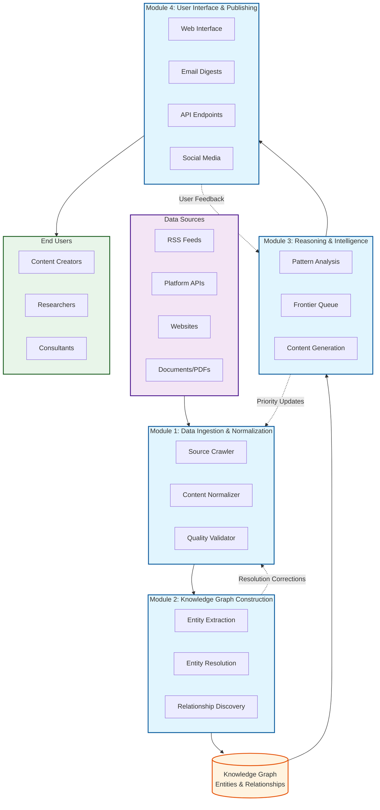
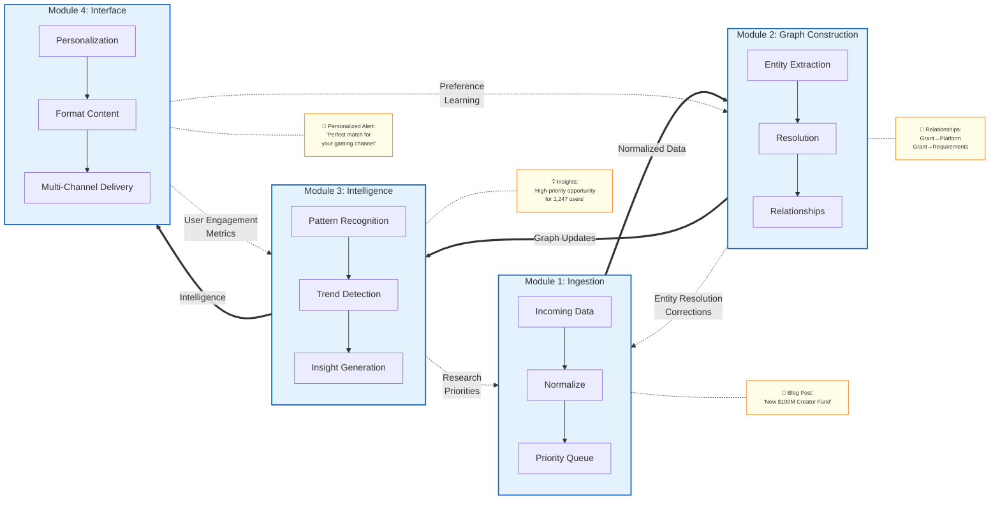
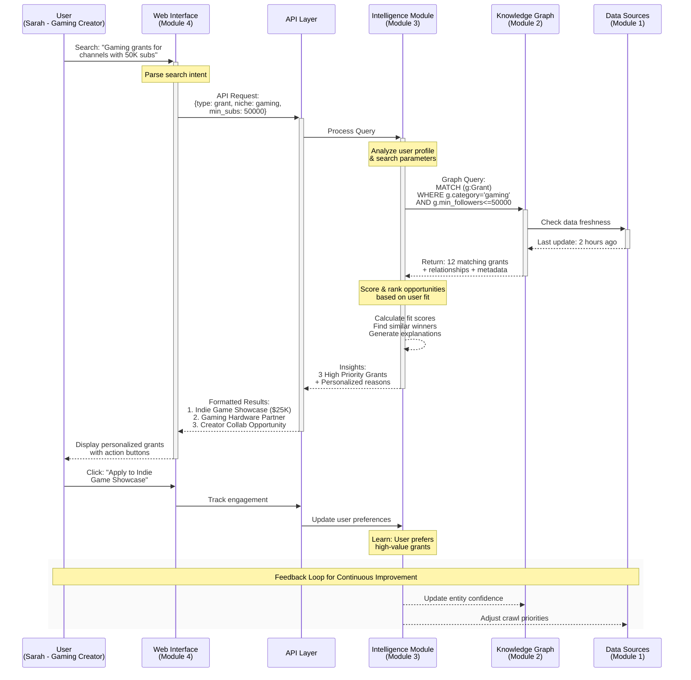

# Project Overview: What We're Building

This document explains the Knowledge Graph Lab system architecture, its four core modules, and how different users will interact with the platform to derive value.

---

## Table of Contents

- [System Overview](#system-overview)
- [The Four Modules](#the-four-modules)
- [How Modules Work Together](#how-modules-work-together)
- [User Journeys](#user-journeys)
- [Integration Points](#integration-points)
- [Next Steps](#next-steps)

---

## System Overview

Knowledge Graph Lab is an end-to-end intelligent research platform that discovers, understands, and synthesizes information about the creator economy. Think of it as having a team of expert researchers working 24/7 to find opportunities specifically relevant to each user.

### The Core Concept: Knowledge Graphs

A **knowledge graph** is a way of storing information that emphasizes relationships between things rather than just listing facts. If traditional databases are like filing cabinets (organized but isolated), knowledge graphs are like mind maps (interconnected and revealing patterns).

**Traditional Database Approach:**
```
Table: Platforms
- YouTube | Video | 2 billion users
- TikTok | Short Video | 1 billion users

Table: Grants  
- Grant A | $10,000 | YouTube creators
- Grant B | $5,000 | TikTok creators
```

**Knowledge Graph Approach:**
```
YouTube --[COMPETES_WITH]--> TikTok
Grant A --[REQUIRES]--> YouTube Account
Grant A --[FUNDED_BY]--> Google
Google --[OWNS]--> YouTube
```

These relationships reveal non-obvious insights. For instance, if Google increases funding for Grant A, we can predict YouTube might introduce new monetization features to retain creators who might otherwise switch to TikTok.

### The Intelligence Layer

Above the knowledge graph sits an intelligence layer that continuously analyzes patterns, identifies opportunities, and generates insights. This isn't just storage—it's active reasoning about the data.

When a new platform launches, the system:
1. **Identifies** its category and features
2. **Compares** it to existing platforms
3. **Predicts** which creators might benefit
4. **Alerts** relevant users about the opportunity
5. **Monitors** adoption and success patterns

This happens automatically, continuously, without human intervention.

### Multi-Channel Delivery

Users interact with this intelligence through channels optimized for different needs:

| Channel | Purpose | Update Frequency | Best For |
| :------ | :------ | :--------------: | :------- |
| **Web Interface** | Exploration & Discovery | Real-time | Deep research sessions |
| **Email Digests** | Curated Updates | Daily/Weekly | Staying informed |
| **API Endpoints** | Programmatic Access | Real-time | Integration & Analysis |
| **Social Media** | Broad Awareness | As needed | Community engagement |

*Table 1: Multi-channel delivery system for different user needs*

<!-- DAB
id: system-overview
title: Knowledge Graph Lab System Architecture
type: architecture
show: data-sources, four-modules, knowledge-graph, intelligence-layer, delivery-channels
notes: Show data flow from raw sources through processing to user value
-->



*Figure 1: High-level system architecture showing data flow*

---

## The Four Modules

Each module is a complete subsystem that provides value independently while contributing to the larger platform. This modular design enables parallel development and maintains system resilience.

### Module 1: Data Ingestion & Normalization

**Purpose**: Connect to the outside world and transform chaos into structure.

The ingestion module is like a multilingual translator at the United Nations. Information arrives in dozens of formats and languages (RSS, JSON, HTML, PDF), and this module translates everything into a common language the system understands.

**Key Capabilities:**

**1. Intelligent Source Management**

The module doesn't blindly scrape everything. It maintains a priority queue of sources based on:
- Historical value (sources that provided good information before)
- User interest (sources relevant to active users)
- Freshness requirements (time-sensitive information gets priority)
- Rate limits (respecting source constraints)

```python
# Example: Prioritizing sources for crawling
def calculate_source_priority(source):
    """Determine crawl priority for an information source."""
    priority = 0
    priority += source.historical_value_score * 0.3
    priority += source.user_interest_score * 0.3
    priority += source.freshness_score * 0.2
    priority += source.uniqueness_score * 0.2
    return priority
```

**2. Content Normalization Pipeline**

Raw content goes through a sophisticated pipeline:

1. **Format Detection**: Identify content type (article, video metadata, JSON API)
2. **Content Extraction**: Pull relevant information from noise
3. **Schema Mapping**: Convert to our standard format
4. **Quality Validation**: Ensure required fields are present
5. **Metadata Enrichment**: Add processing timestamp, confidence scores

**3. Provenance Preservation**

Every piece of information maintains its ancestry:
- Original source URL
- Fetch timestamp
- Processing version
- Transformation applied
- Confidence score

This audit trail enables trust, debugging, and continuous improvement.

**Why This Module Matters:**

Without quality ingestion, the entire system fails. This module must handle:
- **Volume**: Thousands of sources daily
- **Variety**: APIs, feeds, websites, documents
- **Velocity**: Real-time processing for time-sensitive data
- **Veracity**: Detecting and handling bad data

### Module 2: Knowledge Graph Construction

**Purpose**: Transform normalized data into structured knowledge with rich relationships.

This module is like an expert librarian who not only catalogs books but understands how they relate to each other, which authors influenced whom, and which topics connect across disciplines.

**Key Capabilities:**

**1. Entity Extraction and Recognition**

Using Natural Language Processing (NLP), the module identifies important entities in text:

```python
# Example text processing
text = "YouTube announced a $100M creator fund for channels with 10K+ subscribers"

# Extracted entities:
entities = [
    {"type": "platform", "name": "YouTube", "confidence": 0.99},
    {"type": "grant", "name": "creator fund", "amount": "$100M", "confidence": 0.95},
    {"type": "requirement", "value": "10K+ subscribers", "confidence": 0.90}
]
```

**2. Entity Resolution (The Hard Problem)**

The same entity often appears with different names. The module must determine when different mentions refer to the same thing:

- "YouTube Creator Fund" vs "YouTube's Creator Fund" vs "YT Creator Fund"
- "Meta" vs "Facebook Inc." vs "Facebook"
- "MrBeast" vs "Jimmy Donaldson" vs "Beast Philanthropy"

Resolution uses multiple signals:
```python
def calculate_entity_similarity(entity1, entity2):
    """Determine if two entities are the same."""
    scores = {
        "name_similarity": fuzzy_match(entity1.name, entity2.name),
        "temporal_overlap": check_time_overlap(entity1, entity2),
        "shared_relationships": count_common_connections(entity1, entity2),
        "attribute_match": compare_attributes(entity1, entity2)
    }
    return weighted_average(scores)
```

**3. Relationship Discovery**

Beyond identifying entities, the module discovers how they connect:

- **Explicit relationships**: Stated directly in text ("Google owns YouTube")
- **Implicit relationships**: Inferred from patterns ("Creators who use TubeBuddy often mention VidIQ" suggests competition)
- **Temporal relationships**: Time-based connections ("Grant X launched after Platform Y's policy change")

**4. Ontology Management**

The ontology defines what types of entities and relationships exist. While the core remains stable, the system can propose extensions when new patterns emerge:

```yaml
# Example ontology definition
entities:
  Platform:
    attributes: [name, category, user_count, launch_date]
    relationships: [competes_with, partners_with, owned_by]
  
  Grant:
    attributes: [name, amount, deadline, requirements]
    relationships: [offered_by, requires_platform, targets_creators]
```

### Module 3: Reasoning & Intelligence

**Purpose**: Transform static knowledge into dynamic intelligence through analysis and synthesis.

This module is like having a team of expert analysts who continuously study the knowledge graph, identify patterns, and generate insights. It's where information becomes intelligence.

**Key Capabilities:**

**1. The Frontier Queue (What to Research Next)**

The system can't research everything simultaneously. The frontier queue determines priorities:

```python
class FrontierQueue:
    """Manages research priorities based on value and uncertainty."""
    
    def calculate_research_value(self, topic):
        """Determine if a topic is worth researching."""
        value = 0
        value += topic.user_interest * 0.4  # What users care about
        value += topic.uncertainty * 0.3    # What we don't know
        value += topic.volatility * 0.2     # What changes frequently
        value += topic.impact * 0.1         # What affects many entities
        return value
```

**2. Pattern Recognition and Trend Detection**

The module identifies emerging patterns before they become obvious:

- **Platform adoption curves**: Recognizing when a platform hits exponential growth
- **Grant seasonality**: Identifying when certain grants typically open
- **Creator migration patterns**: Detecting platform switching trends
- **Content format evolution**: Spotting new content types gaining traction

**3. Content Generation (Beyond Templates)**

Rather than filling in blanks, the module synthesizes genuine insights:

```python
def generate_opportunity_brief(creator_profile, opportunity):
    """Generate personalized explanation of why an opportunity matters."""
    
    # Analyze fit
    fit_score = calculate_fit(creator_profile, opportunity)
    
    # Find similar successes
    similar_winners = find_similar_creators_who_succeeded(
        creator_profile, 
        opportunity
    )
    
    # Identify unique advantages
    advantages = identify_creator_advantages(creator_profile, opportunity)
    
    # Generate narrative that connects these elements
    narrative = synthesize_narrative(fit_score, similar_winners, advantages)
    
    return narrative
```

**4. Temporal Reasoning (Understanding Time)**

Time isn't just a timestamp—it's a critical dimension for intelligence:

- **Deadline awareness**: Increasing priority as deadlines approach
- **Trend velocity**: Measuring how fast things change
- **Seasonal patterns**: Recognizing cyclical opportunities
- **Decay functions**: Reducing confidence in aging information

### Module 4: User Interface & Publishing

**Purpose**: Make intelligence accessible, actionable, and personalized for each user.

This module is like a personal assistant who knows your preferences, understands your goals, and delivers exactly what you need when you need it.

**Key Capabilities:**

**1. Adaptive Web Interface**

The interface adapts to user behavior and preferences:

```javascript
// Example: Adaptive dashboard components
function generateDashboard(user) {
    const components = [];
    
    // Prioritize based on user interaction history
    if (user.frequently_checks_grants) {
        components.push(<GrantOpportunities priority="high" />);
    }
    
    if (user.platform === "YouTube") {
        components.push(<YouTubeInsights expanded={true} />);
    }
    
    // Add discovery elements for new users
    if (user.is_new) {
        components.push(<GuidedTour />);
        components.push(<PopularInsights />);
    }
    
    return components;
}
```

**2. Multi-Channel Publishing Engine**

Different channels require different approaches:

**Email Digests:**
- Personalized subject lines based on content
- Scannable format with clear sections
- Progressive disclosure (summary → details)
- One-click actions for opportunities

**API Responses:**
- RESTful design for predictability
- GraphQL for flexible queries
- Webhooks for real-time updates
- Rate limiting for fairness

**Social Media:**
- Platform-optimized formatting
- Hashtag intelligence
- Engagement tracking
- Community interaction

**3. Personalization Engine**

The system learns from every interaction:

```python
class PersonalizationEngine:
    """Learns user preferences to improve recommendations."""
    
    def update_user_model(self, user, interaction):
        """Update user preferences based on behavior."""
        
        if interaction.type == "click":
            self.increase_topic_weight(user, interaction.topic)
        
        if interaction.type == "dismiss":
            self.decrease_topic_weight(user, interaction.topic)
        
        if interaction.type == "share":
            self.mark_high_value(user, interaction.content)
        
        # Decay old preferences over time
        self.apply_temporal_decay(user.preferences)
```

**4. Feedback Integration**

User feedback directly improves the system:

- **Explicit feedback**: Ratings, reports, corrections
- **Implicit feedback**: Clicks, time spent, shares
- **Aggregate patterns**: What similar users find valuable
- **System learning**: Adjusting algorithms based on outcomes

<!-- DAB
id: module-interaction
title: Module Interaction and Data Flow
type: flowchart
show: module-connections, data-transformation, feedback-loops
notes: Show how modules work together with example data flowing through
-->



*Figure 2: Module interaction showing data flow and feedback loops*

---

## How Modules Work Together

While each module provides independent value, their integration creates emergent intelligence greater than the sum of parts.

### Example: Discovering a New Opportunity

Let's trace how the system processes a new grant announcement:

**Step 1: Ingestion (Module 1)**
```
Source: Blog post on platformxyz.com
Raw text: "We're excited to announce our Creator Accelerator..."
Output: Normalized JSON with structured fields
```

**Step 2: Knowledge Graph Update (Module 2)**
```
New entities created:
- Grant: "Platform XYZ Creator Accelerator"
- Organization: "Platform XYZ"

New relationships:
- Grant --[OFFERED_BY]--> Platform XYZ
- Grant --[REQUIRES]--> 50K followers
- Grant --[DEADLINE]--> 2024-03-15
```

**Step 3: Intelligence Analysis (Module 3)**
```
Analysis results:
- Similar to YouTube NextUp (70% similarity)
- Fits 1,247 users in our database
- Higher value than 85% of current grants
- Deadline in 10 days (HIGH PRIORITY)
```

**Step 4: User Notification (Module 4)**
```
For Sarah (gaming creator, 50K subs):
- Priority: HIGH (meets all requirements)
- Email: Sent immediately
- Dashboard: Featured at top
- Personalized message: "Similar to YouTube NextUp that helped 
  GamerCreatorX grow 300% last year"
```

This entire process happens automatically within minutes of the announcement.

---

## User Journeys

To understand the system's value, let's follow three distinct users through their complete experiences.

### Sarah: The Gaming Content Creator

**Background**: Sarah creates gaming content on YouTube (50K subscribers) and streams on Twitch (5K followers). She's talented but overwhelmed by the business side of content creation.

**Day 1: Onboarding**

Sarah signs up and connects her accounts. The system immediately:
- Analyzes her content niche (gaming, specifically indie games)
- Identifies her audience demographics (18-34, primarily US/UK)
- Benchmarks her metrics against similar creators
- Generates initial recommendations

**Week 1: First Value**

Her first weekly digest arrives with:

```
Subject: Sarah, 3 opportunities worth $35K+ for your channel

1. Indie Game Showcase Grant - $25,000
   ✓ You qualify (indie game focus matches perfectly)
   ✓ Deadline in 12 days
   ✓ Similar creator "PixelPioneer" won last year
   → One-click application starter

2. Gaming Hardware Sponsorship - $10,000 value
   ✓ Looking for creators exactly your size
   ✓ 6-month partnership program
   ✓ Includes equipment + monthly payment
   → Introduction email template ready

3. Creator Collaboration Opportunity
   ✓ "RetroGamerPro" seeking indie game specialist
   ✓ Their audience overlaps 40% with yours
   ✓ Previous collabs averaged +2K subscribers
   → Mutual connection available
```

**Month 1: System Learning**

As Sarah interacts with recommendations, the system learns:
- She prioritizes grants over sponsorships
- She's interested in audience growth, not just money
- She prefers opportunities with clear requirements
- She responds better to Friday morning emails

The recommendations evolve accordingly.

**Month 3: Measurable Impact**

Sarah's results:
- Won 2 grants totaling $30,000
- Grew to 75,000 subscribers (+50%)
- Reduced research time from 10 hours to 1 hour weekly
- Connected with 5 valuable creator partnerships

**Key Success Factors:**
- Personalization made opportunities relevant
- Timing alerts prevented missed deadlines
- Social proof (similar creators) built confidence
- Automation handled tedious research

### Alex: The Academic Researcher

**Background**: Alex is a PhD candidate studying how creator economy platforms affect traditional media. They need comprehensive, citable data for their dissertation.

**Initial Setup**

Alex configures their research parameters:
```python
research_config = {
    "focus_areas": ["platform competition", "creator migration", "monetization evolution"],
    "platforms": ["YouTube", "TikTok", "Twitch", "Instagram"],
    "time_period": "2020-2024",
    "data_requirements": ["source_citations", "confidence_scores", "raw_data_access"]
}
```

**Research Workflow**

Using the API, Alex runs complex queries:

```python
# Query: Platform switching patterns
query = """
    MATCH (c:Creator)-[r1:ACTIVE_ON]->(p1:Platform)
    WHERE r1.end_date IS NOT NULL
    MATCH (c)-[r2:ACTIVE_ON]->(p2:Platform)
    WHERE r2.start_date > r1.end_date
    RETURN p1.name, p2.name, COUNT(c) as switch_count,
           AVG(c.follower_count) as avg_followers
    ORDER BY switch_count DESC
"""

# Results reveal migration patterns invisible in traditional research
```

**Data Quality Features**

The system provides academic-grade data quality:

1. **Source Attribution**: Every fact links to original source
2. **Confidence Scoring**: Statistical confidence for inferred data
3. **Version History**: Track how information changed over time
4. **Conflict Resolution**: When sources disagree, all versions preserved

**Research Acceleration**

What previously took Alex weeks now takes hours:
- **Before**: Manual collection from 50+ sources
- **After**: Single API query with comprehensive results
- **Time saved**: 40 hours per research question
- **Data completeness**: 10x more comprehensive

**Contribution Back**

Alex identifies data quality issues and suggests improvements:
- Corrects misclassified platform categories
- Proposes new relationship types for the ontology
- Validates entity resolution accuracy
- Contributes academic papers as new sources

### Morgan: The Strategic Consultant

**Background**: Morgan advises media companies on creator economy strategy. Clients pay $50K+ for market intelligence and strategic recommendations.

**Client Project: Launching a Creator Fund**

A streaming platform wants to launch a $10M creator fund. Morgan uses Knowledge Graph Lab to develop the strategy.

**Competitive Analysis Query:**
```
Analyze all creator funds launched since 2022:
- Funding amounts and structures
- Eligibility requirements
- Success metrics
- Creator satisfaction scores
- Platform retention impact
```

**System Insights:**

The analysis reveals non-obvious patterns:

1. **Funding Sweet Spot**: $25K-50K grants most effective
   - Below $25K: Not enough to change creator behavior
   - Above $50K: Diminishing returns on platform loyalty

2. **Hidden Success Factor**: Mentorship matters more than money
   - Funds with mentorship: 85% creator satisfaction
   - Funds without: 45% creator satisfaction

3. **Timing Pattern**: Q1 launches get 3x more applications
   - January: New Year motivation
   - Tax season: Creators planning finances
   - Less competition: Fewer simultaneous opportunities

**Strategic Recommendations:**

Based on system intelligence, Morgan recommends:
```markdown
## Creator Fund Strategy

### Structure
- 200 grants of $50,000 each
- Quarterly cohorts of 50 creators
- 6-month mentorship program included

### Differentiation
- Focus on "emerging professionals" (10K-100K followers)
- Underserved niche: Educational content creators
- Unique offer: Production studio access

### Success Prediction
- Expected applications: 5,000+
- Projected retention lift: 40%
- Creator satisfaction target: 80%+
```

**Client Value Delivered:**

- Strategy developed in 2 days (vs. 2 weeks traditional)
- Backed by data from 147 similar programs
- Identified whitespace competitors missed
- Predicted outcomes with 85% confidence

<!-- DAB
id: user-interaction-flow
title: User Interaction Sequence
type: sequence
actors: User, WebUI, API, IntelligenceModule, KnowledgeGraph
show: query-flow, processing, response-generation
notes: Show complete interaction from user query to insight delivery
-->



*Figure 3: Complete user interaction flow from query to results*

---

## Integration Points

Understanding how modules connect is crucial for development success. Each integration point has clear contracts and failure handling.

### Module 1 → Module 2: Raw to Normalized

**Data Contract:**
```json
{
    "source_id": "abc123",
    "timestamp": "2024-01-15T10:30:00Z",
    "content_type": "article",
    "raw_content": "...",
    "normalized_content": {
        "title": "New Creator Fund Announced",
        "body": "...",
        "entities_mentioned": ["YouTube", "Creator Fund"],
        "metadata": {}
    }
}
```

**Error Handling:**
- Malformed data: Log and skip
- Source unavailable: Retry with backoff
- Rate limited: Queue for later

### Module 2 → Module 3: Knowledge to Intelligence

**Graph Query Interface:**
```python
# Module 3 queries Module 2's knowledge graph
def get_related_grants(creator_profile):
    query = f"""
        MATCH (g:Grant)-[:REQUIRES]->(p:Platform)
        WHERE p.name IN {creator_profile.platforms}
        AND g.min_followers <= {creator_profile.followers}
        AND g.deadline > datetime()
        RETURN g
        ORDER BY g.deadline
        LIMIT 10
    """
    return graph.execute(query)
```

### Module 3 → Module 4: Intelligence to Users

**Content Delivery Format:**
```json
{
    "user_id": "user_456",
    "insights": [
        {
            "type": "opportunity",
            "priority": "high",
            "title": "Perfect Grant Match Found",
            "summary": "...",
            "actions": ["apply", "save", "share"],
            "personalization_reason": "Matches your indie game focus"
        }
    ]
}
```

### Feedback Loops

Each module sends signals back to improve the system:

- **Module 4 → Module 3**: User engagement metrics
- **Module 3 → Module 1**: Research priority updates
- **Module 2 → Module 1**: Entity resolution corrections

---

## Next Steps

Now that you understand what we're building, explore:

- [Project Architecture](./project-architecture.md) - Technical implementation details
- [Module Documentation](../modules/) - Your specific module guide
- [User Journeys](./user-journeys.md) - Detailed user experience narratives
- [Deployment Strategy](./deployment-strategy.md) - Production deployment approach

Remember: This system will help thousands of creators succeed. Your contribution matters. Your code will make a difference. Your learning will launch your career.

Let's build something incredible together.