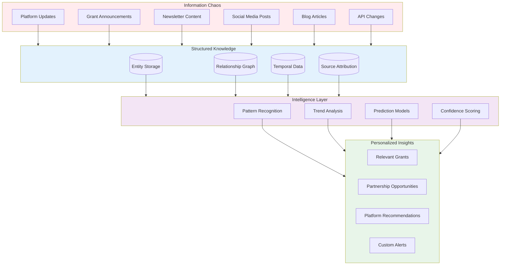

# Project Vision: Knowledge Graph Lab

This document explains why we're building an intelligent research system for the creator economy and how this project will teach you to think about production software systems.

---

## Table of Contents

- [The Problem We're Solving](#the-problem-were-solving)
- [The Opportunity](#the-opportunity)
- [Our Approach](#our-approach)
- [Why This Matters Now](#why-this-matters-now)
- [What Success Looks Like](#what-success-looks-like)
- [The Bigger Picture](#the-bigger-picture)
- [Your Learning Journey](#your-learning-journey)

---

## The Problem We're Solving

The creator economy has grown into a $250 billion market. To understand the scale: that's larger than the global newspaper industry and approaching the size of the video game industry. Millions of people now earn their living creating content on platforms like YouTube, TikTok, Instagram, and Twitch.

Yet despite this massive scale, the infrastructure supporting creators remains fragmented and chaotic. Information about opportunities, grants, platform changes, and partnerships exists across hundreds of sources with no central intelligence layer to make sense of it all.

### A Real Creator's Story

Consider Sarah, a gaming content creator with 50,000 YouTube subscribers. Her weekly workflow reveals the problem:

- **Monday**: Spends 3 hours searching for sponsorship opportunities across 15+ brand websites
- **Tuesday**: Reviews 8 different newsletters hoping to find relevant grants
- **Wednesday**: Checks 5 platform blogs for monetization updates
- **Thursday**: Discovers she missed a $25,000 creator fund deadline by two days
- **Friday**: Realizes a perfect partnership opportunity closed while buried in her inbox

Sarah isn't failing at research. The system is failing Sarah. She's trying to drink from a fire hose of information with no way to filter what matters to her specific situation.

### The Fragmentation Problem

This same fragmentation affects everyone in the ecosystem:

| Stakeholder | Current Challenge | Time Wasted |
| :---------- | :---------------- | :---------: |
| **Creators** | Finding opportunities in noise | 10+ hrs/week |
| **Investors** | Tracking emerging platforms | 20+ hrs/week |
| **Researchers** | Gathering comprehensive data | 40+ hrs/week |
| **Platforms** | Identifying partnership targets | 15+ hrs/week |
| **Policymakers** | Understanding ecosystem impact | 30+ hrs/week |

*Table 1: Information fragmentation costs across creator economy stakeholders*

The creator economy operates like a city without a map. Everyone knows their local neighborhood but nobody sees the whole picture. This isn't just inefficient—it's preventing the ecosystem from reaching its potential.

---

## The Opportunity

Knowledge Graph Lab represents a fundamental shift in how we approach information discovery and synthesis. Instead of expecting humans to search through endless sources, we're building an intelligent system that does the searching for them.

### What Makes This Possible Now

Three technological advances have converged to make this project feasible when it wasn't before:

**1. Large Language Models (LLMs) Can Extract Meaning**

Modern AI models like GPT-4 and Claude can read unstructured text and extract structured information with near-human accuracy. For example, they can read a blog post announcing a grant program and extract:
- Grant amount: $10,000
- Eligibility: Gaming creators with 25k-100k subscribers
- Deadline: March 15, 2024
- Requirements: 3 videos per month minimum

This extraction would have required human analysts just two years ago.

**2. Graph Databases Have Matured**

Graph databases can now handle millions of relationships at production scale. Unlike traditional databases that store data in tables, graph databases naturally represent networks of connections. They can answer questions like "Which grants are offered by organizations that also partner with YouTube?" in milliseconds.

**3. Compute Costs Have Plummeted**

Processing that cost $1,000 in 2010 now costs less than $10. This makes continuous, automated research economically viable for the first time. We can afford to have AI agents constantly scanning for new information.

### The Critical Window

The window to build this system is limited for three reasons:

First, **information advantages compound over time**. The system that achieves comprehensive coverage first becomes the default source others build upon. Early relationship mappings become training data for future predictions.

Second, **the creator economy is professionalizing rapidly**. As more people treat content creation as a career rather than a hobby, the demand for professional-grade intelligence tools accelerates. Building this infrastructure now positions us at the foundation of this transformation.

Third, **network effects create winner-take-all dynamics**. Each user who contributes feedback makes the system smarter for everyone. The first system to reach critical mass becomes exponentially more valuable than alternatives.

---

## Our Approach

Knowledge Graph Lab isn't just another database or search engine. It's a living intelligence system that grows smarter over time through four key principles that differentiate it from traditional information tools.

### Principle 1: Dynamic Knowledge

Traditional databases store static facts that immediately begin aging. Our system treats knowledge as dynamic and continuously evolving.

**Traditional Approach:**
```
Platform X has 10 million users (recorded January 2024)
```

**Our Approach:**
```
Platform X:
- Current users: 12.5 million (updated daily)
- Growth rate: +5% monthly (calculated from trends)
- Trajectory: Likely 15 million by Q2 (projected)
- Confidence: 85% (based on historical accuracy)
```

When Platform X changes its monetization policy, we don't just record the change. We trace its implications across affected creators, competitive platforms, and related grant programs. The knowledge stays fresh and relevant.

### Principle 2: Relationships Over Entities

While others build lists of platforms or directories of grants, we map the connections between them. These relationships reveal insights invisible in isolation.

**Example Network Discovery:**

A gaming creator might dismiss a "Digital Arts Grant" as irrelevant. But our system discovers:
- The grant is offered by TechArts Foundation
- TechArts Foundation partners with Twitch
- Twitch featured 3 gaming creators who won this grant
- Those creators had similar audience sizes to our user
- **Insight**: Despite its name, this grant actively seeks gaming creators

This connection would be invisible in a traditional database but emerges naturally from relationship mapping.

### Principle 3: Uncertainty and Revision

Real-world information is messy, conflicting, and evolving. Our system embraces this reality rather than pretending certainty where none exists.

```python
# How we handle conflicting information
entity = {
    "name": "Creator Fund X",
    "grant_amount": {
        "source_a": "$50,000",
        "source_b": "$45,000",
        "source_c": "$50,000",
        "confidence": 0.83,  # 2 out of 3 sources agree
        "value": "$50,000",
        "note": "Discrepancy likely due to Source B using outdated info"
    }
}
```

This intellectual honesty builds trust and enables users to make informed decisions even when data is incomplete.

### Principle 4: Composability

Inspired by Unix philosophy ("do one thing well") and modern microservices architecture, each module provides value independently while contributing to a greater whole.

<!-- DAB
id: transformation-flow
title: Information Transformation Pipeline
type: flowchart
show: chaos-to-structure, structure-to-intelligence, intelligence-to-insights
notes: Show progression from scattered sources through organization to personalized value
-->



*Figure 1: The transformation from information chaos to personalized insights*

This approach ensures the system remains:
- **Maintainable**: Each module can be updated without breaking others
- **Extensible**: New capabilities can be added as modules
- **Resilient**: Failures in one module don't cascade

---

## Why This Matters Now

### The Perfect Storm of Opportunity

Three converging trends make this the ideal moment to build Knowledge Graph Lab:

**1. Creator Economy Explosion**

The number of people earning money from content creation has grown 10x in five years:
- 2019: ~5 million creators earning income
- 2024: ~50 million creators earning income
- 2029 (projected): ~200 million creators earning income

This growth creates exponential information complexity that human-scale research cannot handle.

**2. AI Capability Breakthrough**

Language models have crossed the threshold from "interesting demos" to "production-ready tools":
- Information extraction accuracy: 95%+ for structured data
- Processing speed: 1000x faster than human analysts
- Cost: 100x cheaper than human researchers
- Availability: 24/7 continuous operation

**3. Market Structure Shift**

The creator economy is transitioning from hobby to profession:
- Average creator income increased 3x since 2020
- Professional creator tools market growing 40% annually
- Enterprise spending on creator partnerships up 10x
- Government recognition with new tax categories and policies

### The Cost of Waiting

Every month we delay, the problem compounds:

- **Information volume doubles** every 18 months
- **New platforms launch** weekly, fragmenting attention further
- **Creators burn out** from information overload
- **Opportunities expire** before reaching their audience
- **Competitors may build** partial solutions that become entrenched

Building now means shaping how the ecosystem understands itself. Building later means playing catch-up in an established market.

---

## What Success Looks Like

Success isn't just about building working software. It's about creating genuine value for users while learning professional development practices.

### For Creators Like Sarah

Success means Sarah spends her time creating content, not searching for opportunities:

- **Before**: 10 hours/week searching, 30 hours creating
- **After**: 1 hour/week reviewing curated insights, 39 hours creating
- **Result**: 30% more content, 50% more monetization, 90% less stress

Her personalized weekly digest includes:
- 3 grants she qualifies for with application tips
- 2 sponsorship opportunities matching her audience
- 1 platform update affecting her revenue
- 0 irrelevant distractions

### For the Development Team

Success means you leave this project with:

**Technical Skills:**
- Building production-grade APIs that handle real traffic
- Working with modern AI/ML services at scale
- Designing data models that evolve gracefully
- Writing code that other developers can maintain

**Professional Skills:**
- Collaborating in a distributed team environment
- Making architectural decisions with trade-offs
- Debugging complex multi-service systems
- Presenting technical work to non-technical audiences

**Portfolio Value:**
- A substantial project to discuss in interviews
- Clean, documented code to share with employers
- Real user testimonials about value delivered
- Demonstrated ability to ship working software

### For the Ecosystem

Success means the creator economy becomes more efficient and equitable:

- **Discovery improves**: Opportunities reach qualified creators faster
- **Competition increases**: Better information levels playing fields
- **Innovation accelerates**: Platforms learn from successful patterns
- **Value flows better**: Money reaches creators who deserve it

---

## The Bigger Picture

### Beyond a Single Product

Knowledge Graph Lab is a reference implementation demonstrating how intelligent systems can augment human capabilities. The patterns we establish here—continuous research, relationship mapping, personalized intelligence—will apply to many domains beyond the creator economy.

Consider potential applications:
- **Healthcare**: Connecting patients with clinical trials
- **Education**: Matching students with scholarships
- **Research**: Identifying collaboration opportunities
- **Nonprofits**: Connecting donors with causes
- **Job Markets**: Matching candidates with opportunities

### Setting New Standards

This project establishes patterns for ethical AI development:

- **Transparency**: Users understand how recommendations are generated
- **Attribution**: Original sources are always credited
- **Privacy**: Personal data is protected and portable
- **Fairness**: The system actively works to reduce bias
- **Sustainability**: Efficient resource usage and carbon awareness

These aren't just nice-to-have features. They're fundamental to building systems that society can trust with important decisions.

### Inspiring Future Builders

By documenting our process thoroughly and open-sourcing key components, we enable others to build similar systems. The next generation of developers will learn from our successes and mistakes, building even better solutions.

---

## Your Learning Journey

As an intern on this project, you're not just writing code—you're learning to think like a production engineer.

### What You'll Build

Over 10 weeks, you'll contribute to a system that:
- Processes thousands of information sources daily
- Maintains a knowledge graph with 100,000+ entities
- Generates personalized insights for diverse users
- Operates reliably at production scale

### What You'll Learn

Beyond the technical skills, you'll develop intuition for:

- **System thinking**: How components interact to create emergent behavior
- **User empathy**: Building for real needs, not imagined ones
- **Engineering trade-offs**: Balancing perfection with shipping
- **Professional practices**: Code review, testing, documentation
- **Team dynamics**: Collaborating effectively with diverse skills

### Your Lasting Impact

The code you write will:
- Help thousands of creators find opportunities
- Demonstrate AI's potential for augmenting human intelligence
- Contribute to open-source projects others build upon
- Become part of your professional portfolio
- Launch your career in production software development

This isn't a classroom exercise or a toy project. You're building real software that solves real problems for real people. That's a responsibility and an opportunity.

---

## Next Steps

Now that you understand the vision, explore:
- [Project Overview](./project-overview.md) - What we're building
- [Project Architecture](./project-architecture.md) - How we're building it
- [Module Documentation](../modules/) - Your specific responsibilities

Remember: every expert was once a beginner. The system you're about to build seemed impossible to you a year ago. Ten weeks from now, you'll look back amazed at what you've accomplished.

Welcome to Knowledge Graph Lab. Let's build something incredible together.