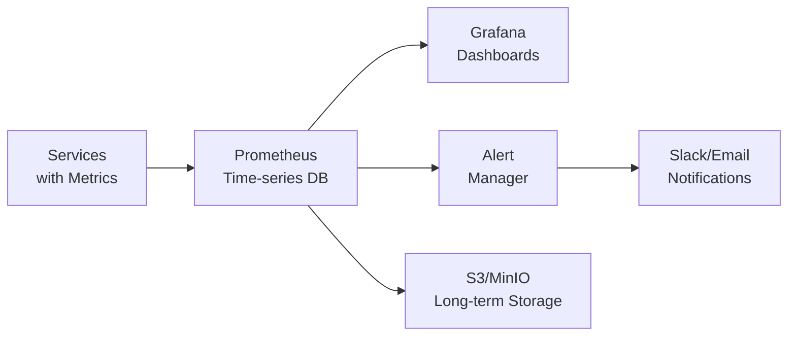

# Success Metrics

**Status**: Draft - To be completed during Week 2 planning
**Purpose**: Define measurable outcomes for the Knowledge Graph Lab project

## Overview
This document establishes the success criteria and metrics for evaluating the Knowledge Graph Lab project.

## Technical Success Metrics

### Performance Thresholds & SLAs

**Service Level Agreement (SLA)** defines the expected performance and availability guarantees for production systems. We measure performance through Service Level Indicators (SLIs) and commit to Service Level Objectives (SLOs).

#### Response Time Requirements

| Endpoint Type | P50 Latency | P95 Latency | P99 Latency | SLO Target |
| :------------ | :---------: | :---------: | :---------: | :--------: |
| Simple Query (GET /grants) | < 50ms | < 200ms | < 500ms | 99.9% |
| Complex Search | < 200ms | < 800ms | < 2000ms | 99.5% |
| AI Processing | < 1000ms | < 3000ms | < 5000ms | 99.0% |
| Graph Traversal | < 100ms | < 400ms | < 1000ms | 99.5% |
| Batch Operations | < 5000ms | < 15000ms | < 30000ms | 98.0% |

*Table 1: API response time SLOs by operation type*

**P50/P95/P99 Explained**: These percentiles show response times for 50%, 95%, and 99% of requests. For example, P95 < 200ms means 95% of requests complete within 200 milliseconds.

#### System Capacity Targets

- **Concurrent Users**: 500 simultaneous active sessions without degradation
- **Requests Per Second (RPS)**: 1000 RPS sustained, 2500 RPS burst (10 seconds)
- **Database Connections**: 100 concurrent connections with connection pooling
- **Background Jobs**: 50 concurrent Celery workers processing queue
- **Memory Usage**: < 4GB per service container under normal load
- **CPU Usage**: < 70% average, < 90% peak on 4-core instances

#### Degradation Thresholds & Alerts

When metrics exceed these thresholds, automated alerts trigger:

```yaml
# Prometheus alert rules
groups:
  - name: performance_alerts
    rules:
      - alert: HighLatency
        expr: http_request_duration_seconds{quantile="0.95"} > 0.8
        for: 5m
        annotations:
          summary: "P95 latency exceeds 800ms for 5 minutes"
          
      - alert: HighErrorRate
        expr: rate(http_requests_total{status=~"5.."}[5m]) > 0.01
        for: 2m
        annotations:
          summary: "Error rate exceeds 1% for 2 minutes"
          
      - alert: ServiceDown
        expr: up{job="api"} == 0
        for: 1m
        annotations:
          summary: "Service unavailable for 1 minute"
```

#### Availability Requirements

- **Uptime SLO**: 99.9% monthly (43.2 minutes downtime allowed)
- **Mean Time To Recovery (MTTR)**: < 15 minutes for critical issues
- **Mean Time Between Failures (MTBF)**: > 720 hours (30 days)
- **Deployment Success Rate**: > 95% (rollback < 5% of deployments)
- **Data Durability**: 99.999999% (nine nines) for critical user data

### Code Quality
- ✅ All modules pass integration tests with >85% code coverage
- ✅ Zero critical security vulnerabilities (OWASP Top 10)
- ✅ Code complexity score < 10 (McCabe Cyclomatic Complexity)
- ✅ Technical debt ratio < 5% (measured by SonarQube)
- ✅ All functions documented with docstrings
- ✅ Type hints on all Python functions
- ✅ Linting passes with zero errors (pylint score > 9.0)

### Module Independence
- ✅ Each module runs standalone with mock data
- ✅ Clear API boundaries between modules
- ✅ No shared code dependencies
- ✅ Individual module demos functional

### AI Integration
- ✅ Entity extraction accuracy > 75%
- ✅ Successful knowledge graph construction
- ✅ Content generation produces readable output
- ✅ API costs within budget constraints

## User Value Metrics

### User Journey Completion
- ✅ Grant discovery journey fully functional
- ✅ Research workflow operational
- ✅ Alert system delivering notifications
- ✅ Content personalization working

### Knowledge Quality
- ✅ 100+ entities in knowledge graph
- ✅ 500+ relationships mapped
- ✅ Daily content ingestion operational
- ✅ Accurate entity resolution

### Interface Usability
- ✅ Responsive design on mobile/desktop
- ✅ Sub-3 second page load times
- ✅ Intuitive navigation
- ✅ Accessibility standards met

## Educational Impact

### Intern Learning Outcomes
- ✅ Each intern completes assigned module
- ✅ Successful integration demonstration
- ✅ Code review participation
- ✅ Technical documentation created

### Skills Development
- Production-quality software development
- Modern AI/ML integration patterns
- Microservices architecture understanding
- Agile development practices

## Project Delivery

### Timeline Adherence
- Week 1: Research briefs completed
- Week 2: Architecture finalized
- Weeks 3-6: Tier 1 features delivered
- Weeks 7-9: Tier 2 features delivered
- Week 10: Successful demo

### Demonstration Readiness
- ✅ All modules integrated
- ✅ Demo script prepared
- ✅ Sample data populated
- ✅ Presentation materials ready

## Measurement Methodologies

### Data Collection Infrastructure

**Metrics Pipeline Architecture:**

<!-- DAB
id: metrics-pipeline
title: Metrics Collection and Monitoring Architecture
type: flowchart
actors: Services, Prometheus, Grafana, AlertManager, S3
must_show: data-flow, storage, alerting, dashboards
notes: Show complete observability stack
-->



*Figure 1: Metrics collection and alerting pipeline*

### Collection Methods by Metric Type

#### Performance Metrics

**Tool**: Prometheus + custom exporters
**Frequency**: Every 15 seconds for critical paths, 60 seconds for others
**Storage**: 15-day hot retention, 90-day cold storage in S3

```python
# Example metric collection in FastAPI
from prometheus_client import Counter, Histogram, Gauge
import time

# Define metrics
request_count = Counter('http_requests_total', 'Total HTTP requests', ['method', 'endpoint', 'status'])
request_latency = Histogram('http_request_duration_seconds', 'HTTP request latency')
active_users = Gauge('active_users', 'Currently active users')

@app.middleware("http")
async def track_metrics(request, call_next):
    start_time = time.time()
    response = await call_next(request)
    
    # Record metrics
    request_count.labels(
        method=request.method,
        endpoint=request.url.path,
        status=response.status_code
    ).inc()
    
    request_latency.observe(time.time() - start_time)
    
    return response
```

#### User Experience Metrics

**Tool**: Custom analytics service + Mixpanel
**Frequency**: Real-time event streaming
**Storage**: 7-day hot cache in Redis, indefinite in PostgreSQL

```javascript
// Frontend tracking example
class AnalyticsService {
    trackUserJourney(event) {
        const metrics = {
            event_type: event.type,
            user_id: this.getUserId(),
            session_id: this.getSessionId(),
            timestamp: Date.now(),
            page_load_time: performance.timing.loadEventEnd - performance.timing.navigationStart,
            time_to_interactive: performance.timing.domInteractive - performance.timing.navigationStart,
            browser: navigator.userAgent,
            viewport: { width: window.innerWidth, height: window.innerHeight }
        };
        
        // Send to analytics pipeline
        this.send('/api/analytics', metrics);
    }
}
```

#### Code Quality Metrics

**Tools**: pytest-cov, SonarQube, GitHub Actions
**Frequency**: On every commit (CI/CD pipeline)
**Storage**: GitHub Actions artifacts, SonarQube dashboard

```yaml
# GitHub Actions workflow for metrics collection
name: Quality Metrics
on: [push, pull_request]

jobs:
  metrics:
    runs-on: ubuntu-latest
    steps:
      - uses: actions/checkout@v2
      
      - name: Run Tests with Coverage
        run: |
          pytest --cov=src --cov-report=xml --cov-report=term
          
      - name: Check Code Complexity
        run: |
          radon cc src -s -j > complexity.json
          
      - name: Security Scan
        run: |
          bandit -r src -f json -o security.json
          
      - name: Upload to SonarQube
        env:
          SONAR_TOKEN: ${{ secrets.SONAR_TOKEN }}
        run: |
          sonar-scanner \
            -Dsonar.projectKey=knowledge-graph-lab \
            -Dsonar.sources=src \
            -Dsonar.python.coverage.reportPaths=coverage.xml
```

### Dashboard Configuration

**Primary Dashboards** (Grafana):

1. **System Health Dashboard**
   - Service uptime percentages
   - Error rates by service
   - Active alerts
   - Resource utilization graphs

2. **Performance Dashboard**
   - Request latency percentiles
   - Throughput (requests/second)
   - Database query performance
   - Cache hit ratios

3. **User Experience Dashboard**
   - Active users over time
   - User journey completion rates
   - Page load times by route
   - Error messages shown to users

4. **Business Metrics Dashboard**
   - Grants discovered per day
   - Knowledge graph growth rate
   - AI API usage and costs
   - User engagement metrics

### Reporting Cadences

| Report Type | Frequency | Audience | Format |
| :---------- | :-------: | :------- | :----- |
| Real-time Alerts | Immediate | On-call Engineer | Slack/PagerDuty |
| Daily Summary | 9 AM daily | Dev Team | Email + Slack |
| Weekly Performance | Monday 10 AM | Tech Lead | Grafana PDF |
| Sprint Metrics | Bi-weekly | Product Owner | JIRA Dashboard |
| Monthly Analysis | First Monday | Stakeholders | Executive Report |

*Table 2: Metric reporting schedule and formats*

---

## Week 10 Demo Day Success Criteria

### Individual Module Demonstrations

Each intern must demonstrate their module independently before integration:

#### Module Demo Requirements

1. **Live Functionality Demo** (10 minutes per module)
   - Start module with single command
   - Show core functionality with real data
   - Demonstrate error handling with invalid input
   - Display monitoring dashboard
   - Perform one bug fix live

2. **Technical Presentation** (5 minutes)
   - Architecture diagram explanation
   - Key design decisions and trade-offs
   - Performance metrics achieved
   - Challenges overcome
   - Learning highlights

3. **Code Walkthrough** (5 minutes)
   - Show most complex algorithm
   - Explain optimization made
   - Demonstrate test coverage
   - Review one pull request received

#### Demo Evaluation Rubric

| Criteria | Weight | Excellent (4) | Good (3) | Satisfactory (2) | Needs Work (1) |
| :------- | :----: | :------------ | :------- | :--------------- | :------------- |
| Functionality | 30% | All features work flawlessly | Minor bugs, core works | Some features incomplete | Major issues |
| Code Quality | 25% | Clean, documented, tested | Mostly clean, some gaps | Functional but messy | Poor quality |
| Performance | 20% | Exceeds all targets | Meets all targets | Meets most targets | Misses targets |
| Presentation | 15% | Clear, engaging, insightful | Good explanation | Adequate coverage | Unclear/incomplete |
| Innovation | 10% | Creative solutions applied | Some clever approaches | Standard implementation | No innovation |

*Table 3: Individual module demonstration scoring rubric*

### Integrated System Demonstration

**Demo Scenario**: "The Creator Success Story"

Live demonstration following a gaming content creator named "PixelQuest" through the entire user journey:

1. **Discovery Phase** (Module 1)
   - PixelQuest signs up with YouTube channel link
   - System extracts profile: 50K subscribers, indie gaming focus
   - Shows personalized dashboard

2. **Knowledge Graph** (Module 2)
   - System identifies PixelQuest as "Indie Gaming Creator" entity
   - Shows connections to similar successful creators
   - Displays grant opportunities network visualization

3. **Content Enhancement** (Module 3)
   - AI analyzes PixelQuest's content style
   - Generates grant application draft
   - Customizes tone to match creator's voice

4. **User Experience** (Module 4)
   - Clean, responsive interface on mobile and desktop
   - Real-time updates as system processes
   - Accessibility features demonstrated

5. **Alert System** (Module 5)
   - New grant matching profile appears
   - Email and in-app notification sent
   - Shows notification preferences

6. **Load Testing** (All Modules)
   - Simulate 100 concurrent users
   - Show dashboards maintaining performance
   - Demonstrate graceful degradation

### Portfolio Documentation Standards

Each intern must deliver:

1. **Technical Documentation** (Markdown, 2000+ words)
   - Module architecture with diagrams
   - API documentation with examples
   - Setup and deployment guide
   - Troubleshooting section

2. **Code Portfolio** (GitHub)
   - Clean commit history
   - Meaningful pull request descriptions
   - Code review participation (give and receive)
   - 85%+ test coverage

3. **Learning Reflection** (Blog post, 1000+ words)
   - Technical challenges faced
   - Solutions implemented
   - Skills developed
   - Future improvements suggested

4. **Demo Video** (5-minute screencast)
   - Module running independently
   - Key features highlighted
   - Technical explanation included
   - Posted to intern's portfolio site

### "Ship-Ready" Definition

The system is considered "ship-ready" when:

**Functional Completeness**:
- ✅ All Tier 1 features operational
- ✅ 80% of Tier 2 features complete
- ✅ Zero critical bugs in production
- ✅ All security vulnerabilities patched

**Operational Readiness**:
- ✅ Deployment automated with single command
- ✅ Monitoring dashboards configured
- ✅ Alerts configured for critical paths
- ✅ Backup and recovery tested
- ✅ Load tested to 2x expected capacity

**Documentation Complete**:
- ✅ User documentation published
- ✅ API documentation with examples
- ✅ Operations runbook created
- ✅ Architecture decisions recorded

**Team Readiness**:
- ✅ On-call rotation established
- ✅ Incident response plan documented
- ✅ Knowledge transfer sessions complete
- ✅ Post-mortem process defined

---

## Intern Learning Outcomes Measurement

### Technical Skills Assessment

**Pre-Project Baseline** (Week 0):
Each intern completes a technical assessment covering:
- Python/JavaScript fundamentals
- Database concepts
- API design basics
- Git workflow
- System design principles

**Mid-Project Check-in** (Week 5):
- Code review of completed features
- Pair programming session with mentor
- Technical quiz on production concepts learned
- Self-assessment of skill growth

**Final Assessment** (Week 10):
- Complete module delivered and documented
- Ability to debug production issues demonstrated
- System design interview with technical lead
- Presentation of technical decisions

### Code Quality Evaluation Criteria

```python
# Scoring rubric for code quality
class CodeQualityScore:
    def calculate_score(self, module_code):
        scores = {
            'functionality': self.assess_functionality(),      # 30%: Does it work?
            'readability': self.assess_readability(),         # 20%: Is it clear?
            'efficiency': self.assess_efficiency(),           # 15%: Is it optimized?
            'testing': self.assess_test_coverage(),           # 20%: Is it tested?
            'documentation': self.assess_documentation(),     # 15%: Is it documented?
        }
        
        weighted_score = sum(score * weight for score, weight in scores.items())
        return weighted_score, self.generate_feedback(scores)
```

### Collaboration Effectiveness Metrics

- **Code Review Participation**: Reviews given/received ratio > 1.0
- **Pull Request Quality**: Average approval time < 24 hours
- **Communication**: Daily standup participation > 90%
- **Knowledge Sharing**: At least 2 technical blog posts or presentations
- **Pair Programming**: Minimum 10 hours logged

### Professional Growth Indicators

| Skill Area | Entry Level | Expected Exit Level | Measurement Method |
| :--------- | :---------- | :------------------ | :----------------- |
| System Design | Academic projects | Production architecture | Design review score |
| Debugging | Print statements | Profilers & debuggers | Live debug session |
| Testing | Manual testing | Automated test suites | Coverage & quality |
| DevOps | Local development | CI/CD pipelines | Pipeline creation |
| Monitoring | Check logs manually | Dashboards & alerts | Dashboard created |

*Table 4: Professional skill progression expectations*

### Self-Assessment vs Peer Assessment

Interns complete weekly assessments rating themselves 1-5 on:
- Technical capability
- Problem-solving skills
- Communication effectiveness
- Team contribution
- Learning progress

Peers provide anonymous 360-degree feedback on:
- Code review helpfulness
- Collaboration quality
- Knowledge sharing
- Reliability
- Technical growth observed

**Calibration Formula**:
```
Growth Score = (0.3 × Self) + (0.4 × Peer) + (0.3 × Mentor)
```

---

## Post-Project Evaluation Criteria

### Long-term System Sustainability Metrics

**3-Month Post-Launch Review**:
- System uptime percentage (target: >99.5%)
- Number of production incidents (target: <5 critical)
- Technical debt accumulated (measured by SonarQube)
- Performance degradation (latency increase <10%)
- Security vulnerabilities discovered (target: 0 critical)

**6-Month Sustainability Check**:
- New features added by other developers
- Documentation still accurate (>90%)
- Deployment frequency maintained (weekly)
- Test coverage maintained (>80%)
- Code complexity trend (stable or improving)

### User Adoption and Retention Tracking

```sql
-- Key adoption metrics query
SELECT 
    DATE_TRUNC('week', created_at) as week,
    COUNT(DISTINCT user_id) as new_users,
    COUNT(DISTINCT CASE 
        WHEN last_active > created_at + INTERVAL '7 days' 
        THEN user_id END) as retained_users,
    AVG(grants_discovered) as avg_grants_per_user,
    AVG(session_duration) as avg_session_minutes
FROM user_metrics
GROUP BY week
ORDER BY week;
```

**Success Targets**:
- Week 1 retention: >40%
- Month 1 retention: >20%
- Daily active users: >100 after 3 months
- User satisfaction (NPS): >30

### Technical Debt Assessment

**Debt Categories to Track**:

| Debt Type | Measurement | Acceptable Level | Action Threshold |
| :-------- | :---------- | :--------------- | :--------------- |
| Code Duplication | Lines of duplicated code | <5% | >10% |
| Outdated Dependencies | Dependencies behind latest | <10 | >20 |
| Missing Tests | Uncovered critical paths | 0 | Any |
| Documentation Gaps | Undocumented public APIs | <5% | >15% |
| Performance Debt | Unoptimized queries | <5 | >10 |
| Security Debt | Unpatched vulnerabilities | 0 critical | Any critical |

*Table 5: Technical debt monitoring thresholds*

### Knowledge Transfer Effectiveness

**Documentation Quality Score**:
- New developer onboarding time: <2 days to first commit
- Questions asked during onboarding: <10 for basic setup
- Time to understand module architecture: <4 hours
- Ability to make changes: Successful PR within first week

**Knowledge Transfer Sessions**:
- Each intern conducts 2 knowledge transfer sessions
- Sessions recorded and available for future reference
- Handover documentation completeness score >90%
- "Bus factor" increased from 1 to 3+ for each module

### Career Impact Measurement

**3-Month Follow-up Survey**:
- Current employment status
- Technologies from project used in current role
- Confidence in production systems (1-10 scale)
- Interview success rate improvement
- Salary negotiations aided by project experience

**6-Month Career Check**:
- Promotions or role changes
- Leading similar projects
- Mentoring others based on learnings
- Open source contributions inspired by project
- Professional network growth from project

**Success Story Template**:
```markdown
## Intern Success Story: [Name]

**Role During Project**: Module [X] Developer
**Current Position**: [Title] at [Company]

### Technical Skills Gained
- Production Python/FastAPI development
- Microservices architecture
- AI/ML integration
- DevOps and monitoring

### Career Impact
"The Knowledge Graph Lab project gave me the confidence to..."

### Advice for Future Interns
[Key learnings and recommendations]
```

**Long-term Success Metrics**:
- 80% of interns in tech roles within 6 months
- 60% using project technologies professionally
- 100% report increased confidence in production systems
- 50% contribute to open source within a year
- Average starting salary increase of 15-20%

---

## Continuous Improvement Process

### Metric Review Cycles

- **Daily**: Error rates, uptime, active alerts
- **Weekly**: Sprint velocity, code coverage, user growth
- **Monthly**: Technical debt, performance trends, costs
- **Quarterly**: Architecture review, skill assessments, career tracking

### Feedback Integration

All metrics feed into continuous improvement:

1. **Identify**: Metric indicates problem or opportunity
2. **Analyze**: Root cause analysis with team
3. **Plan**: Create improvement action items
4. **Implement**: Deploy fixes or enhancements
5. **Measure**: Verify improvement through metrics
6. **Document**: Record learnings for future projects

This creates a virtuous cycle where the system and team continuously improve based on objective measurements and real-world feedback.