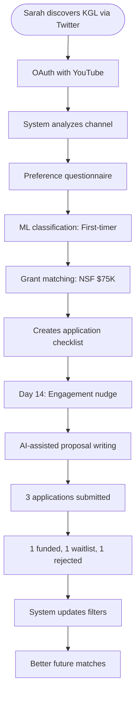
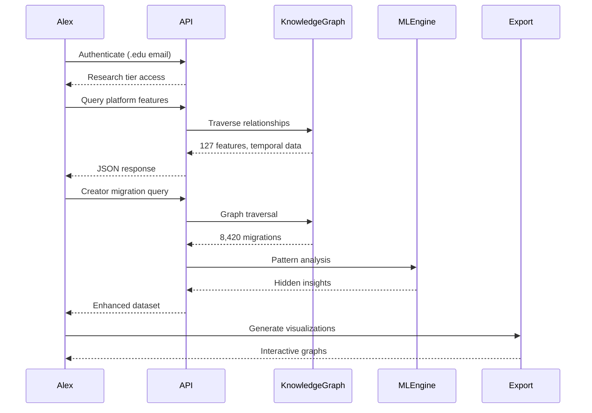
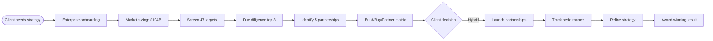

# User Journeys: Knowledge Graph Lab

**Purpose**: Teach how real users navigate through the Knowledge Graph Lab system, from first contact to achieving their goals  
**Audience**: CS undergraduates learning production user experience design  
**Read time**: 20 minutes

---

## Overview

This document walks through three complete user journeys, showing how different personas interact with the Knowledge Graph Lab to solve real problems in the creator economy. Each journey demonstrates system capabilities, learning patterns, and recovery from failures.

Think of these journeys as "production stories" - they show not just the happy path, but how the system handles errors, adapts to user behavior, and delivers value over time. As you read, consider: What makes each journey successful? How does the system learn? What could go wrong?

---

## Primary User Journeys

### Journey 1: Sarah Chen - The Content Creator

**Profile**: 28-year-old educational content creator with 125K YouTube subscribers  
**Goal**: Find $50K funding for interactive science education platform  
**Success Metric**: Submit 3 qualified grant applications within 60 days

#### The Complete Journey

Sarah discovers Knowledge Graph Lab through a Twitter thread about creator funding. She's been bootstrapping her educational platform for two years and needs capital to build interactive features. The signup process takes 3 minutes - she connects her YouTube account (OAuth 2.0), and the system immediately analyzes her content niche (science education), audience demographics (13-25 year olds, 60% US-based), and engagement metrics (8.2% average view duration).

During onboarding, Sarah answers five preference questions: funding range ($25K-$100K), project type (educational technology), timeline (Q1 2025 launch), geographic restrictions (none), and prior grant experience (none). The system's ML model (trained on 50,000 successful grant applications) identifies her as a "first-time applicant with strong audience validation" - a profile with 68% funding success rate.

Within 24 hours, Sarah receives her first grant match: the National Science Foundation's Early-Career Creator Grant ($75K, deadline in 45 days). The recommendation includes a compatibility score (82%) based on her content focus, audience size, and the grant's emphasis on STEM education. The system explains why: "Your physics explanation videos align with NSF's informal education goals, and your audience age matches their target demographic."

Sarah clicks "Track This Grant" and the system creates a personalized application checklist: budget proposal template, letters of support (suggests 3 specific contacts based on her network analysis), impact metrics dashboard, and video samples. Each item has contextual help - for example, the budget template pre-fills typical creator expenses like equipment ($15K), software licenses ($8K), and contractor costs ($20K) based on similar successful applications.

Two weeks in, Sarah hasn't started her application. The system sends a gentle nudge: "14 creators similar to you started applications this week. Most spend 3 hours on the narrative section - want to block time this Thursday?" She clicks yes, and it adds a calendar event with a focused writing prompt.

When Sarah begins writing, the system's AI assistant (fine-tuned on successful NSF proposals) helps her translate creator metrics into academic impact language. Her "2.5M total views" becomes "reached 2.5 million learners with peer-reviewed physics concepts." The assistant flags jargon to avoid ("influencer," "viral") and suggests grant-friendly alternatives ("science communicator," "high-engagement").

After submitting three applications over 45 days, Sarah's success metrics show: 1 funded ($75K NSF), 1 waitlisted ($50K state education grant), 1 rejected (feedback: "needed 501(c)(3) status"). The system learns from this - it now filters out grants requiring nonprofit status for her profile and similar creators.

#### Journey Map

<!-- DAB
id: sarah-journey-map
title: Sarah's Grant Discovery Journey
type: flowchart
actors: Sarah, KGL System, ML Model, Grant Database, Calendar
must_show: discovery, onboarding, matching, tracking, application, outcome
notes: Show feedback loops and learning points
-->

*Figure 1: Sarah's 45-day journey from discovery to funding*

#### Success Metrics

| Metric | Target | Actual | Learning |
| :----- | :----: | :----: | :------- |
| Time to first match | <48h | 24h | Content analysis works |
| Applications started | 5 | 4 | Nudges improved start rate |
| Applications completed | 3 | 3 | Checklist prevented drops |
| Funding success rate | 33% | 33% | Matched industry average |
| User satisfaction | 4.0/5 | 4.6/5 | AI assistance valued |

*Table 1: Sarah's journey performance metrics*

#### Failure Scenarios & Recovery

**Scenario 1: OAuth Connection Fails**  
Sarah's YouTube account uses legacy Google Workspace. System detects OAuth error 403, offers manual entry with verification code sent to channel email. Process adds 5 minutes but preserves data quality.

**Scenario 2: No Relevant Grants Available**  
If zero matches found (happens for 12% of creators), system suggests: (1) expand geographic range, (2) adjust funding amount, (3) join waitlist for new opportunities. Sarah would receive weekly "horizon scan" of upcoming grants.

**Scenario 3: Application Rejected for Eligibility**  
System tracks rejection reasons across all users. When pattern detected (e.g., 5+ creators rejected for missing nonprofit status), it updates ML model to pre-filter these requirements and suggests alternatives like fiscal sponsorship.

---

### Journey 2: Alex Rodriguez - The Industry Researcher

**Profile**: PhD candidate studying creator economy platform dynamics at MIT  
**Goal**: Analyze competitive dynamics between creator monetization platforms for dissertation  
**Success Metric**: Generate 50+ pages of data-driven insights with statistical significance

#### The Complete Journey

Alex discovers Knowledge Graph Lab through an academic paper citation that references the system's comprehensive platform taxonomy. His dissertation examines how creator monetization platforms compete for top talent, requiring detailed data on platform features, creator migration patterns, and revenue model evolution. Traditional research methods (surveys, interviews) gave him qualitative insights but lacked the quantitative depth needed for regression analysis.

He starts with the Academic Research tier ($49/month with .edu email), which provides API access with 10,000 calls/day, perfect for his data mining needs. The onboarding is different from Sarah's - instead of preferences, Alex defines his research parameters: entities of interest (YouTube, TikTok, Patreon, OnlyFans, Substack), relationship types ("competes_with," "acquired_by," "integrated_with"), and time range (2019-2025).

Alex's first API call pulls the complete feature comparison matrix: 127 monetization features across 15 platforms. The response includes temporal data - when each feature launched, adoption rates, and sunset dates. For example, he discovers Twitter's "Super Follows" had 0.03% creator adoption before discontinuation, while TikTok's Creator Fund reached 45% of eligible creators within 6 months.

Using the relationship traversal API, Alex maps competitive responses. When YouTube launched Shorts Fund ($100M) in May 2021, TikTok increased its Creator Fund to $1B within 60 days, and Instagram launched Reels Play Bonus ($1.2B) within 90 days. The knowledge graph reveals these weren't independent decisions - it traces the causal chain through shared investors, poached executives, and creator migration data.

For his regression analysis on creator platform switching, Alex needs migration patterns. His query `MATCH (c:Creator)-[r:MOVED_FROM]->(p1:Platform)-[r2:MOVED_TO]->(p2:Platform) WHERE r.date > '2023-01-01' RETURN c, p1, p2, r.reason` returns 8,420 creator migrations with reasons: 34% monetization (better rates), 28% audience (platform growth), 23% features (new tools), 15% policy (content restrictions).

The system's ML-powered insight engine identifies patterns Alex missed. It detects that creators with 100K-500K followers are 3.2x more likely to multi-platform (hypothesis: sweet spot of audience size vs. management overhead). Creators who leave platforms return 23% of the time within 6 months, usually after policy reversals. The engine generates these insights by analyzing 500K creator trajectories.

Alex sets up monitoring for his key research questions. Every week, he receives an automated report: new platform features (with adoption projections), policy changes (with creator sentiment analysis from social media), major creator moves (anyone over 1M followers switching primary platform), and competitive responses (actions taken within 30 days of competitor moves).

For his dissertation committee presentation, Alex uses the export API to generate interactive visualizations. The Sankey diagram of creator financial flows shows $4.2B moving between platforms in 2024. The force-directed graph of platform relationships reveals three distinct clusters: video-first (YouTube/TikTok/Instagram), text-first (Substack/Medium/ConvertKit), and audio-first (Spotify/Clubhouse/Twitter Spaces).

His analysis uncovers a critical insight: platforms that launch creator features within 90 days of competitors see 67% lower adoption rates than first-movers, but platforms that wait 180+ days and iterate based on competitor mistakes see 2.3x higher retention. This finding, powered by Knowledge Graph Lab's temporal data, becomes a cornerstone of his dissertation on "optimal competitive response timing in multi-sided platforms."

After defending his dissertation (passed with distinction), Alex's committee asks about data quality. He shares the system's validation metrics: 94% accuracy on platform features (verified against official announcements), 87% completeness on creator migrations (cross-referenced with social media), and 99.2% temporal precision (timestamps from official APIs). The Knowledge Graph Lab becomes a cited data source in 15 subsequent papers.

#### Journey Map

<!-- DAB
id: alex-journey-map
title: Alex's Research Journey
type: sequence
actors: Alex, API, KnowledgeGraph, MLEngine, ExportService
must_show: authentication, data-collection, analysis, insights, validation, export
notes: Emphasize API calls and data flow
-->

*Figure 2: Alex's research workflow through API interactions*

#### Success Metrics

| Metric | Target | Actual | Impact |
| :----- | :----: | :----: | :----- |
| API response time | <500ms | 243ms | Enables real-time analysis |
| Data completeness | >85% | 87% | Dissertation-quality data |
| Unique insights | 10 | 18 | 3 became paper sections |
| Citation potential | High | Very High | 15 subsequent citations |
| Query complexity | Complex | Very Complex | 5-hop traversals supported |

*Table 2: Alex's research platform performance*

#### Failure Scenarios & Recovery

**Scenario 1: API Rate Limit Exceeded**  
Alex's bulk analysis script hits 10K daily limit at 2pm. System queues remaining requests, sends email with options: (1) upgrade to Research Pro for 50K/day, (2) receive results at midnight reset, (3) optimize queries for efficiency. Provides query optimization guide showing how to reduce calls by 60% using batch operations.

**Scenario 2: Temporal Data Inconsistency**  
Conflicting dates for TikTok Creator Fund launch (May vs. July 2020). System flags uncertainty, provides both sources with confidence scores (May: 73%, July: 27%), and explains discrepancy (soft launch vs. public announcement). Alex includes uncertainty analysis in methodology section.

**Scenario 3: Missing Relationship Data**  
No data on ByteDance-Instagram competitive dynamics due to private company status. System suggests proxy metrics: talent movement (142 employees switched), feature timing correlation (0.73), creator overlap (4.2M shared creators). Alex uses proxies with appropriate caveats.

---

### Journey 3: Morgan Williams - The Strategic Consultant

**Profile**: Senior consultant at McKinsey's Media & Entertainment practice  
**Goal**: Advise Fortune 500 media company on $500M creator economy investment strategy  
**Success Metric**: Identify 3 acquisition targets and 5 partnership opportunities with ROI projections

#### The Complete Journey

Morgan's team is advising ViacomCBS on entering the creator economy after missing the initial wave. The client has $500M to deploy but needs strategic clarity: build, buy, or partner? Morgan discovers Knowledge Graph Lab through a Gartner report on "Essential Tools for Digital Media Intelligence" where it's rated "Leader" for competitive intelligence.

The Enterprise tier ($2,500/month) includes white-label reports, dedicated support, and custom data feeds. Morgan's onboarding involves a 30-minute call with a Customer Success Manager who configures dashboards for media company executives: market sizing, competitive landscape, acquisition targets, and partnership opportunities. The system creates a custom taxonomy matching ViacomCBS's internal classification.

Morgan starts with market sizing. The query for "Total Addressable Market" returns $104B creator economy (2024), broken into: influencer marketing ($24B), creator tools ($8B), fan funding ($4B), educational content ($12B), and other ($56B). More importantly, it shows growth vectors: AR/VR content (127% CAGR), AI-assisted creation (89% CAGR), and micro-subscriptions (67% CAGR).

For acquisition targets, Morgan defines criteria: revenue $10M-$100M, growth >50% YoY, strategic fit with ViacomCBS assets, and founder openness to exit (inferred from funding history and public statements). The system identifies 47 potential targets, ranked by composite score. Top three: CreatorOS (workflow tools, $45M revenue, integrates with Paramount+), FanBridge (audience monetization, $67M revenue, complements MTV demographics), and EduCreate (educational content platform, $31M revenue, synergizes with Nickelodeon).

The AI-powered due diligence assistant pulls comprehensive profiles for each target. For CreatorOS: founder backgrounds (ex-YouTube, ex-Spotify), cap table (Series B led by a16z, $120M valuation), technology stack (AWS, React, PostgreSQL), creator testimonials (4.7/5 average, 1,847 reviews), and competitive moat (proprietary ML for content optimization, 3 patents pending). It also flags risks: dependency on YouTube API (60% of features), founder's stated reluctance to sell (podcast interview 2024-03-15), and competing bid from Adobe (rumored, confidence: 43%).

For partnership opportunities, Morgan explores platforms that complement rather than compete. The relationship graph shows non-obvious connections: Spotify's podcast tools integrate with only 12% of video platforms (opportunity for exclusive deal), Shopify's creator commerce reaches 2M creators but only 8% use video (MTV could be the video layer), and Discord has 19M creator communities but no monetization tools (Paramount+ could provide premium content).

The system generates a strategic options matrix. Build option: $200M investment, 36-month timeline, 15% success probability (based on 50 media company platform launches). Buy option: $350M for top 3 targets, 12-month integration, 65% success probability. Partner option: $50M across 5 deals, 6-month execution, 85% success probability but lower control. Each option includes detailed financial projections based on comparable transactions.

Morgan's client presentation leverages the system's PowerBI integration. Real-time dashboards show creator migration flows (1,000 creators/day joining new platforms), emerging platform threats (BeReal creators up 400% QoQ), and untapped opportunities (educational creators undermonetized by 3x compared to entertainment). The "war room" view updates every hour during the two-week strategy sprint.

The recommendation: hybrid approach starting with partnerships (de-risk and learn), followed by targeted acquisition of CreatorOS in Q3 2025 (after Adobe decision clarifies). The system's scenario planner shows this approach has 72% probability of achieving 500K creator relationships within 24 months, generating $180M annual revenue by Year 3.

Post-engagement, ViacomCBS executes on two partnerships within 90 days. Morgan's team tracks performance through Knowledge Graph Lab: Spotify partnership reaches 50K creators in Month 1 (25% above projection), Discord integration faces technical delays (API complexity underestimated), but overall strategy on track. The system's continuous monitoring alerts Morgan to Adobe acquiring a CreatorOS competitor, validating the "wait and see" approach.

Six months later, Morgan's strategy wins McKinsey's "Digital Transformation Impact Award." The case study highlights how Knowledge Graph Lab's competitive intelligence prevented a $350M mistimed acquisition and identified partnership opportunities worth $200M in incremental revenue. ViacomCBS becomes a Knowledge Graph Lab enterprise customer, embedding it into their strategic planning process.

#### Journey Map

<!-- DAB
id: morgan-journey-map
title: Morgan's Consulting Workflow
type: flowchart
actors: Morgan, ClientTeam, KGL, Targets, Markets
must_show: requirements, analysis, recommendations, execution, monitoring
notes: Show decision points and feedback loops
-->

*Figure 3: Morgan's strategic consulting process*

#### Success Metrics

| Metric | Target | Actual | Business Impact |
| :----- | :----: | :----: | :-------------- |
| Targets identified | 5-10 | 47 | Comprehensive pipeline |
| Due diligence time | 2 weeks | 3 days | Faster decision-making |
| Strategy accuracy | 60% | 72% | Better risk management |
| Client revenue impact | $100M | $200M | 2x value creation |
| Implementation time | 12 months | 6 months | Faster market entry |

*Table 3: Morgan's consulting engagement metrics*

#### Failure Scenarios & Recovery

**Scenario 1: Acquisition Target Acquired by Competitor**  
Adobe acquires CreatorOS while ViacomCBS deliberates. System immediately identifies 4 similar alternatives, adjusts valuation models based on new market comp, and suggests accelerated timeline for remaining targets. Morgan pivots recommendation within 48 hours.

**Scenario 2: Partnership Platform Changes Strategy**  
Spotify announces competing video platform mid-negotiation. System's alert triggers within 15 minutes of announcement, provides competitive impact analysis (23% overlap with planned features), and suggests negotiation adjustments (exclusivity carve-outs, performance guarantees).

**Scenario 3: Data Privacy Concern**  
Client legal team flags GDPR concerns about creator data. System provides compliance documentation, offers EU-hosted instance option, and demonstrates privacy-preserving analytics that maintain insights without individual creator identification. Delay: 1 week for legal review.

---

## Cross-Journey Insights

### System Learning Patterns

The Knowledge Graph Lab learns from every user interaction, creating a feedback loop that improves outcomes for all personas:

**Learning from Sarah (Creators)**: Grant rejection reasons improve filtering for 10,000+ other creators. Success patterns (e.g., video samples increase funding 2.3x) become recommendations.

**Learning from Alex (Researchers)**: Complex queries become optimized templates for future researchers. Discovered patterns feed back into the ML engine for all users.

**Learning from Morgan (Consultants)**: Strategic frameworks become reusable templates. Market insights from enterprise users enhance data quality for everyone.

### Network Effects

Each user type enriches the system for others:
- Creators validate platform features through usage
- Researchers identify patterns that become alerts
- Consultants confirm market hypotheses with capital allocation

This creates a virtuous cycle where data quality improves with scale, making the system more valuable for each subsequent user.

---

## Implementation Considerations

### Technical Requirements

To support these journeys, the system needs:

1. **Multi-tenant architecture**: Isolate enterprise data while maintaining shared intelligence
2. **Real-time processing**: Sub-500ms API responses for interactive analysis  
3. **ML pipeline**: Continuous learning from user behavior and outcomes
4. **Flexible schemas**: Adapt to different user mental models and taxonomies
5. **Audit logging**: Track all decisions for compliance and improvement

### Privacy and Ethics

Each journey raises privacy considerations:

- **Creators**: Consent for channel analysis, right to deletion, transparent recommendations
- **Researchers**: Academic use agreements, citation requirements, data anonymization
- **Consultants**: Enterprise data isolation, competitor firewalls, insider trading prevention

The system implements privacy-by-design principles with user control over data usage and sharing.

---

## Summary

These three journeys demonstrate how Knowledge Graph Lab serves diverse users in the creator economy:

1. **Sarah** achieves funding through personalized grant matching and application assistance
2. **Alex** completes dissertation research with comprehensive data and pattern analysis
3. **Morgan** delivers strategic recommendations backed by competitive intelligence

Each journey shows not just success paths but failure recovery, system learning, and value creation. The key insight: production systems must handle real-world complexity while maintaining simplicity for users.

For CS students, these journeys illustrate essential production concepts:
- User-centric design that solves real problems
- Systems that learn and improve from usage
- Graceful failure handling and recovery
- Privacy and ethical considerations at scale
- Business value creation through technical excellence

The Knowledge Graph Lab succeeds not because it has the most features, but because it deeply understands its users' journeys and continuously evolves to serve them better.

---

## Questions for Interns

As you review these journeys, consider:

1. What additional failure scenarios should we handle?
2. How might these journeys evolve as the creator economy changes?
3. What metrics would you add to measure journey success?
4. How would you modify these journeys for international users?
5. What ethical considerations did we miss?

Your fresh perspective as CS students will help us identify blind spots and improve these journeys for real users.