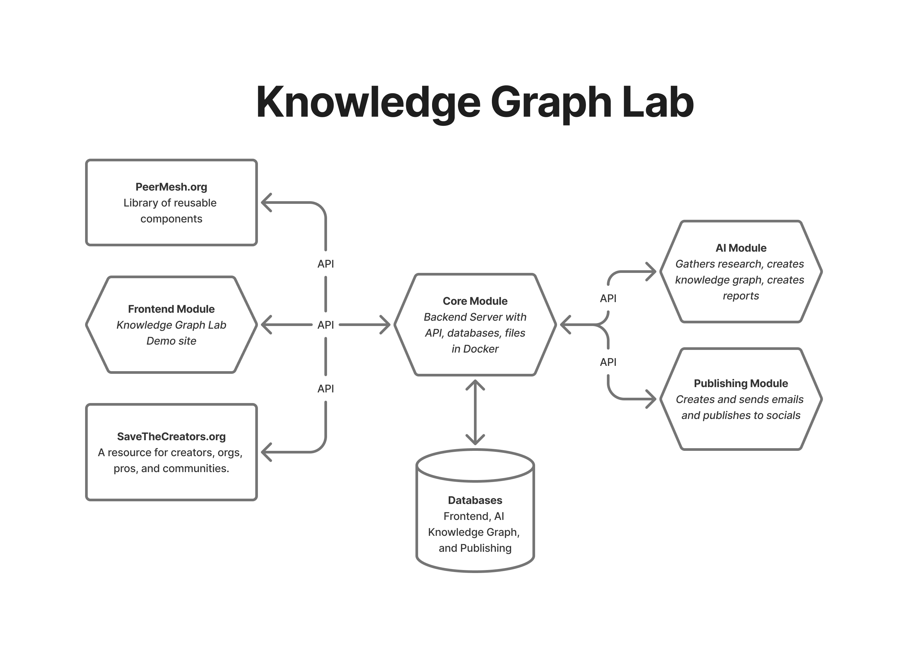
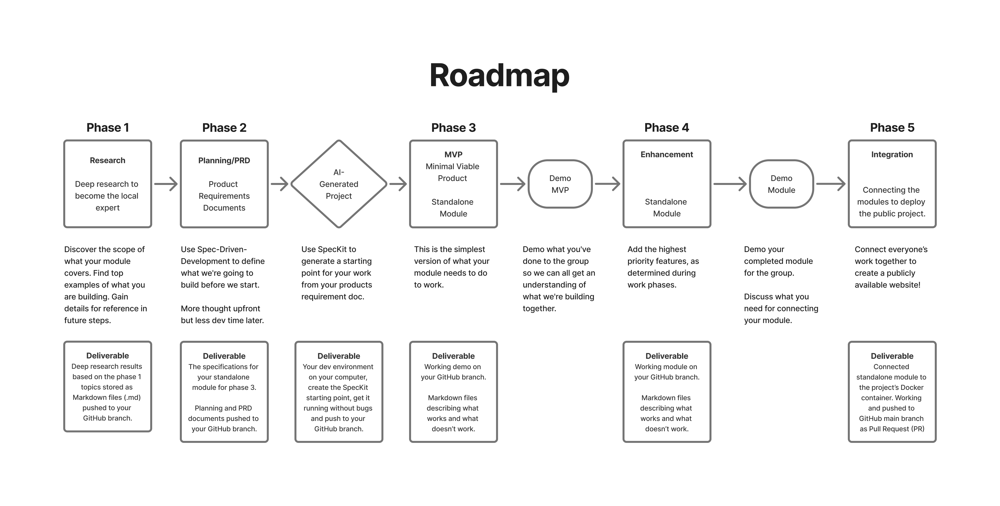

# Team Start Here

Welcome! You're here to build a module. Let's get you to the right place.

## System Architecture

*The Knowledge Graph Lab consists of interconnected modules that work together through a central Core Module. Each team member will be building one of these specialized modules.*

## Module Assignment Table

| Your Role | Your Module Directory | Assignment File | Example Focus |
|-----------|----------------------|--------------|---------------|
| Backend Engineer | module-assignments/backend-architecture/ | 02-phase-1-research/02b-phase-1-research-assignment.md | PostgreSQL vs MongoDB comparison matrix |
| Frontend Developer | module-assignments/frontend-design/ | 02-phase-1-research/02b-phase-1-research-assignment.md | React vs Vue framework evaluation |
| AI/ML Engineer | module-assignments/ai-development/ | 02-phase-1-research/02b-phase-1-research-assignment.md | LangChain vs LlamaIndex implementation guide |
| Content Systems | module-assignments/publishing-tools/ | 02-phase-1-research/02b-phase-1-research-assignment.md | Multi-channel API integration analysis |

## Quick Links

- **System Overview**: [../design/product/system-overview.md](../design/product/system-overview.md) - What we're building and how modules connect (READ FIRST)
- **Git Workflow**: [git-workflow.md](git-workflow.md) - How to submit your work
- **[Phase 2 Deliverables (SpecKit)](project-plan/phase-2-deliverables.md)** - PRD requirements for code generation
- **Project Plan**: [project-plan/overview.md](project-plan/overview.md) - All phases and deliverables
- **Module Ownership**: [module-ownership.md](module-ownership.md) - Who owns what and communication channels
- **Research Methodology**: [../design/research/methodology.md](../design/research/methodology.md) - How to conduct research
- **New team member?**: [onboarding.md](onboarding.md) - Complete setup guide
- **Project vision**: [../design/strategy/vision.md](../design/strategy/vision.md) - Core mission and objectives

## Development Roadmap

*This roadmap shows the 5-phase development process you'll follow: from initial research through to final integration. Each phase builds upon the previous one, culminating in a connected, publicly available system.*

## Your Next Steps

1. **Review the project plan**: [project-plan/overview.md](project-plan/overview.md) - Understand all phases
2. **Check phase deliverables**: [project-plan/phase-1-deliverables.md](project-plan/phase-1-deliverables.md) - Phase 1 requirements
3. **Navigate to your module**: Go to your assigned module directory from the table above
4. **Complete your assigned work**: Follow the guidance in your module's assignment files

## Module Work Structure

Each module directory contains:
- `01-work-description.md` - Your module's complete scope
- `02-phase-1-research/` - Phase 1 research documents
  - `02a-phase-1-research-overview.md` - Phase 1 research context
  - `02b-phase-1-research-assignment.md` - Phase 1 specific tasks
  - `02c-phase-1-research-advanced.md` - Additional resources
- `03-phase-2-prd+plan/` - Phase 2 PRD and implementation documents
  - `03a-phase-2-prd-overview.md` - Phase 2 PRD context
  - `03b-phase-2-prd-assignment.md` - Phase 2 specific tasks
  - `03c-phase-2-prd-advanced.md` - Advanced implementation guidance
