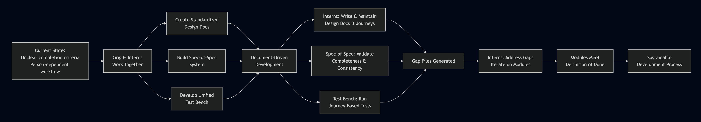

# Knowledge Graph Lab Intern Strategy Meeting

**Date**: December 1, 2025

**Purpose**: Document-Driven Development & Spec-of-a-Spec System

---

## Meeting Purpose

- Explain the current state of Knowledge Graph Lab intern work
- Present document-driven development (DDD) strategy
- Introduce spec-of-a-spec system
- Clarify intern roles and expectations

---

## Current State and Pain Points

**Time Constraint:**
- Interns have ~100 hours total
- We are ~50% through the internship
- Weekly 1-hour meetings

**Current Challenges:**
- Interns often feel they "don't know what to do next"
- Specs mostly written by Grig, run through SpecKit
- Produces: OpenAPI specs, backend implementations, basic web frontends

---

## Current Pain Points (continued)

**Intern Confusion:**
- Don't know when a module is "done"
- Don't know how to judge if endpoints are complete
- Unclear definition of completion

**Bottleneck:**
- Grig is the bottleneck: too much pre-work and context-building
- Not enough time to productize work
- Need to shift from person-driven to document-driven

---

## Planned Approach: Document-Driven Development

**Core Principle:**
- Standardized design-doc set in `docs/`
- Code and AI artifacts must map back to those docs
- "Definition of Done" lives in documents, not in one person's head

**Benefits:**
- Clear completion criteria
- Self-service for interns
- Reduced dependency on single person for context

---

## Planned Approach: Spec-of-a-Spec System

**What It Is:**
- Meta-layer that checks design docs, user journeys, and module specs
- Validates completeness and consistency
- Generates structured "gap" artifacts when something is missing

**Output:**
- Gap files in Markdown format
- Clear identification of what's missing or inconsistent
- Actionable items for completion

---

## Planned Approach: Unified Test Bench

**Standard Infrastructure:**
- Common UI and process every module plugs into
- Runs user-journey-driven scenarios against module APIs
- Logs issues and gaps as Markdown

**Benefits:**
- Consistent testing across all modules
- Journey-based validation
- Automated gap detection

---

## Intern Role Reframing

**Not Just Implementers:**
- Interns are not waiting for perfect instructions
- They become active contributors to the system

**New Roles:**
- Design-doc miners and synthesizers
- User-journey authors and maintainers
- Spec-of-spec operators
- Module shepherds

---

## Intern Responsibilities

**Design-Doc Mining:**
- Extract value from scattered notes and documentation
- Synthesize into structured design documents

**User-Journey Management:**
- Write and maintain user journey documentation
- Ensure journeys reflect actual use cases

**Spec-of-Spec Operations:**
- Run spec-of-spec checks
- Read and interpret gap files
- Address identified gaps

---

## Intern Responsibilities (continued)

**Module Ownership:**
- Own the coherence of a module's:
  - Design doc
  - Interfaces
  - Definition of Done
- Ensure module meets completion criteria

**Active Participation:**
- Identify gaps proactively
- Propose solutions
- Drive module to completion

---

## Process Flow: Building the New System

**Interactive Version:** [View on Mermaid Live](https://mermaid.live/view#pako:eNpdU21vqjAU_itNP9xP4hVBVHKzZMJ0Ok2Wud0lF_3Q0aM2g5aUss0Z__ttC0YdCYGnPC89p4cDTgUFHOJNJj7THZEKzZ9WHOnrNokqKYErtFREQfjnTf6-eeFpBkSiVORFBooJjlLJFEhG7PdHkKXgDoUCODXaTyHfjfcaOc4NGiUTybboF5pyreGl1bxqCnoWW1A7kOs6fGTpURJJ0NlmB5wSSdk3UKuJoWRbjmKRlleKOBlVLKNoWUDqiI1jnlaw3JcK8ivuXRLDB2SiQC-cbVjj_AylQiPg6a4hR5Y8TnRWleuSnFiyD-DNNqyBWW7Ycc2uwd0lGFswSZrSQ_RqGqd7sSCMK33_LEx_molKctifaqwt7pPL6kL0l2SM6i5ZfVQfDHAojUEkeMl05TzdX3lMk3OdIXqq6vAmzhmREigyjFPyxKpmyYQUaMwyKNFER0idShvGfc2owfQSzCx4OBd-S6k029Nm9QRMlbVCepoWglbavjF9sNJ50qyiBYBq2rRhnNn5ExvdLQ6NYm4Vi2RZlaan5C2DnyeFHqVIdf4at_BWMopDJSto4RxkTgzEB-O1wnoec1jhUL_q4Xtf4RU_ak1B-D8h8pNMimq7w-GGZKVGVWGOImZkK8mZYn4GGYmKKxy6nb71wOEBf-Ew8Npuf-B7gTvse4Nhp-e38F6zPL_d73Z7_jDoDQYdt39s4W-b2mkPvKAbuL7vel03CIb-8T9TLDCr)

---

## Decisions and Agreements

**Module Ownership:**
- Each intern will own one module
- Responsible for design doc, spec, and implementation coherence

**Documentation Standard:**
- Adopt standardized design-doc set under `docs/`
- All modules follow same structure

**Pilot Approach:**
- Start with one pilot module for spec-of-spec and test bench
- Validate approach before scaling

---

## Action Items

**Per Intern:**
- Identify and claim one module
- Gather relevant documentation and notes
- Draft initial module design doc
- Run spec-of-spec checks

**For Grig:**
- Describe minimal design-doc skeleton
- Define spec-of-spec entry point
- Provide initial gap analysis tools

---

## Action Items (continued)

**For Future Agents:**
- Help consolidate notes into `docs/`
- Assist interns in creating and refining journeys
- Support spec development and validation
- Facilitate module completion

---

## Open Questions / Risks

**Unresolved Issues:**
- Timeline for spec-of-spec system implementation
- Test bench integration complexity
- Learning curve for new tools and processes

**Mitigation:**
- Start with pilot module
- Iterate based on feedback
- Provide clear documentation and examples

---

## Next Steps

**Immediate:**
- Interns select modules and begin design-doc mining
- Draft initial design documents

**Short-term:**
- Implement spec-of-spec system and unified test bench
- Validate approach with pilot module

**Long-term:**
- Scale to all modules, refine processes, and build sustainable workflow

---

## Questions

Take initiative, ask questions, and contribute to the system design.

Surface blockers early so we can adjust the approach.

 

**<small>Building a sustainable, document-driven development process together.</small>**

