# AI Module Pipeline - Complete Overview & Technology Strategy

**Date:** November 13, 2025
**Purpose:** Technology evaluation and selection for autonomous research enrichment system
**Status:** Planning phase - Technology strategy definition

---

## What We're Building

### **Project: Autonomous Research-Enrichment System**

A **deep research automation platform** that takes user queries and autonomously:
1. Identifies knowledge gaps in an existing knowledge graph
2. Plans and executes systematic research across multiple sources
3. Extracts structured information from documents
4. Merges new knowledge while resolving conflicts
5. Enriches user answers with discovered information and sources

### **Key Characteristics**
- **Autonomous:** Minimal human intervention; agents execute research independently
- **Research-driven:** Actively seeks missing information, not just retrieves existing data
- **Multi-source:** Web, academic databases, APIs, documentation, social sources
- **Intelligent steering:** Uses previous results to guide next research directions
- **Knowledge consolidation:** Merges new information into unified knowledge graph
- **Feedback loops:** Uses user feedback to improve future research

### **Steering & Input Mechanisms**
- User queries with optional context and constraints
- Budget limits (research cost control)
- Source preferences and blacklists
- Temporal scope (how current must info be?)
- Domain-specific entity definitions
- Confidence thresholds for accepting information
- Manual feedback on research quality and correctness

---

## Full Pipeline Diagram

```mermaid
graph LR
    User["👤 User Query<br/>+ Context"]
    A["1️⃣ Query<br/>Processing"]
    B["2️⃣ Gap<br/>Detection"]
    C["3️⃣ Research<br/>Orchestration"]
    D["4️⃣ Document<br/>Ingestion"]
    E["5️⃣ Entity<br/>Extraction"]
    F["6️⃣ Relationship<br/>Extraction"]
    G["7️⃣ Knowledge<br/>Graph Merge"]
    H["8️⃣ Query<br/>Re-execution"]
    Result["📊 Enriched Answer<br/>+ Sources"]

    User -->|Query| A
    A -->|Parsed Query| B
    B -->|Gap Report| C
    C -->|Research Tasks| D
    D -->|Documents| E
    E -->|Entities| F
    F -->|Relationships| G
    G -->|Updated Graph| H
    H -->|Answer| Result
    Result -->|Feedback| User

    style User fill:#e3f2fd
    style A fill:#e1f5ff
    style B fill:#f3e5f5
    style C fill:#e8f5e9
    style D fill:#fff3e0
    style E fill:#fce4ec
    style F fill:#f1f8e9
    style G fill:#e0f2f1
    style H fill:#ede7f6
    style Result fill:#f5f5f5
```



---

## Pipeline Steps (8-Layer Architecture)

| Step | Name | Purpose | Technology Focus |
|------|------|---------|------------------|
| 1️⃣ | User Query Processing | Parse, validate, normalize user input | NLP frameworks, query understanding |
| 2️⃣ | Gap Detection | Analyze KB and identify missing knowledge | Graph query engines, matching algorithms |
| 3️⃣ | Research Orchestration | Plan and coordinate research tasks | Task orchestration frameworks, agent systems |
| 4️⃣ | Document Ingestion | Fetch and normalize documents from sources | Web scraping, format conversion, text cleaning |
| 5️⃣ | Entity Extraction | Extract entities from documents using LLM | LLM services, NER tools, confidence scoring |
| 6️⃣ | Relationship Extraction | Identify connections between entities | Relationship extraction tools, semantic matching |
| 7️⃣ | Knowledge Graph Merge | Integrate new knowledge with conflict resolution | Graph databases, entity resolution, data merging |
| 8️⃣ | Query Re-execution | Answer original query with enriched KB | LLM synthesis, answer ranking, source citation |

---

## Research for This Document

**Agent: Please research the following areas to inform technology selection:**

### **Autonomous Research & Planning Systems**
- Tools and frameworks for autonomous research planning (like what exists for multi-agent research)
- Systems that can decompose gaps into research tasks
- Agent orchestration platforms (what's the state of the art?)
- Systems combining planning + execution loops
- Research budget management and cost optimization

### **End-to-End Solutions**
- Do any existing systems handle most/all of this pipeline?
- RAG systems that include research automation (not just retrieval)
- Agentic search systems (Perplexity, etc.) - how do they work?
- Knowledge graph construction platforms
- Graph-based Q&A systems with knowledge enrichment

### **Related Domains to Study**
- Deep research automation (academic research automation)
- Autonomous agents and agent frameworks
- Knowledge graph construction and management
- Multi-source data integration
- Data quality and conflict resolution in knowledge systems

---

## Technology Selection Framework

For each pipeline step, we need to evaluate:

### **For Each Step:**
1. **What existing tools/services/frameworks can handle this?**
2. **What's the state of the art?**
3. **What are the trade-offs (speed vs. accuracy vs. cost)?**
4. **How do we evaluate options?**
5. **How do we test/validate our choice?**

### **Key Decision Points:**
- **LLM Provider Strategy** - Claude vs. GPT-4 vs. others for entity/relationship extraction
- **Knowledge Graph Technology** - Neo4j vs. others for graph storage and querying
- **Research Source Integration** - APIs, web scraping, specialized research services
- **Orchestration/Workflow** - Custom code, DAGs, agent frameworks
- **Vector Search & Embeddings** - Which embedding model? Which vector DB?
- **Data Integration** - How to merge, deduplicate, resolve conflicts?
- **Feedback & Learning** - How to use user feedback to improve research?

---

## Individual Pipeline Steps

Each step document covers:
- **Purpose and role in the system**
- **Existing solutions and tools** (what's already out there?)
- **Technology options** (alternative approaches)
- **Evaluation criteria** (how to choose?)
- **Testing/validation approach** (how to verify the choice works?)
- **Integration points** (how does it connect to other steps?)
- **Trade-off considerations** (speed, accuracy, cost, complexity)

---

## Critical Research Areas Across All Steps

### **🔴 Foundation - Affects All Steps**
1. **Task Orchestration** - How do we coordinate 8 async stages?
   - Event-driven (Kafka, Redis, etc.)?
   - Workflow engine (Airflow, Temporal, etc.)?
   - Agent frameworks?
   - What's the right level of abstraction?

2. **Knowledge Graph Technology** - Central to system
   - Neo4j vs. alternatives?
   - Query patterns we need to support?
   - Scale requirements?
   - Entity resolution capabilities?

3. **LLM Integration** - Used in multiple steps
   - Which provider(s) for which tasks?
   - Cost optimization strategies?
   - Fallback/reliability approach?
   - Prompt engineering best practices for each task?

### **🟡 Cross-Step Considerations**
4. **Vector Embeddings** - Entity extraction, semantic matching, relationship extraction
   - Which embedding model? (OpenAI, Anthropic, open source?)
   - Which vector DB? (Qdrant, Pinecone, Weaviate, etc.)
   - How to handle updates?

5. **Data Integration & Conflict Resolution** - Step 7 depends on understanding this
   - Existing tools for deduplication?
   - Entity resolution libraries/services?
   - Conflict resolution strategies?

6. **Source Integration** - Step 3 & 4 need comprehensive research
   - Web scraping best practices and tools
   - API integration patterns
   - Handling different document formats
   - Respecting robots.txt, rate limits, TOS

---

## Questions for Deep Research

**These questions should drive your research for existing solutions:**

1. **Is there a single platform that does most of this?**
   - Anthropic's research tools?
   - OpenAI's agentic frameworks?
   - LangChain/LlamaIndex ecosystems?
   - Specialized platforms (Perplexity, Tavily)?

2. **What's the current state of multi-agent research systems?**
   - How do they plan research?
   - How do they choose sources?
   - How do they coordinate parallel searches?
   - How do they handle conflicting information?

3. **Knowledge graph construction - how is it typically done?**
   - Manual curation + tools?
   - Automated extraction + human review?
   - Hybrid approaches?
   - Quality metrics?

4. **RAG implementations - what's the modern approach?**
   - 15+ ways to do vector search - what are the key differences?
   - Chunking strategies and their trade-offs?
   - Re-ranking and relevance scoring?
   - Handling knowledge graph integration with vectors?

5. **Entity resolution and deduplication - what's battle-tested?**
   - Libraries vs. custom implementations?
   - Performance at scale?
   - Handling domain-specific challenges?

6. **Orchestration and async coordination:**
   - Do we need a workflow engine or is event-driven sufficient?
   - Cost and complexity trade-offs?
   - Fault tolerance and recovery?
   - Scalability characteristics?

---

## Document Structure

```
PIPELINE/
├── 00-PIPELINE-OVERVIEW.md              [YOU ARE HERE]
│   ├── What we're building (full context)
│   ├── Pipeline diagram and steps
│   ├── Technology selection framework
│   ├── Research areas for deep investigation
│   └── Questions to drive research
│
├── 01-USER-QUERY-PROCESSING.md
├── 02-GAP-DETECTION.md
├── 03-RESEARCH-ORCHESTRATION.md
├── 04-DOCUMENT-INGESTION.md
├── 05-ENTITY-EXTRACTION.md
├── 06-RELATIONSHIP-EXTRACTION.md
├── 07-KNOWLEDGE-GRAPH-MERGE.md
└── 08-QUERY-RE-EXECUTION.md

Each step includes:
✅ Purpose and role
✅ Existing solutions/tools
✅ Technology options with trade-offs
✅ Evaluation criteria
✅ Testing/validation approach
✅ Integration points
```

---

## Next Steps

1. **Deep Research:** Run research on existing solutions for each step
2. **Technology Audit:** Document what's available (tools, services, frameworks)
3. **Trade-off Analysis:** For each step, compare options (cost, complexity, accuracy)
4. **Selection Criteria:** Define how we choose between options
5. **Validation Plan:** Design how we test that our choice works

**This overview + 8 step documents should enable:**
- Informed technology decisions
- Clear understanding of trade-offs
- Validation strategy for each choice
- Integration strategy across the full pipeline

---

**Status:** Planning phase - Technology strategy definition in progress
