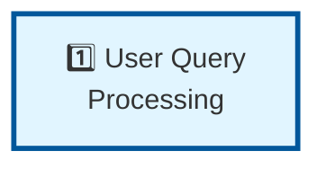

# Pipeline Step 1: User Query Processing

**Layer:** 1 of 8
**Role:** Entry point - Accept, parse, and normalize user input
**Phase:** Technology strategy - Evaluating approaches

---

## Step Element



---

## Purpose

Accept user queries and transform them into a canonical internal representation that downstream steps can work with.

**What it does:**
- Accepts queries from REST API, chat interface, or other sources
- Validates input format and content
- Parses query to extract intent, entities, temporal scope
- Normalizes query representation
- Enforces user authentication and rate limiting
- Passes standardized representation to Gap Detection

---

## System Role & Integration

### **Inputs**
```
← External (user-facing)
  ├── Query text (string)
  ├── User credentials/tokens
  ├── Context metadata (timestamp, source)
  └── Optional parameters (filters, constraints)
```

### **Outputs**
```
→ To next step (Gap Detection)
  ├── Parsed query intent
  ├── Extracted entities/topics
  ├── Temporal scope (if specified)
  ├── Query confidence/clarity score
  └── Session/correlation ID
```

### **Systems It Must Integrate With**
- REST API framework (FastAPI, Django, Flask, etc.)
- Authentication system (JWT, OAuth, API keys)
- Rate limiting (per-user, per-IP, per-key)
- Logging/monitoring
- Queue/message system to downstream step

---

## Technology Options to Evaluate

### **Query Understanding & Parsing**

| Option | Approach | Trade-offs |
|--------|----------|-----------|
| **LLM-based** (Claude, GPT-4) | Send query to LLM, get structured intent | Accuracy ✅, Cost ❌, Latency ⚠️ |
| **Traditional NLP** (spaCy, NLTK) | Dependency parsing + entity extraction | Fast ✅, Limited accuracy ⚠️, No cost ✅ |
| **Hybrid** | Rules + NLP + LLM for ambiguous cases | Balanced, Complex ❌ |
| **Purpose-built** (Rasa NLU) | Specialized intent/entity framework | Requires training data, Moderate cost |

**Key Questions to Research:**
- How do existing Q&A systems handle query parsing? (Perplexity, Tavily, etc.)
- What accuracy do we need for effective downstream processing?
- Cost impact at scale (1000s of queries/day)?
- How to handle multi-lingual queries?
- How to detect query clarity issues early?

---

### **API Framework**

| Option | Pros | Cons |
|--------|------|------|
| **FastAPI** | Modern, async, built-in validation, auto-docs | Python only, newer |
| **Django + DRF** | Mature, feature-rich, large ecosystem | Heavyweight, synchronous |
| **Flask** | Lightweight, flexible | Minimal built-ins |
| **Anthropic API** | Use Anthropic's infrastructure | Limited control, integrated auth |

**Decision Factor:** Integration with broader system architecture

---

### **Authentication & Rate Limiting**

| Option | Approach | Suitable For |
|--------|----------|-------------|
| **JWT tokens** | Stateless, self-contained | Distributed systems, scalability |
| **API keys** | Simple, per-key rate limits | Service-to-service integration |
| **OAuth 2.0** | External identity providers | User-facing applications |
| **Managed service** (Auth0, Firebase) | Outsourced auth | Rapid development, no ops |

---

## Evaluation Criteria

**Choose based on:**

1. **Accuracy for Intent Detection**
   - How well does it understand the user's actual need?
   - What % of queries are correctly parsed?
   - How does it handle ambiguous/complex queries?

2. **Latency**
   - P50, P95, P99 latencies
   - Target: < 500ms from REST call to next step
   - Impact of LLM-based parsing on overall pipeline

3. **Cost**
   - Per-query cost
   - Total cost at scale (10K, 100K, 1M queries/month)
   - Cost vs. accuracy trade-off

4. **Scalability**
   - How many concurrent queries can it handle?
   - Does it gracefully degrade under load?
   - Rate limiting flexibility?

5. **Robustness**
   - Error handling for malformed input
   - Fallback behavior for parsing failures
   - Security (injection attacks, etc.)

6. **Integration Complexity**
   - How to pass standardized query to next step?
   - Message format and serialization
   - Backward compatibility if changes needed

---

## Testing & Validation Approach

### **Phase 1: Prototype Evaluation**
- Create 50-100 representative test queries (simple, complex, edge cases)
- Test each option against the query set
- Measure accuracy, latency, cost for each
- Identify failure modes

### **Phase 2: Integration Test**
- Feed output from selected approach into Gap Detection
- Does downstream step understand the parsed query correctly?
- Does it have all info needed to detect gaps?

### **Phase 3: Production Validation**
- A/B test with real users
- Measure downstream success rate (gaps detected correctly)
- Monitor for query types that aren't handled well
- Adjust approach if needed

---

## Key Decisions to Make

1. **Intent Extraction Strategy**
   - Will we use LLM parsing or traditional NLP?
   - What's our accuracy requirement?
   - Cost vs. accuracy trade-off?

2. **Required Inputs**
   - Just query text, or additional context?
   - User preferences/constraints in query?
   - Temporal scope handling?

3. **Error Handling**
   - What makes a query "invalid"?
   - Return error to user or best-effort parsing?
   - Confidence threshold for proceeding?

4. **API Design**
   - Simple REST endpoint or streaming?
   - Request/response format?
   - Session management?

---

## Related Documentation

- **Pipeline Overview:** `00-PIPELINE-OVERVIEW.md` (full project context)
- **Next Step:** `02-GAP-DETECTION.md` (what expects as input)
- **Architecture:** `ARCHITECTURE-DETAILS/` (API, auth, rate limiting specs)

---

**Status:** Planning phase - Technology options under evaluation
