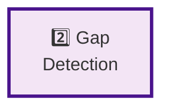

# Pipeline Step 2: Gap Detection

**Layer:** 2 of 8
**Role:** Analyze KB and identify missing knowledge
**Phase:** Technology strategy - Evaluating approaches

---

## Step Element



---

## Purpose

Analyze the user's query against the existing knowledge graph to identify what knowledge is **missing, outdated, or uncertain** - this determines what research needs to be done.

**What it does:**
- Queries knowledge graph for entities mentioned in user query
- Checks for relationships between entities
- Evaluates data freshness (is the info recent enough?)
- Scores confidence in existing answers
- Produces gap report (what's missing, how important)
- Prioritizes research needs

---

## System Role & Integration

### **Inputs**
```
← From Query Processing step
  ├── Parsed query intent
  ├── Extracted entities/topics
  ├── Temporal scope
  └── Session/correlation ID
```

### **Outputs**
```
→ To Research Orchestration step
  ├── Gap list (missing entities, relationships, outdated data)
  ├── Gap priorities (what to research first)
  ├── Confidence scores (how sure are we about what's missing?)
  └── Research budget estimate (expected effort)
```

### **Systems It Must Integrate With**
- Knowledge graph database (Neo4j, etc.)
- Graph query language (Cypher, SPARQL, etc.)
- Semantic matching/similarity (embeddings?)
- Data recency tracking
- Messaging system to next step

---

## Technology Options to Evaluate

### **Knowledge Graph Database**

| Option | Query Language | Strengths | Considerations |
|--------|---|---|---|
| **Neo4j** | Cypher | Industry standard, mature, large community | Commercial model, licensing costs |
| **Amazon Neptune** | Gremlin/SPARQL | Managed AWS service, scalable | AWS lock-in, SPARQL complexity |
| **JanusGraph** | Gremlin | Open source, distributed | Requires Cassandra/HBase backend |
| **ArangoDB** | AQL | Multi-model (graph + doc), good for hybrid | Smaller ecosystem |
| **PostgreSQL + JSON** | SQL | Familiar, cost-effective | Performance limits for complex graphs |

**Key Questions to Research:**
- How do existing knowledge graph systems scale? (Wikidata, Google KG, etc.)
- Query performance requirements? (must be < 500ms for gap detection)
- Graph complexity - how many entities/relationships?
- Need for transaction support and ACID?
- Cost at scale?

---

### **Gap Detection Strategy**

| Approach | Method | Pros | Cons |
|----------|--------|------|------|
| **Query-based** | Run Cypher queries to check KB | Exact, deterministic | Requires predefined queries |
| **Semantic** | Embedding similarity for missing entities | Flexible, catches near-misses | May have false positives |
| **Hybrid** | Combine exact match + semantic | Best accuracy | More complex |
| **LLM-based** | Ask LLM what's missing | Flexible, understands context | Expensive, non-deterministic |

**Key Questions:**
- How do search engines identify what to search for? (Perplexity, Tavily approach)
- What's the state of the art in query expansion?
- How to handle implicit information? (not stated but can be inferred)

---

### **Entity Matching & Deduplication**

| Option | Matching Strategy | Accuracy | Cost |
|--------|---|---|---|
| **Exact match** | String equality | High (no false positives) | May miss variants |
| **Fuzzy matching** | Levenshtein distance | Good | Can have false positives |
| **Semantic** | Embedding similarity | Very good | Higher compute cost |
| **LLM-based** | Ask Claude if entities are same | Excellent | High API cost |

---

### **Freshness & Staleness Detection**

| Approach | Implementation | Cost | Accuracy |
|----------|---|---|---|
| **Timestamp metadata** | Store last-updated on each fact | Low | Perfect if maintained |
| **Source dating** | Infer age from source publication date | Low | Approximate |
| **Manual review** | Human marks outdated info | High | Perfect |
| **LLM assessment** | Ask Claude if info seems current | Medium | Good |

---

## Evaluation Criteria

**Choose based on:**

1. **Query Performance**
   - Gap detection latency (target: < 500ms)
   - P50, P95, P99 latencies
   - Impact on overall pipeline

2. **Accuracy of Gap Detection**
   - False positives (say something is missing when it's there)
   - False negatives (miss actual gaps)
   - Downstream impact - bad gap detection ruins everything

3. **Scalability**
   - KB size: 1M entities? 10M? 100M?
   - Query concurrency: 10s? 100s? 1000s per second?
   - Memory and storage requirements

4. **Cost**
   - Database licensing/hosting
   - Query costs (if using cloud services)
   - Scaling costs

5. **Ease of Updates**
   - How to add new facts?
   - How to update stale info?
   - How to handle corrections?

6. **Integration Complexity**
   - Query language learning curve
   - Standardizing gap reports
   - Connecting to research step

---

## Testing & Validation Approach

### **Phase 1: Gap Detection Accuracy**
- Create 50 test queries with known missing information
- Run gap detection on each
- Compare detected gaps vs. expected gaps
- Measure precision, recall, F1 score
- Identify patterns in misses

### **Phase 2: Performance Testing**
- Load test with concurrent queries
- Measure latency at various loads
- Identify bottlenecks
- Compare options side-by-side

### **Phase 3: End-to-End Integration**
- Do detected gaps lead to good research? (Step 3)
- Do they improve final answer quality? (Step 8)
- What types of gaps are hardest to detect?
- Feedback loop: adjust gap detection based on results

---

## Key Decisions to Make

1. **Knowledge Graph Technology**
   - Neo4j for maturity?
   - Cloud service for less ops?
   - Open source for cost?

2. **Gap Detection Approach**
   - Query-based (requires predefined queries)?
   - Semantic (embedding-based)?
   - Hybrid?

3. **Handling Ambiguity**
   - Entity with multiple matches in KB - report as found or missing?
   - Close-but-not-exact matches?

4. **Freshness Requirements**
   - How old is "too old"? (90 days? 1 year? domain-specific?)
   - How strictly enforce freshness?

5. **Gap Prioritization**
   - What makes a gap "high priority" vs. "low priority"?
   - Research budget constraints?

---

## Related Documentation

- **Pipeline Overview:** `00-PIPELINE-OVERVIEW.md`
- **Previous Step:** `01-USER-QUERY-PROCESSING.md`
- **Next Step:** `03-RESEARCH-ORCHESTRATION.md`
- **Architecture:** `ARCHITECTURE-DETAILS/2025-11-13-DEPLOYMENT-INFRASTRUCTURE-ARCHITECTURE.md` (KB design)

---

**Status:** Planning phase - Technology options under evaluation
