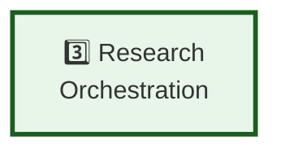

# Pipeline Step 3: Research Orchestration

**Layer:** 3 of 8
**Role:** Plan and coordinate autonomous research across multiple sources
**Phase:** Technology strategy - Evaluating approaches

---

## Step Element



---

## Purpose

Take gap report and orchestrate systematic research to fill those gaps.

**What it does:**
- Converts gaps into research tasks (what to search for, where to search)
- Dispatches parallel research agents
- Coordinates across web search, academic sources, APIs, documentation
- Tracks progress and handles failures
- Aggregates and deduplicates results
- Returns documents for processing

---

## System Role & Integration

### **Inputs**
```
← From Gap Detection step
  ├── Gap list
  ├── Gap priorities
  ├── Confidence scores
  └── Research budget estimate
```

### **Outputs**
```
→ To Document Ingestion step
  ├── Research results (documents, data, snippets)
  ├── Source metadata (URL, date, quality score)
  ├── Research coverage report
  └── Any unresolved gaps
```

### **External Systems**
- Web search APIs (Google, Bing, DuckDuckGo)
- Academic databases (arXiv, PubMed, Google Scholar)
- Documentation sources (GitHub, ReadTheDocs, Wikipedia)
- REST/GraphQL APIs
- Social media APIs (LinkedIn, Twitter)

---

## Technology Options to Evaluate

### **Agentic Research Systems**

| Option | Approach | Pros | Cons |
|--------|----------|------|------|
| **Custom orchestration** | Build with task queues, agent pool | Full control, tailor to needs | Complex, time-consuming |
| **LangChain agents** | Use LangChain framework | Quick to prototype, good docs | Opinionated, specific to LLM flow |
| **Anthropic tools** | Use Anthropic's agent tools | Tight integration with Claude | Limited to Anthropic LLMs |
| **Tavily/Perplexity APIs** | Use existing research services | Proven, battle-tested | Black box, less control |
| **LlamaIndex** | RAG/research orchestration | Good for RAG workflows | Narrower agent support |

**Key Research Questions:**
- How do agentic systems currently handle research? (Perplexity, Tavily architecture)
- What's the state of the art in task planning and decomposition?
- How do existing systems handle source prioritization?
- Cost models for different approaches?

---

### **Task Planning & Decomposition**

| Approach | Method | Accuracy | Complexity |
|----------|--------|----------|-----------|
| **Rule-based** | Predefined rules gap → search query | Predictable | Low |
| **Template-based** | Templates for common gap types | Flexible | Medium |
| **LLM-based** | Ask Claude to plan research | Very flexible | High |
| **Hybrid** | Rules + LLM for complex cases | Best | Medium |

---

### **Search Source Integration**

| Source Type | Examples | Integration | Coverage |
|---|---|---|---|
| **Web search** | Google, Bing, DuckDuckGo | APIs + web scraping | Broad |
| **Academic** | arXiv, PubMed, Google Scholar | APIs + scraping | Deep but narrow |
| **Documentation** | GitHub, ReadTheDocs, Wikipedia | APIs + scraping | Technical, curated |
| **Social** | LinkedIn, Twitter, Medium | APIs (limited free) | Current, trending |
| **Proprietary** | Company APIs, databases | Custom integration | Specific knowledge |

---

### **Orchestration & Coordination**

| Option | Framework | Parallelism | Cost |
|--------|-----------|---|---|
| **Message queue** | Redis, RabbitMQ, Kafka | Native | Low-medium |
| **Task queue** | Celery, Rq, Bull | Native | Low-medium |
| **Workflow engine** | Airflow, Temporal, Prefect | Built-in | Medium |
| **Serverless** | AWS Lambda, Google Cloud Functions | Managed | Variable |
| **Agent framework** | AutoGPT, similar | Simple | Depends |

---

## Evaluation Criteria

**Choose based on:**

1. **Coordination Model**
   - Sequential? Parallel? DAG-based?
   - Throughput requirements?
   - Fault tolerance needed?

2. **Research Quality**
   - How complete are results?
   - Source quality and relevance?
   - Handling contradictions?

3. **Cost**
   - API costs (web search, academic APIs)
   - Compute costs (agents, orchestration)
   - Total cost per research request

4. **Speed**
   - Time to complete research
   - Can operations be parallelized?
   - Trade-off: speed vs. completeness

5. **Flexibility**
   - How to add new sources?
   - How to adjust research strategy?
   - Learning from previous research?

---

## Testing & Validation Approach

### **Phase 1: Quality Assessment**
- Run 30 research tasks on known gaps
- Evaluate result quality, completeness
- Compare different source combinations
- Measure coverage (what % of gaps resolved)

### **Phase 2: Performance Testing**
- Measure time to complete research
- Cost per research task
- Parallel execution efficiency
- Source fallback behavior

### **Phase 3: Integration Testing**
- Do research results help fill gaps?
- Are documents suitable for extraction?
- Source quality vs. downstream results
- Feedback loop: improve research based on extraction quality

---

## Key Decisions to Make

1. **Research System**
   - Build custom with agents?
   - Use existing service (Tavily, Perplexity)?
   - Hybrid approach?

2. **Source Prioritization**
   - Which sources for which gap types?
   - Confidence in different sources?
   - Fallback strategy?

3. **Research Budget**
   - Hard limit on cost per request?
   - Depth of research (1 source? 5? 10?)
   - Stop conditions?

4. **Result Handling**
   - All results or top-N?
   - Deduplication strategy?
   - How handle conflicting information?

---

## Related Documentation

- **Pipeline Overview:** `00-PIPELINE-OVERVIEW.md`
- **Previous Step:** `02-GAP-DETECTION.md`
- **Next Step:** `04-DOCUMENT-INGESTION.md`

---

**Status:** Planning phase - Technology options under evaluation
