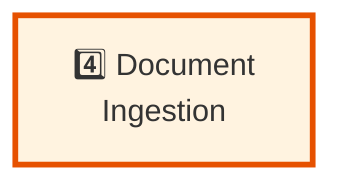

# Pipeline Step 4: Document Ingestion

**Layer:** 4 of 8
**Role:** Fetch and normalize documents from research sources
**Phase:** Technology strategy - Evaluating approaches

---

## Step Element



---

## Purpose

Fetch research results and normalize them into clean text for entity/relationship extraction.

**What it does:**
- Fetches documents from URLs, files, APIs
- Parses different formats (HTML, PDF, JSON, plaintext)
- Removes boilerplate and noise
- Cleans and normalizes text
- Chunks text into processing units
- Returns processed documents for extraction

---

## System Role & Integration

### **Inputs**
```
← From Research Orchestration step
  ├── Document URLs/content
  ├── Source metadata
  ├── Content types
  └── Quality hints
```

### **Outputs**
```
→ To Entity Extraction step
  ├── Processed text chunks
  ├── Chunk metadata (source, position)
  ├── Format detection
  └── Ingestion stats
```

### **External Systems**
- HTTP client (fetch web content)
- PDF parser
- HTML parser  
- Format converters
- Text cleaning libraries

---

## Technology Options to Evaluate

### **Web Fetching & Parsing**

| Option | Format | Parsing | Pros | Cons |
|--------|--------|---------|------|------|
| **BeautifulSoup + requests** | HTML | Python | Simple, Pythonic | Limited performance |
| **Playwright/Selenium** | HTML (dynamic) | Browser automation | Handles JavaScript | Slow, resource-heavy |
| **Trafilatura** | HTML/articles | Specialized | Extracts main content | Limited to articles |
| **APIs** | JSON/XML | Native | Clean, structured | Source availability, cost |
| **Web scraping service** | Any | Managed | Scalable, reliable | Black box, cost |

**Research Questions:**
- What's the best approach for different document types?
- How to handle JavaScript-heavy sites?
- Rate limiting and robots.txt compliance?
- Cost at scale (10K? 100K docs/month)?

---

### **PDF Parsing**

| Option | Strengths | Cons | Use Case |
|--------|-----------|------|----------|
| **PyPDF2** | Simple, pure Python | Limited OCR, layout | Text-based PDFs |
| **pdfplumber** | Preserves structure | Complex PDFs harder | Tables, precise layout |
| **Tesseract OCR** | Handles scanned docs | Slow, resource-heavy | Scanned documents |
| **Commercial** (Adobe, etc.) | Best accuracy | Expensive | Critical extraction |

---

### **Text Cleaning & Normalization**

| Approach | Method | Aggressiveness | Cost |
|----------|--------|---|---|
| **Rule-based** | Remove known boilerplate patterns | Low-medium | Low |
| **ML-based** | Train model to identify main content | Medium | Medium |
| **LLM-based** | Ask Claude to clean text | High | High |
| **Combination** | Rules + ML fallback | Medium | Medium |

---

### **Chunking Strategy**

| Strategy | Approach | Pros | Cons |
|----------|----------|------|------|
| **Fixed size** | Split every N tokens | Simple, predictable | May split mid-sentence |
| **Sentence-based** | Respect sentence boundaries | Preserves meaning | Variable chunk size |
| **Semantic** | Split by topic/paragraph | Best semantic quality | More complex |
| **Recursive** | Multi-level splitting | Flexible | Implementation complexity |

---

## Evaluation Criteria

**Choose based on:**

1. **Format Support**
   - HTML, PDF, JSON, plaintext
   - Structured data (tables)?
   - Images and embedded content?

2. **Quality of Extraction**
   - Text accuracy
   - Boilerplate removal effectiveness
   - Handling of edge cases

3. **Performance**
   - Fetch latency
   - Parsing speed
   - Memory usage

4. **Cost**
   - API costs
   - Compute resources
   - Storage

5. **Scalability**
   - Documents per second
   - Concurrent processing
   - Disk/memory requirements

---

## Testing & Validation Approach

### **Phase 1: Format Coverage**
- Test each parser on 20 documents per format
- Measure extraction quality
- Identify failure modes
- Compare accuracy across formats

### **Phase 2: Performance Testing**
- Throughput: documents per second
- Latency: time per document
- Memory usage under load
- Scaling characteristics

### **Phase 3: Quality Validation**
- Do extracted chunks work well for entity extraction?
- No critical information lost?
- Boilerplate removal effective?
- Proper chunking for downstream steps?

---

## Key Decisions to Make

1. **Format Priority**
   - Which formats most common?
   - Which most critical?
   - Acceptable quality trade-offs?

2. **Cleaning Approach**
   - How aggressive? (remove nav, ads, comments?)
   - Language detection needed?
   - Encoding detection?

3. **Chunking**
   - Chunk size? (2K? 4K? 8K tokens?)
   - Overlap? (0? 200 tokens?)
   - Boundary preference?

4. **Error Handling**
   - Corrupted files - skip or best-effort?
   - Timeout handling?
   - Fallback parsers?

---

## Related Documentation

- **Pipeline Overview:** `00-PIPELINE-OVERVIEW.md`
- **Previous Step:** `03-RESEARCH-ORCHESTRATION.md`
- **Next Step:** `05-ENTITY-EXTRACTION.md`

---

**Status:** Planning phase - Technology options under evaluation
