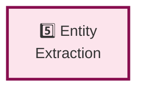

# Pipeline Step 5: Entity Extraction

**Layer:** 5 of 8
**Role:** Extract named entities from documents using LLM and NLP
**Phase:** Technology strategy - Evaluating approaches

---

## Step Element



---

## Purpose

Extract structured information (entities) from unstructured text documents.

**What it does:**
- Identifies named entities (persons, organizations, locations, concepts, technologies)
- Scores confidence in extractions
- Deduplicates entities within documents
- Handles entity variants and aliases
- Returns entities with metadata and confidence scores

---

## System Role & Integration

### **Inputs**
```
← From Document Ingestion step
  ├── Text chunks
  ├── Source metadata
  └── Document context
```

### **Outputs**
```
→ To Relationship Extraction step
  ├── Extracted entities
  ├── Confidence scores
  ├── Entity references (location in text)
  └── Extracted types & attributes
```

---

## Technology Options to Evaluate

### **Entity Extraction Approach**

| Option | Method | Accuracy | Cost | Flexibility |
|--------|--------|----------|------|---|
| **LLM-based** (Claude, GPT-4) | Prompt LLM to extract entities | High | High | Very high |
| **Traditional NER** (spaCy) | Statistical NER model | Medium | None | Limited |
| **Transformers** (BERT, RoBERTa) | Fine-tuned transformer model | High | Medium | Medium |
| **Hybrid** | Rules + NER + LLM fallback | Very high | Medium | High |
| **Specialized** (domain-specific) | Custom model for domain | Domain-specific | Varies | Limited |

**Research Questions:**
- Which LLM provider for best accuracy vs. cost?
- How do existing knowledge graph tools handle extraction?
- Domain-specific entity types vs. general types?
- Multi-lingual entity extraction needs?

---

### **LLM Provider Selection**

| Provider | Cost | Latency | Quality | Availability |
|----------|------|---------|---------|---|
| **Anthropic Claude** | Medium | ~1-3s | Excellent | Good |
| **OpenAI GPT-4** | Medium-high | ~2-5s | Excellent | Excellent |
| **Cohere** | Medium | ~1-2s | Good | Good |
| **Local Llama** | Free (compute) | ~5-10s | Decent | Perfect (always available) |
| **Open source models** | Free (compute) | Varies | Varies | Perfect |

---

### **Confidence Scoring**

| Approach | Method | Accuracy | Cost |
|----------|--------|----------|------|
| **LLM confidence** | Use LLM's confidence score directly | Variable | Free (with LLM) |
| **Multi-pass** | Extract twice, compare results | High | 2x cost |
| **Ensemble** | Multiple models, vote | Very high | 2-3x cost |
| **Heuristic** | Context, frequency, source quality | Medium | Free |

---

## Evaluation Criteria

**Choose based on:**

1. **Accuracy**
   - Entity detection rate (recall)
   - Entity type correctness (precision)
   - Benchmark on standard datasets

2. **Cost**
   - Per-entity cost
   - Total cost at scale
   - Cost vs. accuracy trade-off

3. **Latency**
   - Time per document chunk
   - Can we parallelize?
   - Acceptable for user experience?

4. **Entity Coverage**
   - Entity types needed
   - Domain-specific entities
   - Multi-lingual support

5. **Integration**
   - How to standardize output?
   - Confidence score format
   - Entity deduplication approach

---

## Testing & Validation Approach

### **Phase 1: Accuracy Testing**
- Create gold-standard annotated dataset (50+ documents)
- Run each approach on dataset
- Measure precision, recall, F1 score
- Analyze error patterns

### **Phase 2: Cost-Accuracy Analysis**
- Compare cost vs. accuracy for each option
- Find optimal cost/performance balance
- Evaluate multi-pass vs. single-pass

### **Phase 3: Scaling Tests**
- Throughput: entities per second
- Latency: impact on pipeline speed
- Cost at different scales (100 docs? 10K? 100K?)

---

## Key Decisions to Make

1. **Primary Extraction Method**
   - LLM (high accuracy, high cost)?
   - NER (lower cost, lower accuracy)?
   - Hybrid (best of both)?

2. **LLM Provider**
   - Claude for quality?
   - GPT-4 for reliability?
   - Open source for cost?

3. **Entity Types**
   - Generic types (person, org, location)?
   - Domain-specific types?
   - Custom entity categories?

4. **Confidence Thresholds**
   - Low confidence entities - include or exclude?
   - Human review threshold (< 0.7)?

5. **Deduplication**
   - How to handle "John Smith" vs. "J. Smith"?
   - Merge aliases or keep separate?

---

## Related Documentation

- **Pipeline Overview:** `00-PIPELINE-OVERVIEW.md`
- **Previous Step:** `04-DOCUMENT-INGESTION.md`
- **Next Step:** `06-RELATIONSHIP-EXTRACTION.md`

---

**Status:** Planning phase - Technology options under evaluation
