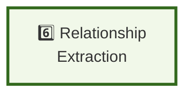

# Pipeline Step 6: Relationship Extraction

**Layer:** 6 of 8
**Role:** Identify connections between extracted entities
**Phase:** Technology strategy - Evaluating approaches

---

## Step Element



---

## Purpose

Identify and classify relationships between entities found in documents.

**What it does:**
- Finds entity pairs in text
- Identifies relationship types (works_for, located_in, etc.)
- Scores confidence in relationships
- Handles implicit vs. explicit relationships
- Returns entity-relationship triples

---

## System Role & Integration

### **Inputs**
```
← From Entity Extraction step
  ├── Extracted entities
  ├── Confidence scores
  └── Entity references in text
```

### **Outputs**
```
→ To Knowledge Graph Merge step
  ├── Relationship triples (source → rel → target)
  ├── Confidence scores per relationship
  ├── Relationship types
  └── Text references/evidence
```

---

## Technology Options to Evaluate

### **Relationship Extraction Method**

| Option | Approach | Accuracy | Cost |
|--------|----------|----------|------|
| **LLM-based** | Prompt Claude/GPT to identify relationships | High | High |
| **Dependency parsing** (spaCy) | Linguistic patterns for relationships | Medium | Low |
| **Pattern matching** | Regex + rule-based extraction | Low-Medium | Low |
| **Semantic** | Embeddings of entity pairs | Medium | Medium |
| **Hybrid** | Combine multiple methods | High | Medium |

**Research Questions:**
- What relationships are most important for domain?
- Explicit vs. implicit relationships - how to handle?
- How do knowledge graph systems extract relationships?

---

### **Relationship Type Definition**

| Approach | Flexibility | Accuracy | Maintenance |
|----------|---|---|---|
| **Fixed set** | Low | High | Low |
| **Learned** | High | Medium | Medium |
| **Domain-specific** | High | High | High |

---

## Evaluation Criteria

**Choose based on:**

1. **Coverage**
   - What relationships exist in domain?
   - Can we find them accurately?
   - Implicit relationships needed?

2. **Accuracy**
   - Relationship type identification
   - Confidence scoring reliability

3. **Cost & Speed**
   - Per-relationship cost
   - Latency impact

4. **Scalability**
   - Number of entity pairs
   - Parallelization potential

---

## Testing & Validation

- Test on annotated dataset (50+ documents)
- Measure precision/recall per relationship type
- Evaluate implicit vs. explicit handling
- Integration: do relationships help answer queries?

---

## Key Decisions

1. **Relationship Types** - what's needed?
2. **Extraction Method** - LLM vs. linguistic vs. hybrid?
3. **Implicit Relationships** - include or only explicit?
4. **Confidence Thresholds** - acceptance criteria?

---

**Status:** Planning phase - Technology options under evaluation
