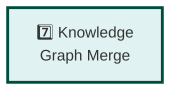

# Pipeline Step 7: Knowledge Graph Merge

**Layer:** 7 of 8
**Role:** Integrate new knowledge into knowledge graph with conflict resolution
**Phase:** Technology strategy - Evaluating approaches

---

## Step Element



---

## Purpose

Merge extracted entities and relationships into existing knowledge graph, handling deduplication and conflicts.

**What it does:**
- Normalizes entities to canonical forms
- Deduplicates entities (same entity, different representations)
- Resolves conflicts (contradictory information)
- Tracks provenance (source of each fact)
- Updates knowledge graph
- Maintains data consistency

---

## System Role & Integration

### **Inputs**
```
← From Relationship Extraction step
  ├── Entity-relationship triples
  ├── Confidence scores
  ├── Text evidence
  └── Provenance info
```

### **Outputs**
```
→ To Query Re-execution step (Step 8)
  ├── Updated knowledge graph
  ├── Merge statistics
  ├── Conflicts detected
  └── New facts added/updated
```

### **Core System**
- Knowledge graph database (Neo4j, etc.)
- Entity resolution engine
- Conflict resolution logic
- Provenance tracking

---

## Technology Options to Evaluate

### **Knowledge Graph Technology** (if not already selected in Step 2)

| Option | Query Language | Entity Resolution | Scalability |
|--------|---|---|---|
| **Neo4j** | Cypher | Plugins available | Good |
| **Amazon Neptune** | Gremlin/SPARQL | Custom | Excellent |
| **JanusGraph** | Gremlin | Custom | Excellent |
| **PostgreSQL + JSON** | SQL | Custom | Limited |

---

### **Entity Resolution/Deduplication**

| Approach | Method | Accuracy | Cost |
|----------|--------|----------|------|
| **Exact match** | String equality | High | Low |
| **Fuzzy** | Levenshtein distance | Medium | Low |
| **Semantic** | Embeddings | High | Medium |
| **LLM-based** | Ask Claude | Very high | High |
| **Hybrid** | Combine methods | Very high | Medium |

**Key Questions:**
- How to handle "Apple Inc" vs. "Apple" vs. "Apple Corporation"?
- Temporal entities - "was CEO" vs. "is CEO"?
- Authority/trust - which source wins on conflicts?

---

### **Conflict Resolution Strategy**

| Strategy | Method | Simplicity | Effectiveness |
|----------|--------|---|---|
| **By recency** | Newer data overwrites old | Simple | Good |
| **By confidence** | Higher confidence wins | Simple | Good |
| **By source quality** | Trusted sources win | Complex | Very good |
| **Manual review** | Escalate to human | Most effective | Expensive |
| **Version all** | Keep all versions | No loss | Complex queries |

---

## Evaluation Criteria

**Choose based on:**

1. **Entity Deduplication Quality**
   - False positive rate (mark same as different)
   - False negative rate (miss duplicates)
   - Performance at scale

2. **Conflict Resolution Accuracy**
   - Correct choice in conflicts
   - Accuracy of source quality assessment

3. **Performance**
   - Merge latency
   - Throughput (entities/relationships per second)
   - Graph query performance post-merge

4. **Scalability**
   - Graph size (1M? 10M? 100M nodes?)
   - Update frequency
   - Query concurrency

---

## Testing & Validation

- Test deduplication on 1000+ entities
- Measure precision/recall
- Conflict resolution accuracy testing
- Performance under load
- Post-merge query performance

---

## Key Decisions

1. **Deduplication Approach** - fuzzy matching threshold?
2. **Conflict Strategy** - recency? source quality? manual?
3. **Provenance Depth** - what metadata to track?
4. **Temporal Handling** - how to handle "was" vs. "is"?
5. **Versioning** - keep history or overwrite?

---

**Status:** Planning phase - Technology options under evaluation
