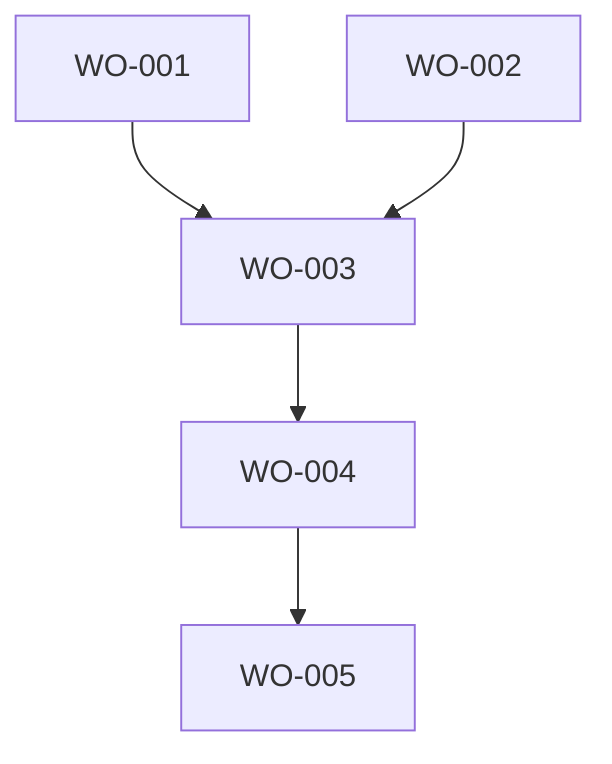

# Work Order Index Template

Generate and maintain a work order index for tracking all work orders in a project.

## File Location
Save to: `.dev/ai/workorders/WO-INDEX.md`

## Update Triggers
- When creating new work orders
- When completing work orders
- When updating work order status
- During handoff creation
- On "show work queue" command

## Index Structure

```markdown
# Work Order Index
**Last Updated:** [YYYY-MM-DD-HH-MM-SS]
**Project:** [Project Name]

## Outstanding Work Orders

### Critical Priority
| WO ID | Title | Status | Created | Created By | Blocked By | Age |
|-------|-------|--------|---------|------------|------------|-----|
| WO-xxx | [Title] | NOT_STARTED | [Date] | [Agent] | - | [Days] |

### High Priority
| WO ID | Title | Status | Created | Created By | Blocked By | Age |
|-------|-------|--------|---------|------------|------------|-----|
| WO-xxx | [Title] | IN_PROGRESS | [Date] | [Agent] | WO-yyy | [Days] |

### Medium Priority
| WO ID | Title | Status | Created | Created By | Blocked By | Age |
|-------|-------|--------|---------|------------|------------|-----|

### Low Priority
| WO ID | Title | Status | Created | Created By | Blocked By | Age |
|-------|-------|--------|---------|------------|------------|-----|

## Completed This Session
| WO ID | Title | Completed | Completed By | Time Taken |
|-------|-------|-----------|--------------|------------|
| WO-xxx | [Title] | [Timestamp] | [Agent] | [Actual vs Est] |

## Blocked Work Orders
| WO ID | Title | Blocked On | Reason |
|-------|-------|------------|--------|
| WO-xxx | [Title] | External approval | Waiting for customer |
| WO-yyy | [Title] | WO-xxx | Depends on completion |

## Work Order Statistics
- **Total Outstanding:** [Count]
- **Completed Today:** [Count]
- **Blocked:** [Count]
- **Average Age:** [Days]
- **Completion Rate:** [Percentage]

## Discovered Work (Not Yet WO)
Items found during work that may need work orders:
- [ ] [Description of potential work]
- [ ] [Another item needing investigation]

## Work Order Relationships

```

## Query Commands

Support these queries:

- "Show all outstanding work orders" → Display outstanding section
- "Show blocked work" → Display blocked section
- "Show work by priority" → Group by priority
- "Show oldest work orders" → Sort by age
- "Show work order dependencies" → Display relationship graph

## Maintenance Rules

1. **Never delete entries** - Move completed to archive
2. **Update status immediately** when work order changes
3. **Track all WOs** - Including those from previous sessions
4. **Age calculation** - Days since creation
5. **Relationship tracking** - Update blocks/blocked-by

## Archive Location

Completed work orders older than 7 days move to:
`.dev/ai/workorders/WO-ARCHIVE.md`

## Integration Points

- **With Handoffs:** Pull outstanding WO list from here
- **With Proposals:** Add generated WOs here
- **With Tracking:** Reference this in project tracking
- **With Reviews:** Update effectiveness scores here
- **With Accomplishments:** Auto-create accomplishment entries when WOs complete
- **With Changelogs:** Link to detailed change documentation

## Index Update Command

```bash
# After any WO status change
echo "Updated WO-xxx status to COMPLETED" >> .dev/ai/workorders/WO-CHANGELOG.md
# Update index
[Update the WO-INDEX.md file]
# Track change
~/.agents/scripts/track-project.sh "[project]" "WO Index updated" "[change summary]" "[agent]" "update index"

# If status changed to COMPLETED, create accomplishment entry
if [[ "$NEW_STATUS" == "COMPLETED" ]]; then
  ~/.agents/scripts/create-accomplishment.sh "WO-xxx Title" "Feature Implementation" "WO-xxx" "[agent]"
  echo "Created accomplishment entry for completed WO-xxx"
fi
```
