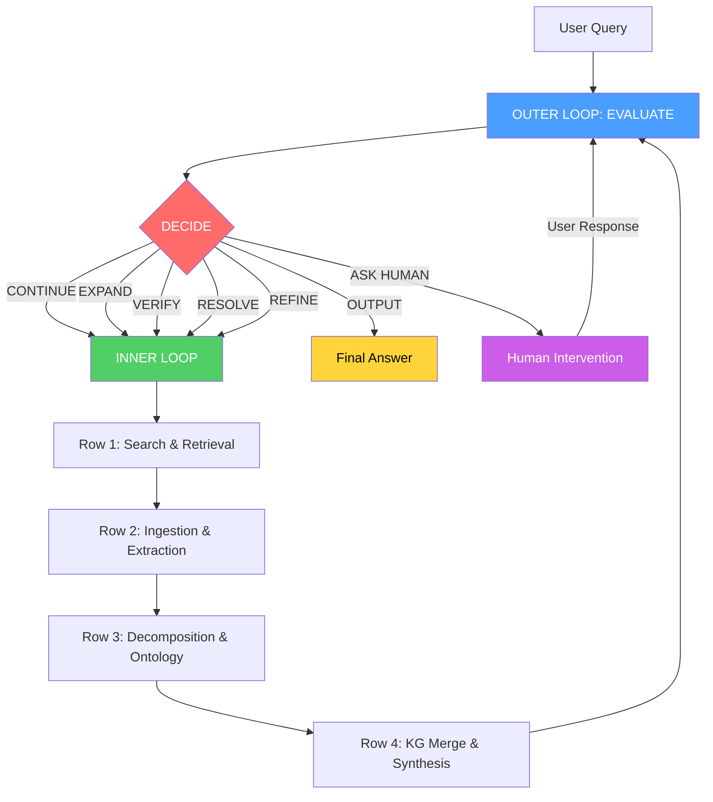
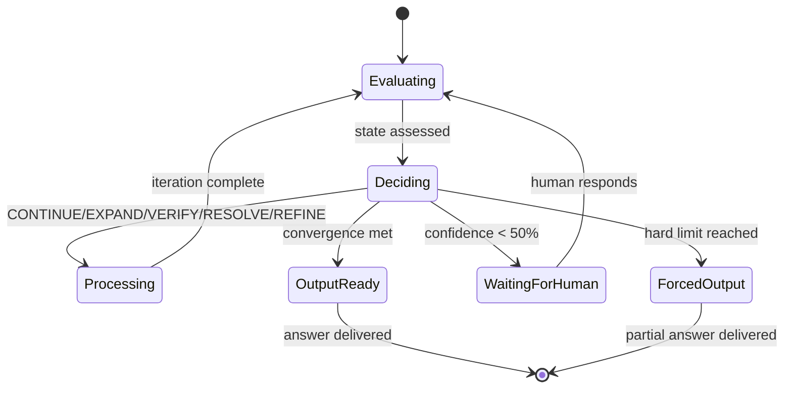

# Infinite Loop Learning Pattern

**Version:** 1.0.0
**Date:** 2026-01-27
**Status:** THEORY DOCUMENT
**Related:** [Master Pipeline Architecture](../foundation/05-MASTER-PIPELINE-ARCHITECTURE.md)

---

## 1. Introduction: The Derived Infinite Loop

Knowledge Graph Lab is built on a fundamental insight: knowledge is never complete in a single pass. Every answer reveals new questions, every connection suggests unexplored territory, and every synthesis exposes gaps that demand further investigation.

The **Derived Infinite Loop** is the architectural pattern that formalizes this reality. It consists of two interlocking loops:

- **Inner Loop (Processing Pipeline):** A deterministic sequence that transforms raw inputs into structured knowledge -- search, extract, decompose, merge.
- **Outer Loop (Reasoning Engine):** An evaluative cycle that assesses the current knowledge state and decides whether to continue processing, output results, or request human guidance.

Together, these loops create a system that can autonomously expand its knowledge until convergence criteria are met, self-correct when errors are detected, and request human intervention when uncertainty is too high. The result is not a static pipeline but a living process that learns with each iteration.

The term "derived" is deliberate. The infinite loop is not hardcoded; it emerges from the interaction between two finite, bounded processes. Neither loop alone produces open-ended learning. The inner loop executes a fixed sequence. The outer loop makes a single decision. But when the outer loop feeds its decision back into the inner loop, an unbounded learning trajectory emerges -- bounded only by convergence criteria and safety limits.

```
              ┌──────────────────────────────────────────────┐
              │           OUTER LOOP (Reasoning)              │
              │                                                │
              │   EVALUATE ──► DECIDE ──► ACTION               │
              │       ▲                     │                   │
              │       │                     ▼                   │
              │       │    ┌────────────────────────────┐      │
              │       │    │  CONTINUE  OUTPUT  ASK     │      │
              │       │    └──────┬─────────────────────┘      │
              │       │           │                             │
              │       │           ▼                             │
              │   ┌───┴───────────────────────────────────┐    │
              │   │        INNER LOOP (Processing)         │    │
              │   │                                         │    │
              │   │  ROW 1: Search & Retrieval              │    │
              │   │  ROW 2: Ingestion & Extraction          │    │
              │   │  ROW 3: Decomposition & Ontology        │    │
              │   │  ROW 4: Knowledge Graph & Synthesis     │    │
              │   │                                         │    │
              │   └─────────────────────────────────────────┘    │
              │                                                │
              └──────────────────────────────────────────────┘
```

---

## 2. Inner Loop: The Processing Pipeline

The inner loop is the engine that converts raw information into structured knowledge. It operates across four rows, each responsible for a distinct phase of transformation.

### Row 1: Search and Retrieval

The pipeline begins by understanding what is being asked and finding relevant material.

```
QUERY ──► T1:MAP ──► GAPS ──► T2:ROUTE ──► [PARALLEL SEARCH] ──► MERGE
```

- **QUERY:** Natural language input is parsed into structured intent -- entities, relationships, constraints.
- **MAP:** The structured intent is mapped against existing knowledge to identify what is already known.
- **GAPS:** An LLM-driven stage identifies what is missing -- which questions remain unanswered, which entities lack connections, which claims need corroboration.
- **ROUTE:** Gap analysis results are fanned out to appropriate search backends (full-text, vector, web).
- **SEARCH:** Multiple search strategies execute in parallel, each optimized for different retrieval characteristics.
- **MERGE:** Results are combined using Reciprocal Rank Fusion (RRF) to produce a unified, ranked set of documents.

The key insight of Row 1 is that search is not a single action but a multi-strategy process. Gap analysis ensures the system does not redundantly search for information it already has.

### Row 2: Ingestion and Extraction

Raw documents are transformed into structured facts.

```
INGEST ──► T4:CHUNK ──► EXTRACT ──► T5:PAIR ──► RELATE
```

- **INGEST:** Documents are fetched and normalized into a standard format regardless of source (PDF, HTML, API response).
- **CHUNK:** Content is segmented into processing units optimized for extraction -- paragraphs, sections, or semantic blocks.
- **EXTRACT:** LLM-driven entity and fact extraction pulls out the structured elements: people, organizations, concepts, claims, dates.
- **PAIR:** Extracted entities are combined into candidate pairs for relationship discovery.
- **RELATE:** Typed relationships are built between entity pairs -- causal, hierarchical, temporal, associative.

Row 2 converts unstructured text into a preliminary knowledge structure. The output is a set of entities and relationships ready for deeper analysis.

### Row 3: Decomposition and Ontology Mapping

This is the layer that transforms coarse topics into granular, connected concepts.

```
CONCEPTS ──► T:LENS ──► ONTOLOGY-MAP ──► TEMPORAL-TAG ──► PROVENANCE
```

- **CONCEPTS:** High-level topics are decomposed into atomic concepts -- the "Cloud of Words" that represents the full semantic space of a topic.
- **LENS:** A perspective filter is applied. The same data can be viewed through ecological, economic, social, or technical lenses, each revealing different connections.
- **ONTOLOGY-MAP:** Relationships between concepts are induced -- is-a, causes, precedes, requires, relates-to. This creates the ontological backbone of the knowledge graph.
- **TEMPORAL-TAG:** Relationships gain a time dimension. Static "A relates to B" becomes dynamic "A leads to B at t+1" or "A causes B over 2 years."
- **PROVENANCE:** Every concept and relationship is linked back to its source sentence, with confidence scores and lens attribution.

Row 3 is what distinguishes a knowledge graph from a simple entity database. It captures not just what exists but how things relate, through what perspective, and across what timeframe.

### Row 4: Knowledge Graph and Synthesis

The final row integrates new knowledge with existing knowledge and produces output.

```
KG-MERGE ──► T6:FILTER ──► SYNTH ──► OUTPUT
```

- **KG-MERGE:** New entities and relationships are merged into the existing knowledge graph with conflict resolution -- handling duplicates, contradictions, and confidence updates.
- **FILTER:** The relevant subgraph for the current query is extracted from the full knowledge graph.
- **SYNTH:** An LLM generates a synthesized answer with citations, drawing from the filtered subgraph.
- **OUTPUT:** The result is formatted and delivered to either the user or the outer loop for evaluation.

### State Propagation

Each row passes state forward through a pipeline context object that accumulates:

- **Entities discovered** (growing set across rows)
- **Relationships built** (edges added in Rows 2-3)
- **Confidence scores** (updated at each stage)
- **Provenance chain** (linking every fact to its source)
- **Cost accumulator** (tracking budget consumption)
- **Iteration counter** (tracking loop depth)

This state object is what the outer loop evaluates when deciding the next action.

---

## 3. Outer Loop: The Reasoning Engine

The outer loop wraps the inner processing pipeline and provides autonomous decision-making. Where the inner loop asks "how do I process this?", the outer loop asks "should I keep going?"

### The Evaluate-Decide-Act Cycle

```
EVALUATE ──► DECIDE ──► ACTION
    ▲                      │
    └──────────────────────┘
```

**EVALUATE** inspects the current knowledge state along multiple dimensions:

| Dimension | Measurement | Source |
|-----------|-------------|--------|
| Confidence | Weighted average of claim confidence scores | Row 2-3 extraction |
| Coverage | Percentage of identified gaps that have been addressed | Row 1 gap analysis |
| Coherence | Internal consistency of the knowledge graph | Row 4 merge conflicts |
| Novelty | Percentage of new information gained in the last iteration | Delta between iterations |
| Budget | Remaining cost and time budget | Tuning layer accumulators |

**DECIDE** applies decision logic to the evaluation:

| Condition | Decision |
|-----------|----------|
| Confidence < 85% AND Coverage < 90% | CONTINUE |
| Found entity X but missing related Y | EXPAND |
| Single-source claim detected | VERIFY |
| Sources contradict each other | RESOLVE |
| Results too broad or too narrow | REFINE |
| All convergence criteria met | OUTPUT |
| Confidence < 50% OR ambiguous intent | ASK HUMAN |

**ACTION** executes the decision:

- **CONTINUE:** Re-enter the inner loop with updated parameters. The gap analysis in Row 1 will focus on remaining unknowns.
- **EXPAND:** Queue a new search for related entities discovered during processing. This is the primary mechanism for autonomous knowledge growth.
- **VERIFY:** Queue a corroboration search specifically targeting single-source claims, seeking independent confirmation.
- **RESOLVE:** Queue a search for authoritative sources to arbitrate between conflicting claims.
- **REFINE:** Adjust query parameters (scope, depth, specificity) and re-enter the inner loop.
- **OUTPUT:** Generate the final synthesized answer and return to the user.
- **ASK HUMAN:** Present the current state to the user with specific questions about ambiguity or low-confidence areas.

### Feedback Loop Types

The outer loop does not simply repeat the inner loop unchanged. Each re-entry is shaped by a specific feedback type:

**Expansion Feedback:** "I found X, now I need to understand Y which is related to X." This drives breadth -- the system discovers adjacent concepts and follows connections outward.

**Verification Feedback:** "I have a claim from one source. I need a second independent source." This drives reliability -- the system actively seeks corroboration.

**Conflict Resolution Feedback:** "Sources A and B disagree on this point. I need a more authoritative source." This drives accuracy -- the system resolves contradictions rather than ignoring them.

**Refinement Feedback:** "My results are too broad/narrow. I need to adjust my search strategy." This drives precision -- the system adapts its approach based on result quality.

---

## 4. Loop Interaction and Nesting

The power of the dual-loop architecture comes from how the loops interact. Neither loop is aware of the other's internal details -- they communicate through well-defined interfaces.

### Invocation Pattern

The outer loop invokes the inner loop by passing a **ProcessingRequest**:

```
ProcessingRequest {
  query:           structured intent or expanded query
  feedbackType:    INITIAL | EXPAND | VERIFY | RESOLVE | REFINE
  focusEntities:   entities to prioritize in search
  excludeResults:  documents already processed (avoid redundancy)
  budgetRemaining: cost and time limits
  iteration:       current loop count
}
```

The inner loop returns a **ProcessingResult**:

```
ProcessingResult {
  entities:        newly discovered entities
  relationships:   newly built relationships
  confidence:      aggregate confidence score
  coverage:        gap coverage percentage
  conflicts:       detected contradictions
  singleSource:    claims with only one source
  costConsumed:    budget spent this iteration
  newGaps:         gaps discovered during processing
}
```

### Nesting Scenarios

The dual-loop architecture supports several nesting patterns:

**Simple Query (1 iteration):**
```
Outer: EVALUATE(empty) → DECIDE(CONTINUE) → Inner Loop → EVALUATE(result) → DECIDE(OUTPUT) → Done
```
The user asks a straightforward question. One pass through the inner loop produces sufficient confidence and coverage. The outer loop outputs immediately.

**Expansion Chain (3-5 iterations):**
```
Outer: EVALUATE → CONTINUE → Inner(query A)
Outer: EVALUATE → EXPAND  → Inner(related entity B)
Outer: EVALUATE → EXPAND  → Inner(related entity C)
Outer: EVALUATE → OUTPUT  → Done
```
The system discovers related entities during processing and autonomously follows the knowledge trail. Each iteration adds new nodes and edges to the graph.

**Verification Loop (2-3 iterations):**
```
Outer: EVALUATE → CONTINUE → Inner(query)
Outer: EVALUATE → VERIFY   → Inner(corroboration search)
Outer: EVALUATE → OUTPUT   → Done
```
Initial processing reveals single-source claims. The system automatically seeks corroboration before outputting.

**Conflict Resolution (3-4 iterations):**
```
Outer: EVALUATE → CONTINUE → Inner(query)
Outer: EVALUATE → VERIFY   → Inner(second source)
Outer: EVALUATE → RESOLVE  → Inner(authoritative source)
Outer: EVALUATE → OUTPUT   → Done
```
Sources disagree. The system escalates to authoritative sources for resolution.

**Deep Research (5-10 iterations):**
```
Outer: EVALUATE → CONTINUE → Inner(broad query)
Outer: EVALUATE → REFINE   → Inner(narrowed query)
Outer: EVALUATE → EXPAND   → Inner(entity A)
Outer: EVALUATE → EXPAND   → Inner(entity B)
Outer: EVALUATE → VERIFY   → Inner(corroborate claim)
Outer: EVALUATE → EXPAND   → Inner(entity C)
Outer: EVALUATE → RESOLVE  → Inner(conflict on entity A)
Outer: EVALUATE → OUTPUT   → Done
```
A complex topic triggers multiple feedback types across many iterations, building a rich knowledge graph.

### State Accumulation Across Iterations

Each iteration builds on the previous. The knowledge graph grows monotonically (entities and relationships are added, not removed). State accumulates:

- **Iteration 1:** 12 entities, 8 relationships, 60% confidence
- **Iteration 2:** 25 entities, 19 relationships, 72% confidence (expanded)
- **Iteration 3:** 28 entities, 24 relationships, 81% confidence (verified)
- **Iteration 4:** 30 entities, 28 relationships, 88% confidence (resolved conflicts)
- **OUTPUT:** Rich, verified knowledge graph with provenance

---

## 5. Convergence Criteria

Convergence is the mechanism that transforms the infinite loop into a terminating process. Without convergence criteria, the system would expand indefinitely. The criteria define "done" -- the point at which further processing yields diminishing returns.

### Primary Convergence Conditions

The outer loop exits when **any** of these conditions is met:

| Criterion | Threshold | Rationale |
|-----------|-----------|-----------|
| **Confidence** | >= 85% | Claims are well-supported by evidence |
| **Coverage** | >= 90% | Most identified gaps have been addressed |
| **Diminishing Returns** | < 5% new info for 2 consecutive iterations | Further processing is unlikely to improve results |
| **Budget Exhausted** | Cost or time limit reached | Resource constraints override quality targets |
| **Max Iterations** | Default: 10 | Hard safety bound prevents runaway loops |
| **User Interrupt** | Manual stop signal | Human overrides autonomous processing |

### Confidence Calculation

Confidence is computed as a weighted average across all claims in the knowledge graph:

```
confidence = sum(claim.confidence * claim.weight) / sum(claim.weight)
```

Where `claim.weight` reflects relevance to the original query. Peripheral entities contribute less to the overall confidence score than core entities.

Claim-level confidence is determined by:
- **Source count:** Multiple independent sources increase confidence
- **Source authority:** Authoritative sources (peer-reviewed, official) carry more weight
- **Recency:** More recent sources carry more weight for time-sensitive topics
- **Internal consistency:** Claims that align with the broader graph are more confident

### Coverage Calculation

Coverage tracks how many identified knowledge gaps have been addressed:

```
coverage = addressed_gaps / total_identified_gaps
```

Gaps are identified in Row 1 (GAPS stage) and tracked across iterations. A gap is "addressed" when at least one relevant document has been processed for it. Coverage increases as the system works through its gap list.

### Diminishing Returns Detection

The system tracks the novelty of each iteration:

```
novelty = new_entities_this_iteration / total_entities_so_far
```

If novelty falls below 5% for two consecutive iterations, the system concludes that the knowledge space has been sufficiently explored. This prevents the system from chasing increasingly marginal connections.

### Dynamic Threshold Adjustment

Convergence thresholds can be adjusted based on the task:

| Task Type | Confidence | Coverage | Max Iterations |
|-----------|-----------|----------|----------------|
| Quick lookup | 70% | 70% | 3 |
| Standard research | 85% | 90% | 10 |
| Deep research | 95% | 95% | 20 |
| Exhaustive audit | 98% | 98% | 50 |

The tuning layer (Tier 3) allows users to configure these thresholds through the recipe system.

### Example: Convergence in Action

A user asks: "What are the environmental impacts of lithium mining?"

| Iteration | Action | Entities | Confidence | Coverage | Novelty |
|-----------|--------|----------|------------|----------|---------|
| 1 | CONTINUE | 15 | 55% | 40% | 100% |
| 2 | EXPAND (water pollution) | 28 | 68% | 60% | 46% |
| 3 | EXPAND (indigenous communities) | 38 | 74% | 72% | 26% |
| 4 | VERIFY (deforestation claims) | 41 | 82% | 80% | 7% |
| 5 | RESOLVE (water table debate) | 43 | 88% | 85% | 4% |
| 6 | **OUTPUT** | 43 | 88% | 85% | -- |

The system exits at iteration 6 because confidence (88%) exceeds the 85% threshold. Note how different feedback types (expand, verify, resolve) drove different improvements.

---

## 6. Self-Correction Mechanisms

A learning system must be able to detect and correct its own errors. The dual-loop architecture provides multiple self-correction mechanisms operating at different levels.

### Error Detection

**Contradiction Detection (Row 4: KG-MERGE):** When merging new knowledge into the existing graph, the system checks for contradictions. If entity A is claimed to both "cause" and "prevent" entity B, a conflict is flagged.

**Confidence Decay:** Claims that are contradicted by newer, more authoritative sources have their confidence reduced rather than being deleted. This preserves the historical record while adjusting the system's beliefs.

**Orphan Detection:** Entities that are connected to nothing else in the graph are flagged as potentially erroneous -- they may be extraction artifacts rather than genuine concepts.

**Circular Reasoning Detection:** If the provenance chain for a claim traces back to itself (A supports B, B supports C, C supports A), the system flags this as circular and reduces confidence.

### Correction Strategies

**Re-extraction:** When a contradiction is detected, the system can re-extract from the original source documents with a more focused prompt, asking specifically about the contradicted claim.

**Source Escalation:** When confidence is low, the system seeks more authoritative sources. This is not random re-searching but targeted escalation -- moving from blog posts to academic papers to primary sources.

**Relationship Revision:** When new evidence contradicts an existing relationship, the system does not delete the old relationship. Instead, it adds the new relationship with higher confidence and marks the old one as superseded. This maintains full provenance.

**Confidence Recalculation:** After any correction, confidence scores propagate through the graph. If a foundational claim is revised, all claims that depend on it have their confidence recalculated.

### Correction Propagation

Corrections are not local -- they ripple through the knowledge graph:

```
Claim X revised (confidence: 0.9 → 0.3)
    │
    ├── Claim Y (depends on X): confidence reduced by 40%
    │       │
    │       └── Claim Z (depends on Y): confidence reduced by 20%
    │
    └── Claim W (depends on X): confidence reduced by 40%
```

The propagation is dampened -- each hop reduces the impact. A revision to a leaf claim affects only its neighbors. A revision to a foundational claim cascades through the entire subgraph.

### Retry and Recovery

At the infrastructure level, the tuning layer provides retry mechanisms for transient failures:

- **LLM extraction failures:** Retry with exponential backoff, up to 3 attempts
- **Search timeouts:** Retry with adjusted timeout, fall back to cached results
- **Rate limit hits:** Queue and retry after cooldown period
- **Malformed output:** Re-extract with stricter output schema enforcement

These are distinct from knowledge-level corrections -- they handle infrastructure errors rather than reasoning errors.

---

## 7. Autonomous Expansion Triggers

The most distinctive feature of the infinite loop pattern is its ability to autonomously expand knowledge without explicit user direction. The system does not just answer the question asked -- it discovers and explores adjacent territory that enriches the answer.

### Gap Detection Triggers

During Row 1 (GAPS stage), the system identifies what it does not know. These gaps become expansion triggers:

- **Entity gaps:** "I found references to entity X but have no data about it."
- **Relationship gaps:** "I know entities A and B exist but not how they relate."
- **Temporal gaps:** "I have data about X in 2020 but not in 2025."
- **Perspective gaps:** "I have the economic view but not the ecological view."

Each gap is scored by relevance to the original query. High-relevance gaps trigger automatic expansion. Low-relevance gaps are noted but not pursued unless budget permits.

### Uncertainty Triggers

High uncertainty in specific claims triggers targeted investigation:

- **Single-source claims:** Any claim supported by only one source triggers a verification search.
- **Low-confidence extraction:** When the LLM extraction returns low confidence for an entity or relationship, the system seeks additional context.
- **Contradicted claims:** When sources disagree, the system seeks authoritative resolution.

These triggers are conservative -- they fire only when uncertainty exceeds the configured threshold (default: confidence < 70% for individual claims).

### Curiosity-Driven Expansion

Beyond gaps and uncertainty, the system can pursue "interesting" connections:

- **Hub entities:** Entities with many connections may warrant deeper exploration because they are structurally important to the knowledge graph.
- **Bridge entities:** Entities that connect otherwise disconnected subgraphs are explored because they reveal non-obvious relationships.
- **Trending concepts:** If multiple recent sources mention a concept not yet in the graph, it may represent an emerging topic worth exploring.

Curiosity-driven expansion is the lowest priority and only fires when budget headroom exists. It is the mechanism by which the system can surprise the user with insights they did not explicitly ask for.

### Related Concept Discovery

As the ontology mapping (Row 3) builds relationships, it naturally discovers related concepts:

```
User asks about "Regenerative Agriculture"
    │
    ├── Row 3 discovers "Soil Carbon Sequestration" (causal link)
    │       └── Outer loop: EXPAND to explore carbon sequestration
    │
    ├── Row 3 discovers "Cover Cropping" (technique link)
    │       └── Outer loop: EXPAND to explore cover cropping methods
    │
    └── Row 3 discovers "Insurance Risk Models" (economic lens)
            └── Outer loop: EXPAND if economic lens is active
```

This is how the knowledge graph grows organically. The user asks one question, and the system builds a web of interconnected knowledge around it.

### Expansion Budgeting

Autonomous expansion is powerful but must be controlled. The system allocates expansion budget as follows:

| Priority | Budget Allocation | Trigger Type |
|----------|------------------|--------------|
| 1 (Highest) | 40% | Direct gap filling for original query |
| 2 | 25% | Verification of single-source claims |
| 3 | 20% | Conflict resolution |
| 4 | 10% | Related concept discovery |
| 5 (Lowest) | 5% | Curiosity-driven exploration |

When budget is exhausted at any priority level, lower-priority expansions are skipped. This ensures the system always prioritizes answering the user's actual question.

---

## 8. Safety Boundaries and Human Intervention

An autonomous learning system must have clear boundaries. The infinite loop pattern includes multiple safety mechanisms to prevent runaway processing, budget overruns, and low-quality outputs.

### Hard Limits

These limits cannot be exceeded regardless of other conditions:

| Limit | Default | Configurable |
|-------|---------|-------------|
| Max iterations | 10 | Yes (1-50) |
| Max cost per query | $0.50 | Yes |
| Max processing time | 5 minutes | Yes |
| Max entities per graph | 500 | Yes |
| Max depth (hops from root) | 5 | Yes |

When any hard limit is reached, the system outputs whatever knowledge it has accumulated, clearly marking areas of low confidence or incomplete coverage.

### Soft Limits and Alerts

Soft limits generate warnings without stopping processing:

- **Budget at 80%:** Warning logged, curiosity-driven expansion disabled
- **Budget at 90%:** Warning logged, only direct gap-filling continues
- **Time at 80%:** Processing switches to "fast mode" (reduced extraction depth)
- **Iteration 7 of 10:** Log accumulated state for recovery if needed

### Human Intervention Points

The outer loop can invoke the ASK HUMAN action at any point. Specific triggers:

- **Ambiguous intent:** The system cannot determine what the user is asking
- **Low confidence across the board:** Overall confidence below 50% after 3 iterations
- **Ethical boundary:** The topic touches areas where the system should defer to human judgment
- **Conflicting authoritative sources:** Two equally authoritative sources disagree and the system cannot resolve the conflict

When ASK HUMAN fires, the system presents:
1. What it has found so far
2. What specifically is unclear or uncertain
3. What it would do next if it could continue
4. A clear question for the human to answer

### Graceful Degradation

When the system cannot reach convergence, it degrades gracefully:

- **Partial results with confidence markers:** Every claim is annotated with its confidence level
- **Gap report:** The system explicitly states what it could not find or verify
- **Suggested follow-up queries:** The system recommends specific questions that would fill remaining gaps
- **Processing transcript:** A summary of what was attempted, what worked, and what failed

The user never receives a blank response or a false claim of completeness. The system is transparent about what it knows and what it does not.

---

## 9. Examples and Use Cases

### Use Case 1: Quick Factual Query

**Query:** "Who founded OpenAI?"

```
Iteration 1:
  Inner Loop: Search finds multiple authoritative sources
  Outer Loop: EVALUATE → confidence 95%, coverage 95% → OUTPUT
  Total: 1 iteration, ~$0.01, ~2 seconds
```

Simple queries converge immediately. The infinite loop pattern does not add unnecessary overhead for straightforward questions.

### Use Case 2: Research Topic Exploration

**Query:** "Explain the relationship between gut microbiome and mental health"

```
Iteration 1: Broad search → 18 entities, 12 relationships, 58% confidence
Iteration 2: EXPAND (gut-brain axis) → 32 entities, 25 relationships, 70% confidence
Iteration 3: EXPAND (specific neurotransmitters) → 44 entities, 38 relationships, 78% confidence
Iteration 4: VERIFY (probiotic efficacy claims) → 47 entities, 42 relationships, 84% confidence
Iteration 5: EXPAND (clinical trial evidence) → 52 entities, 48 relationships, 87% confidence
Outer Loop: OUTPUT
Total: 5 iterations, ~$0.15, ~45 seconds
```

The system autonomously followed the knowledge trail from a broad question to specific mechanisms, verified contested claims, and built a rich knowledge graph.

### Use Case 3: Conflict Resolution Scenario

**Query:** "Is intermittent fasting beneficial for longevity?"

```
Iteration 1: Search finds conflicting evidence → 20 entities, 65% confidence
Iteration 2: VERIFY (pro-fasting claims from single study) → found corroboration, 72%
Iteration 3: RESOLVE (contradictory meta-analyses) → sought newer meta-analysis, 78%
Iteration 4: EXPAND (mechanism of action: autophagy) → 35 entities, 83%
Iteration 5: RESOLVE (human vs animal study disagreement) → flagged distinction, 86%
Outer Loop: OUTPUT with nuanced answer noting areas of scientific debate
Total: 5 iterations, ~$0.18, ~50 seconds
```

The system did not pick a side. It identified the conflict, sought resolution, and when full resolution was not possible, it clearly presented the state of the debate.

### Use Case 4: Human-in-the-Loop Scenario

**Query:** "What is the best programming language for my project?"

```
Iteration 1: Search finds generic comparisons → 15 entities, 45% confidence
Iteration 2: REFINE (too broad) → still generic, 48% confidence
Iteration 3: ASK HUMAN → "What type of project? Web, mobile, data science, systems?"
User: "Real-time data pipeline processing"
Iteration 4: CONTINUE with refined query → 25 entities, 75% confidence
Iteration 5: EXPAND (specific frameworks) → 35 entities, 85% confidence
Outer Loop: OUTPUT with focused recommendation
Total: 5 iterations (including human pause), ~$0.12
```

The system recognized it could not converge without more context and asked a specific, actionable question rather than producing a generic answer.

---

## 10. Integration with KGL Architecture

The infinite loop learning pattern is not an isolated theoretical construct. It maps directly to the KGL three-tier architecture defined in the [Master Pipeline Architecture](../foundation/05-MASTER-PIPELINE-ARCHITECTURE.md).

### Mapping to Three-Tier Architecture

| Loop Component | KGL Tier | Implementation |
|---------------|----------|----------------|
| Inner Loop | Tier 2: Processing Pipeline | Rows 1-4 execute sequentially |
| Outer Loop | Tier 1: Reasoning Engine | EVALUATE/DECIDE/ACTION cycle |
| Convergence Tuning | Tier 3: Recipe System | Thresholds configured per-recipe |
| Hard Limits | Tier 3: Cost Control Switch | Budget and iteration caps |
| Feedback Types | Tier 1: Feedback Loops | Expansion, Verification, Conflict, Refinement |

### Relationship to Other Vision Documents

- **Recursive Ontology:** The decomposition layer (Row 3) enables recursive concept discovery that feeds expansion triggers. Ontology growth is a natural output of the infinite loop pattern.
- **Temporal Prediction:** Temporal tagging in Row 3 enables the system to not only discover current relationships but predict future ones. This adds a predictive dimension to the outer loop's EVALUATE step.
- **Pipeline Tuning UI:** The recipe system provides the user-facing controls for convergence thresholds, budget limits, and expansion priorities. Every parameter described in this document is tunable through the recipe system.

### Implementation Considerations

The infinite loop pattern requires:

1. **Stateful processing context** that persists across iterations and accumulates knowledge
2. **Efficient delta computation** so each iteration only processes new information
3. **Graph-aware merge** that handles duplicates, contradictions, and confidence updates
4. **Budget tracking** that spans across all iterations of a single query
5. **Observable loop state** so users can monitor progress in real time

These requirements map to existing KGL infrastructure: Redis for state management, BullMQ for job queuing, and the telemetry switch for observability.

---

## Appendix A: Dual-Loop Interaction Diagram



## Appendix B: Convergence State Machine



## Appendix C: Glossary

| Term | Definition |
|------|-----------|
| **Convergence** | The state where further processing yields diminishing returns |
| **Derived Infinite Loop** | The emergent unbounded learning pattern created by two finite loops interacting |
| **Expansion** | Autonomous discovery and exploration of related concepts |
| **Feedback Type** | The category of re-entry into the inner loop (expand, verify, resolve, refine) |
| **Gap** | An identified piece of missing knowledge relevant to the query |
| **Inner Loop** | The processing pipeline (Rows 1-4) that transforms raw input into structured knowledge |
| **Novelty** | The percentage of new information gained in a single iteration |
| **Outer Loop** | The reasoning engine (Evaluate-Decide-Act) that controls iteration |
| **Provenance** | The chain of evidence linking a claim back to its source |
| **Recipe** | A tunable configuration that controls convergence thresholds and processing parameters |
