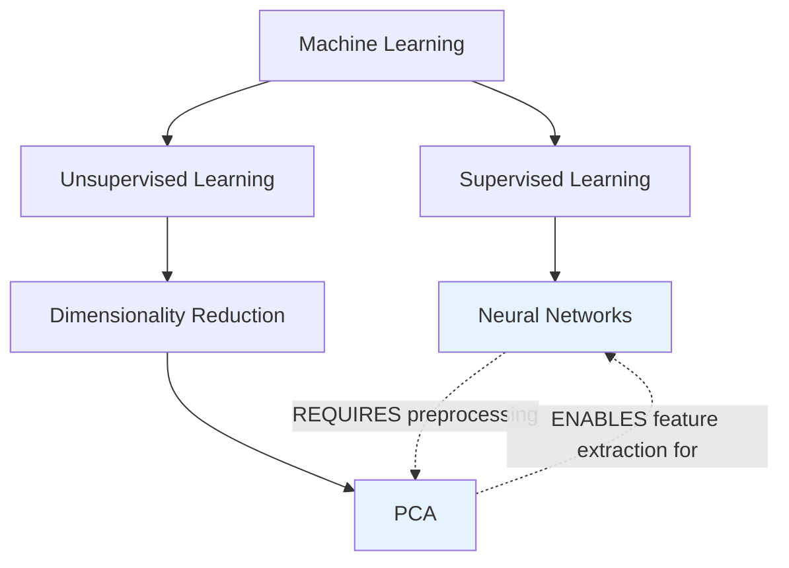
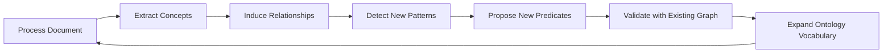

# Recursive Ontology Architecture

**Status:** Vision Document
**Version:** 1.0.0
**Date:** 2026-01-27
**Related:** WO-VIS-010, [Master Pipeline Architecture](../foundation/05-MASTER-PIPELINE-ARCHITECTURE.md), [Pipeline Layer Experimentation](./PIPELINE-LAYER-EXPERIMENTATION.md)
**Cross-references:** [Infinite Loop Learning](./INFINITE-LOOP-LEARNING.md) (WO-VIS-011), [Temporal Prediction Layer](./TEMPORAL-PREDICTION.md) (WO-VIS-012)

---

## 1. Introduction and Motivation

The Knowledge Graph Lab aspires to be a self-replicating, recursive knowledge engine that maps the latent space of human understanding into a navigable, visual ontology. At the heart of this ambition lies a fundamental architectural challenge: how does a system move from coarse, high-level topics to the fine-grained, semantically rich concept networks that enable genuine reasoning?

Traditional knowledge graph systems treat ontology as a static scaffolding -- a predefined schema that data conforms to. KGL takes a radically different approach. The ontology is not a container for knowledge; it is an emergent property of the knowledge itself. As the system processes information, it discovers concepts, induces relationships, and grows its own structural vocabulary. The ontology is alive.

This document describes the theory behind KGL's recursive ontology architecture: a multi-layer, self-growing system where concepts decompose into sub-concepts, multiple analytical lenses provide different perspectives on the same data, and the act of processing information produces new ontological structure. Provenance -- the traceable lineage of every concept and relationship -- is not metadata bolted on after the fact, but a foundational architectural concern woven into every layer.

### The Problem: The Missing Layer

Current knowledge systems suffer from a critical gap. User input arrives as natural language. Search engines return documents. Between these two endpoints, most systems produce only coarse topic vectors -- blunt instruments that lose the semantic richness of the original material.

```
CURRENT (Lossy):
  User Input --> [Search] --> Coarse Topic Vectors --> Knowledge Graph

PROPOSED (Recursive Decomposition):
  User Input --> [Search] --> Documents --> [Decomposition] --> Atomic Concepts
       --> [Ontology Mapping] --> Typed Relationships --> Knowledge Graph
```

The decomposition layer is the missing step. It transforms unstructured text into atomic semantic nodes with typed, provenance-tracked relationships. Without it, the knowledge graph is a collection of loosely connected topics. With it, the graph becomes a reasoning substrate.

---

## 2. Core Concept: Recursive Decomposition

### 2.1 What Is Recursive Decomposition?

Recursive decomposition is the process of breaking a concept into its constituent parts, then breaking those parts further, until the system reaches a level of granularity appropriate for the analytical task at hand. Each decomposition step produces new concept nodes and new typed relationships, expanding the ontology from within.

Consider the concept "Machine Learning":

```
Machine Learning
  |-- Supervised Learning
  |     |-- Classification
  |     |     |-- Decision Trees
  |     |     |-- Support Vector Machines
  |     |     |-- Neural Networks
  |     |-- Regression
  |           |-- Linear Regression
  |           |-- Polynomial Regression
  |-- Unsupervised Learning
  |     |-- Clustering
  |     |     |-- K-Means
  |     |     |-- DBSCAN
  |     |-- Dimensionality Reduction
  |           |-- PCA
  |           |-- t-SNE
  |-- Reinforcement Learning
        |-- Q-Learning
        |-- Policy Gradient
```

This is not a static taxonomy defined by a human. It is a structure induced by the system as it processes research about machine learning. Each node carries provenance (which source document introduced it), confidence (how well-supported is this decomposition), and lens membership (which analytical perspectives include it).

### 2.2 The Five-Stage Decomposition Flow

Decomposition operates through five stages, corresponding to Row 3 of the KGL Master Pipeline:

```
SIGNAL --> CANDIDATE GENERATION --> DECOMPOSITION --> ONTOLOGY MAPPING --> INTEGRATION
```

**Stage 1: Signal.** A trigger arrives -- a user query, a search result, a gap identified by the reasoning engine. This signal carries context: what the user is investigating, what the system already knows, what gaps exist.

**Stage 2: Candidate Generation.** An LLM proposes high-level topics related to the signal. This is the current state of most systems: broad, surface-level associations. For "Regenerative Agriculture," candidates might include "Soil Health," "Carbon Sequestration," "Permaculture."

**Stage 3: Decomposition.** Each candidate is broken into 10-20 atomic semantic nodes. "Soil Health" becomes ["Soil Microbiome," "Mycorrhizal Networks," "Organic Matter Content," "Soil pH," "Water Retention Capacity," "Nutrient Cycling"]. Each node receives a confidence score and a provenance link to the source material.

**Stage 4: Ontology Mapping.** Typed edges are drawn between atomic nodes. The system induces relationships using semantic predicates:

- "Mycorrhizal Networks" ENABLES "Nutrient Cycling"
- "Organic Matter Content" INCREASES "Water Retention Capacity"
- "Soil pH" CONSTRAINS "Soil Microbiome"

Each relationship is tagged with its analytical lens (Ecological, Economic, Social, Technical) and linked to the source sentence that supports it.

**Stage 5: Integration.** New nodes and edges merge into the global graph. Deduplication detects that "Soil Microbiome" may already exist under a different parent. Conflict resolution handles cases where new relationships contradict existing ones. Layer tagging ensures each node and edge knows which lens(es) it belongs to.

### 2.3 Decomposition Depth Criteria

How deep should decomposition go? The system uses four criteria to decide when to stop:

1. **Atomicity.** A concept is atomic when further decomposition would produce terms that are not meaningfully distinct in the current analytical context. "Linear Regression" is atomic for a survey of ML techniques; it is not atomic for a statistics textbook.

2. **Source Support.** Decomposition stops when source material does not contain enough evidence to support further breakdown. The system does not hallucinate structure beyond what the data warrants.

3. **Diminishing Returns.** If a decomposition step produces sub-concepts with confidence scores below a threshold (default: 0.6), the system treats the parent as effectively atomic.

4. **Budget Constraints.** Each decomposition step costs LLM tokens. The system respects per-query and per-session cost budgets, stopping decomposition when the budget is exhausted.

### 2.4 Hierarchical vs. Networked Relationships

Decomposition produces hierarchical IS_A relationships (parent-child). But the real power emerges when the system discovers cross-branch connections: lateral relationships that cut across the hierarchy.



The dashed lines represent cross-branch relationships discovered during ontology mapping. These lateral connections are where the most valuable insights live: they reveal how concepts from different parts of the hierarchy interact with each other.

---

## 3. Multi-Lens Perspective System

### 3.1 What Is a Lens?

A lens is an analytical perspective applied to the same underlying data. The raw concepts and source material remain constant; what changes is the set of relationships the system highlights, the predicates it prioritizes, and the sub-concepts it considers relevant.

Consider "Deforestation" viewed through four lenses:

| Lens | Relevant Concepts | Key Relationships |
|------|-------------------|-------------------|
| **Ecological** | Habitat Loss, Biodiversity Decline, Carbon Release, Soil Erosion | Deforestation CAUSES Habitat Loss; Soil Erosion PRECEDES Landslide |
| **Economic** | Timber Revenue, Land Value, Carbon Credits, Supply Chain Risk | Deforestation ENABLES Timber Revenue; Carbon Credits MITIGATE Carbon Release |
| **Social** | Indigenous Displacement, Food Security, Public Health, Migration | Deforestation CAUSES Indigenous Displacement; Migration PRECEDES Urbanization |
| **Technical** | Remote Sensing, GIS Mapping, Satellite Imagery, Fire Detection | Remote Sensing ENABLES Monitoring; GIS Mapping REQUIRES Satellite Imagery |

Each lens produces a different subgraph from the same pool of atomic concepts. A single concept node (like "Carbon Release") may appear in multiple lenses, serving as a bridge node that connects perspectives.

### 3.2 Lens Architecture

```
                        ┌──────────────────────────┐
                        │    ATOMIC CONCEPT POOL     │
                        │  (lens-agnostic raw data)  │
                        └──────────┬───────────────┘
                                   │
                    ┌──────────────┼──────────────┐
                    │              │              │
              ┌─────▼─────┐ ┌─────▼─────┐ ┌─────▼─────┐
              │ ECOLOGICAL │ │ ECONOMIC  │ │  SOCIAL   │
              │   LENS     │ │   LENS    │ │   LENS    │
              │            │ │           │ │           │
              │ Predicates:│ │ Predicates│ │ Predicates│
              │ CAUSES     │ │ ENABLES   │ │ CAUSES    │
              │ PRECEDES   │ │ MITIGATES │ │ PRECEDES  │
              │ REQUIRES   │ │ COSTS     │ │ DISPLACES │
              └─────┬──────┘ └─────┬─────┘ └─────┬─────┘
                    │              │              │
                    └──────────────┼──────────────┘
                                   │
                        ┌──────────▼───────────────┐
                        │   COMPOSITE VIEW LAYER    │
                        │  (overlay, compare, find  │
                        │   bridge nodes)            │
                        └──────────────────────────┘
```

The lens system is not a filter that hides data. It is a relationship generator: the same concept pool, processed through different analytical frames, produces different relationship networks. The composite view layer allows users to overlay multiple lenses and discover bridge nodes -- concepts that connect otherwise separate analytical domains.

### 3.3 Lens Switching Mechanics

Lens switching is a zero-cost operation on pre-computed data. When the system processes a document, it runs decomposition through all active lenses simultaneously (see [Pipeline Layer Experimentation](./PIPELINE-LAYER-EXPERIMENTATION.md) for the parallel processing architecture). The results are stored with lens tags on every edge.

Switching a lens in the UI is a graph filter operation: show edges where `layerId === "lens_ecological"`. Overlaying two lenses is a union: show edges where `layerId IN ("lens_ecological", "lens_economic")`. Finding bridge nodes is an intersection: show concept nodes that have edges in both lens layers.

### 3.4 Custom and Domain-Specific Lenses

The four default lenses (Ecological, Economic, Social, Technical) are starting points. The system supports user-defined lenses for domain-specific analysis:

- A pharmaceutical researcher might define a "Regulatory" lens that highlights compliance relationships
- A historian might define a "Chronological" lens that emphasizes temporal ordering
- A systems engineer might define a "Failure Mode" lens that highlights causal chains leading to failure

Custom lenses are defined by specifying: (a) a set of preferred predicates, (b) a concept relevance prompt that guides the LLM during decomposition, and (c) optional domain-specific predicates beyond the standard five (IS_A, CAUSES, PRECEDES, REQUIRES, RELATES_TO).

---

## 4. Ontology Induction Mechanics

### 4.1 What Is Ontology Induction?

Traditional ontology engineering is a top-down process: domain experts define categories, relationships, and rules, then data is classified into that structure. Ontology induction inverts this. The structure emerges from the data.

In KGL, every document processed, every concept decomposed, every relationship mapped contributes to the growing ontology. The system does not start with a fixed schema. It starts with five primitive predicates (IS_A, CAUSES, PRECEDES, REQUIRES, RELATES_TO) and discovers richer, domain-specific predicates as it processes more material.

### 4.2 The Induction Cycle

Ontology induction operates as a feedback loop within the decomposition layer:



**Step 1: Process Document.** A new source enters the pipeline. The system chunks it, extracts entities, and identifies candidate concepts.

**Step 2: Extract Concepts.** Atomic concepts are extracted using context-aware prompts that include the current conversation context and existing graph structure. The extraction is not generic -- it is tuned to the user's analytical goals.

**Step 3: Induce Relationships.** An LLM examines pairs of concepts within the document context and proposes typed relationships. The system uses a Generator-Critic pattern: one LLM pass proposes relationships, a second pass reviews and refines them.

**Step 4: Detect New Patterns.** As the graph grows, the system detects recurring relationship patterns that do not fit neatly into the five primitive predicates. For example, in a medical domain, the pattern "Drug X TREATS Condition Y" appears repeatedly. The system recognizes this as a candidate for a new predicate.

**Step 5: Propose New Predicates.** The Meta-Reviewer component examines detected patterns and proposes domain-specific predicates: TREATS, INHIBITS, CONTRAINDICATED_WITH for medicine; FUNDS, REGULATES, COMPETES_WITH for business.

**Step 6: Validate with Existing Graph.** Proposed predicates are checked against the existing graph for consistency. Does the new predicate overlap with an existing one? Does it create contradictions? Is it supported by enough evidence (minimum 3 distinct source documents)?

**Step 7: Expand Ontology Vocabulary.** Validated predicates join the ontology vocabulary. Future decomposition passes can now use these richer predicates, producing more semantically precise relationship networks.

### 4.3 Convergence and Stability

A self-growing ontology risks unbounded expansion. KGL uses three mechanisms to ensure convergence:

1. **Predicate Saturation.** As a domain is well-covered, the rate of new predicate discovery decreases. The system tracks the predicate discovery rate per domain; when it falls below a threshold (fewer than 1 new predicate per 10 documents), the domain ontology is considered stable.

2. **Concept Deduplication.** New concepts are matched against existing nodes using semantic similarity (vector distance). If a proposed concept is within a configurable similarity threshold of an existing node, it is merged rather than added.

3. **Structural Pruning.** Concepts and relationships with very low confidence (below 0.3) that have not been reinforced by subsequent documents are pruned after a grace period, preventing the graph from accumulating noise.

---

## 5. Provenance as First-Class Citizen

### 5.1 Why Provenance Is Architectural

In most knowledge systems, provenance is an afterthought -- a metadata field recording where data came from. In KGL, provenance is a structural property of the graph itself. Every concept node and every relationship edge carries a provenance record that is as much a part of the graph as the semantic content.

This is not a philosophical distinction. It has concrete architectural consequences:

- **Confidence Propagation.** A concept's confidence score is computed from the confidence scores of its provenance sources. A concept supported by three peer-reviewed papers has higher confidence than one supported by a single blog post.
- **Source Transparency.** Any claim in the graph can be traced back to the exact sentence in the exact document that introduced it. This is essential for domains where auditability matters (legal, medical, financial).
- **Conflict Detection.** When two sources disagree about a relationship, the provenance records enable the system to present both sides rather than silently choosing one.
- **Staleness Detection.** Provenance records include timestamps. The system can identify concepts whose source material is outdated and flag them for re-research.

### 5.2 Provenance Data Model

Every node and edge in the graph carries a provenance record:

```
ConceptNode {
  id: string
  label: string
  type: CONCEPT | ENTITY | PROCESS
  layerId: string              // which lens layer
  provenance: {
    sourceVectorId: string     // link to source document in vector store
    sourceText: string         // exact sentence that introduced this concept
    confidence: number         // 0.0 to 1.0
    lens: string               // which lens produced this node
    extractionMethod: string   // which LLM/prompt produced this
    timestamp: ISO8601         // when this was extracted
  }
}

OntologyTriple {
  sourceId: string             // from concept
  targetId: string             // to concept
  predicate: string            // IS_A | CAUSES | PRECEDES | REQUIRES | RELATES_TO | custom
  weight: number               // relationship strength
  layerId: string              // lens layer
  temporalContext: {
    startTime: ISO8601?
    endTime: ISO8601?
    isSequential: boolean
  }
  provenance: {
    sourceText: string         // sentence supporting this relationship
    discoverySource: string    // document ID
    confidence: number
    extractionMethod: string
    timestamp: ISO8601
  }
}
```

### 5.3 Confidence Propagation

Confidence is not a static score assigned once. It propagates through the graph:

- **Source Authority.** Peer-reviewed sources contribute higher base confidence than informal sources.
- **Corroboration.** When multiple independent sources support the same concept or relationship, confidence increases.
- **Recency.** More recent sources contribute higher confidence for time-sensitive domains.
- **Consistency.** Concepts that are consistent with the surrounding graph structure receive a coherence bonus; concepts that contradict their neighbors receive a penalty.

The confidence of a concept node is the weighted average of the confidence values from all provenance records that support it, adjusted by source authority, recency, and consistency factors.

---

## 6. Self-Organization Principles

### 6.1 Emergence Over Engineering

KGL's ontology is not engineered top-down. It emerges bottom-up from the interaction of simple rules:

1. **Decompose.** Break concepts into parts.
2. **Relate.** Draw typed edges between parts.
3. **Tag.** Assign lens membership and provenance.
4. **Merge.** Integrate into the global graph, deduplicating as needed.
5. **Prune.** Remove low-confidence noise.
6. **Reinforce.** Strengthen concepts and relationships that appear across multiple sources.

These six operations, applied recursively across incoming documents, produce complex ontological structure without any predefined schema.

### 6.2 The Ontology Grows Its Own Vocabulary

The most distinctive feature of KGL's recursive ontology is that it extends its own vocabulary. The system begins with five primitive predicates. As it processes domain-specific material, it discovers and validates new predicates. A medical knowledge graph might grow to include TREATS, INHIBITS, DIAGNOSES, CONTRAINDICATED_WITH. A legal knowledge graph might grow to include SUPERSEDES, AMENDS, CITES, OVERRULES.

This vocabulary growth is itself subject to convergence criteria. A mature domain ontology stabilizes around a characteristic set of predicates -- typically 15-25 for a well-defined domain. The system tracks this convergence and reports when a domain's ontological vocabulary has stabilized.

### 6.3 Recursive Growth Patterns

The system exhibits three characteristic growth patterns:

**Pattern 1: Deepening.** An existing branch of the concept hierarchy is decomposed further. The user investigates "Neural Networks" in more depth, and the system decomposes it into "Convolutional Networks," "Recurrent Networks," "Transformers," each with their own sub-concepts.

**Pattern 2: Bridging.** The system discovers lateral connections between previously separate branches. Processing a document about "Transfer Learning" creates edges connecting "Computer Vision" (one branch) to "Natural Language Processing" (another branch), revealing structural similarities.

**Pattern 3: Reframing.** A new lens applied to existing data reveals entirely new relationship structures. Applying an "Environmental Impact" lens to a technology knowledge graph surfaces relationships like "GPU Manufacturing REQUIRES Rare Earth Mining" that were invisible under the Technical lens.

---

## 7. Examples and Use Cases

### 7.1 Example: Regenerative Agriculture

**Input Signal:** User enters "Regenerative Agriculture" as a research topic.

**Decomposition (Stage 3):**
Atomic concepts extracted: Soil Health, Carbon Sequestration, Permaculture, No-Till Farming, Cover Crops, Composting, Biodiversity, Mycorrhizal Networks, Water Retention, Nutrient Cycling, Crop Rotation, Holistic Grazing.

**Ontology Mapping (Stage 4) through Ecological Lens:**
- Cover Crops INCREASES Soil Health (confidence: 0.92, source: doc-417, sentence 23)
- No-Till Farming PRESERVES Mycorrhizal Networks (confidence: 0.88, source: doc-417, sentence 45)
- Mycorrhizal Networks ENABLES Nutrient Cycling (confidence: 0.85, source: doc-312, sentence 12)
- Carbon Sequestration MITIGATES Climate Change (confidence: 0.91, source: doc-289, sentence 7)

**Same data through Economic Lens:**
- Carbon Sequestration GENERATES Carbon Credits (confidence: 0.78, source: doc-501, sentence 31)
- Cover Crops REDUCES Input Costs (confidence: 0.72, source: doc-503, sentence 14)
- Biodiversity INCREASES Crop Resilience (confidence: 0.83, source: doc-312, sentence 56)

**Bridge Node Discovery:**
"Carbon Sequestration" appears in both Ecological and Economic lenses. It is a bridge node connecting environmental science to market mechanisms. The system surfaces this to the user as a cross-domain insight.

### 7.2 Example: Recursive Deepening

A user starts with "Artificial Intelligence" and the system produces a top-level decomposition. The user then clicks on "Natural Language Processing" to investigate further. The system recursively decomposes NLP into: Tokenization, Named Entity Recognition, Sentiment Analysis, Machine Translation, Question Answering, Text Summarization, etc. Each of these can be further decomposed. The ontology grows on demand, following the user's curiosity.

### 7.3 Example: Ontology Induction in Legal Domain

Processing 50 legal documents, the system starts with the five primitive predicates. By document 15, it detects a recurring pattern: "Statute X was replaced by Statute Y" -- this does not fit IS_A, CAUSES, PRECEDES, REQUIRES, or RELATES_TO cleanly. The system proposes a new predicate: SUPERSEDES. By document 30, it has also induced AMENDS, CITES, and OVERRULES. By document 50, the legal ontology vocabulary has stabilized at 12 predicates.

---

## 8. Integration with KGL Pipeline

The recursive ontology architecture corresponds to **Row 3 (Decomposition Layer)** in the [Master Pipeline Architecture](../foundation/05-MASTER-PIPELINE-ARCHITECTURE.md):

```
ROW 3: DECOMPOSITION LAYER
  CONCEPTS --> T:LENS --> ONTOLOGY-MAP --> TEMPORAL-TAG --> PROVENANCE
```

| Pipeline Stage | Ontology Operation | Cost | Latency |
|----------------|-------------------|------|---------|
| CONCEPTS | Extract atomic concepts from chunked text | ~$0.004/call | <1500ms |
| T:LENS | Apply perspective filter (zero-cost on pre-computed data) | ~$0 | <10ms |
| ONTOLOGY-MAP | Induce typed relationships via Generator-Critic pattern | ~$0.003/call | <1000ms |
| TEMPORAL-TAG | Add time dimension to sequential relationships | ~$0.002/call | <500ms |
| PROVENANCE | Link every node and edge to source sentences | ~$0 | <100ms |

The decomposition layer sits between Ingestion/Extraction (Row 2) and KG-Merge/Synthesis (Row 4). It transforms extracted entities and relationships into the rich, typed, multi-lens ontological structure described in this document.

The Tuning Layer's Recipe system applies per-stage: a cost-sensitive recipe might skip TEMPORAL-TAG for non-sequential domains; a high-fidelity recipe might run ONTOLOGY-MAP twice with different LLM prompts and take the intersection.

**Connections to other vision documents:**
- **Infinite Loop Learning (WO-VIS-011):** The ontology induction cycle feeds into the infinite learning loop. Golden Tuples (user-verified best relationships) refine future decomposition. The Negative Constraint Log prevents the system from re-proposing rejected relationships.
- **Temporal Prediction Layer (WO-VIS-012):** The TEMPORAL-TAG stage produces the raw material for temporal link prediction. Sequential relationships (A PRECEDES B with temporal context) accumulate into patterns that enable predictive reasoning.

---

## 9. Summary

The recursive ontology architecture gives KGL its defining capability: the ability to reason about concepts, not just retrieve documents. Through recursive decomposition, multi-lens perspectives, self-growing ontological vocabulary, and architecturally embedded provenance, the system transforms raw information into structured understanding.

The ontology is not a static schema. It is a living structure that grows with every document processed, refines itself through user feedback, and extends its own vocabulary as it encounters new domains. It is the substrate on which KGL's reasoning engine operates -- and the reason KGL is not just another search tool, but a thinking machine.

---

**Document Version:** 1.0.0
**Last Updated:** 2026-01-27
**Author:** KGL Vision Team
**Work Order:** WO-VIS-010
