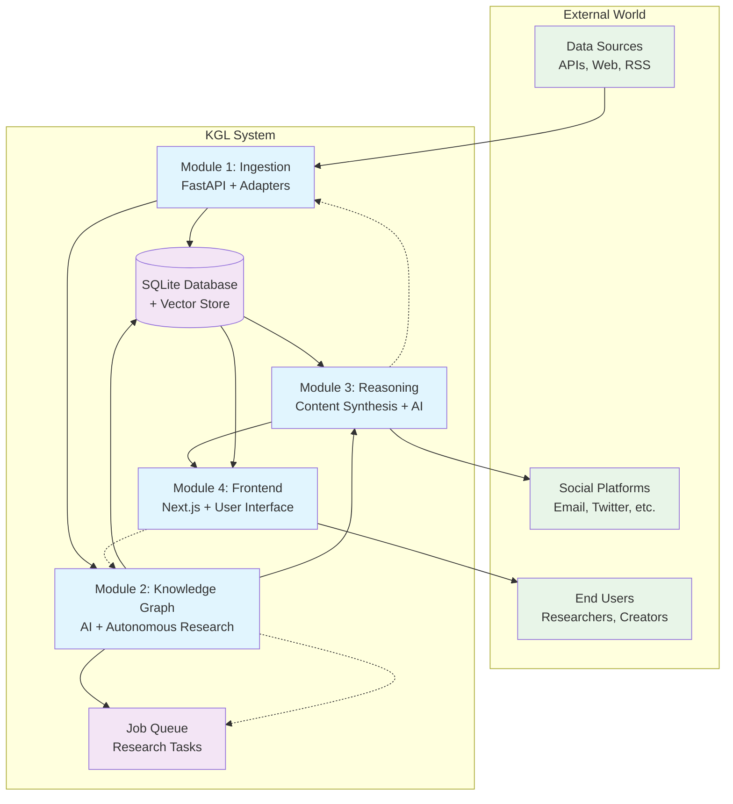
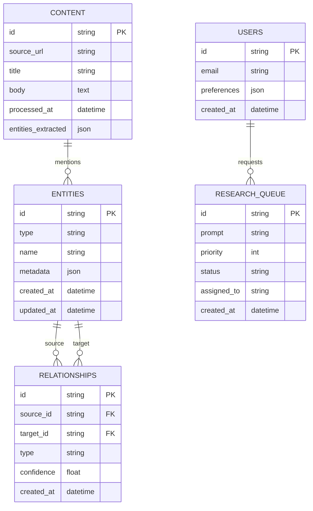
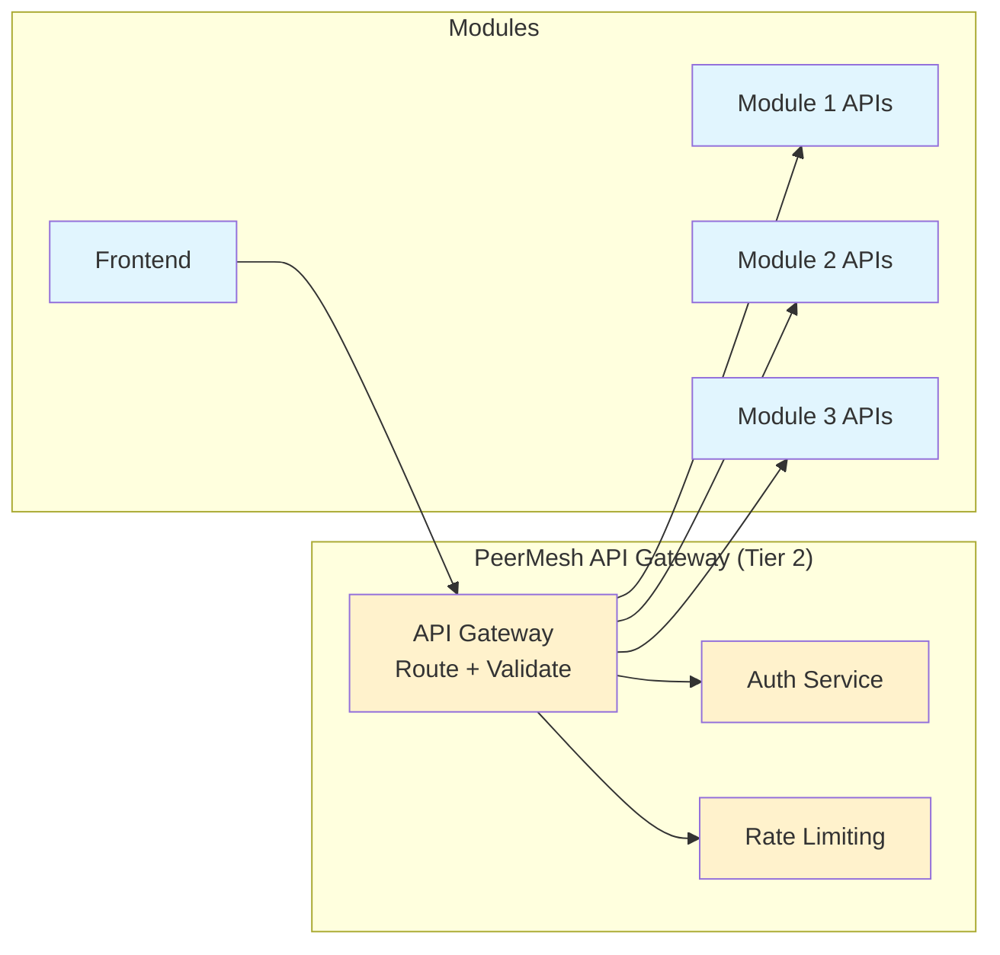

# Dependencies & Integration Architecture

**Purpose**: Visual guide to how the 4 modules connect, share data, and work independently

## 🏗️ High-Level System Architecture



## 🔄 Data Flow & Dependencies

### Primary Data Flow (Left to Right)
1. **Sources → Module 1**: Raw content ingestion and cleaning
2. **Module 1 → Database**: Normalized, clean data storage  
3. **Module 1 → Module 2**: Triggers for new research based on ingested content
4. **Module 2 → Database**: Knowledge graph entities and relationships
5. **Module 2 → Module 3**: Research priorities and knowledge updates
6. **Module 3 → Module 4**: Generated content, digests, recommendations
7. **Module 4 → Users**: Final user interface and experience

### Feedback Loops (Right to Left)
- **Module 4 → Module 2**: User preferences influence research priorities
- **Module 3 → Module 1**: Content needs drive what sources to prioritize
- **Module 2 → Queue**: AI system schedules its own research tasks

## 📊 Module Interdependency Matrix

| Module | Depends On | Provides To | Independence Strategy |
|--------|------------|-------------|---------------------|
| **Module 1<br/>Ingestion** | External APIs, Web sources | Clean data to M2, M3, M4 | Mock external sources, seed data |
| **Module 2<br/>Knowledge Graph** | Data from M1, User prefs from M4 | Entities to M3, M4; Research tasks to M1 | Synthetic knowledge graph data |
| **Module 3<br/>Reasoning** | Knowledge from M2, Raw content from M1 | Content to M4, Priorities to M1 | Mock knowledge + user profiles |
| **Module 4<br/>Frontend** | Content from M3, Data from M2, M1 | User preferences to M2 | Mock all backend APIs |

## 🛠️ Integration Interfaces

### Module 1 → Module 2 Interface
```python
# Ingestion notifies Knowledge Graph of new content
POST /api/knowledge/ingest-notification
{
    "content_id": "123",
    "source_url": "https://...",
    "content_type": "article|policy|announcement",
    "extracted_entities": ["Platform", "Creator", "Policy"],
    "timestamp": "2025-09-07T14:00:00Z"
}
```

### Module 2 → Module 3 Interface  
```python
# Knowledge Graph provides research updates to Reasoning
GET /api/knowledge/updates?since=timestamp
{
    "new_entities": [...],
    "updated_relationships": [...],
    "research_priorities": [...],
    "knowledge_gaps": [...]
}
```

### Module 3 → Module 4 Interface
```python
# Reasoning provides content to Frontend
GET /api/content/digest?user_id=123
{
    "personalized_content": [...],
    "trending_topics": [...],
    "recommendations": [...],
    "generated_summaries": [...]
}
```

### Module 4 → Module 2 Interface
```python
# Frontend sends user preferences to Knowledge Graph
POST /api/user/preferences
{
    "user_id": "123",
    "interests": ["creator-rights", "platform-policies"],
    "geographic_scope": "boulder|colorado|us|global",
    "priority_weights": {...}
}
```

## 🔧 Shared Infrastructure

### Database Schema (Shared by All Modules)


### API Gateway Pattern (Optional Tier 2)


## 🔒 Independence Strategies

### Week 3-6: Tier 1 Independence
Each module works with mock data and simplified interfaces:

**Module 1**: Uses sample URLs and mock API responses  
**Module 2**: Works with synthetic creator economy dataset  
**Module 3**: Uses predefined knowledge graph and mock user profiles  
**Module 4**: Mocks all backend APIs with realistic data

### Week 7-9: Tier 2 Integration
Modules begin connecting to each other:

**Progressive Integration**: Connect one interface at a time  
**Graceful Degradation**: Modules fall back to mocks when connections fail  
**Integration Testing**: Automated tests verify interfaces work correctly

### Week 10: Full Integration (Stretch Goal)
All modules working together:

**End-to-End Flow**: Data flows from ingestion through to user interface  
**Real-time Updates**: Changes propagate through the system  
**Performance Optimization**: System handles realistic loads

## ⚠️ Integration Risks & Mitigations

### Risk: API Contract Drift
**Problem**: Module APIs change, breaking other modules  
**Mitigation**: Version all APIs, maintain backwards compatibility, contract testing

### Risk: Data Format Incompatibility  
**Problem**: Module A outputs data Module B can't understand  
**Mitigation**: Shared schema definitions, validation at boundaries, clear documentation

### Risk: Performance Bottlenecks
**Problem**: Module dependencies create slow chains  
**Mitigation**: Async processing, caching, graceful degradation

### Risk: Single Points of Failure
**Problem**: If Module A fails, everything breaks  
**Mitigation**: Circuit breakers, fallback modes, independent operation capability

## 📈 Scalability Considerations

### Horizontal Scaling Patterns
- **Module 1**: Scale ingestion workers independently  
- **Module 2**: Distribute knowledge graph processing  
- **Module 3**: Scale content generation workers  
- **Module 4**: Standard web application scaling

### Data Partitioning Strategies
- **By Domain**: Creator economy vs. investment research vs. personal projects  
- **By Geography**: Local vs. regional vs. global data  
- **By User**: Personal knowledge graphs per user or organization

---

*This architecture ensures each intern can work independently while building toward a cohesive, integrated system.*