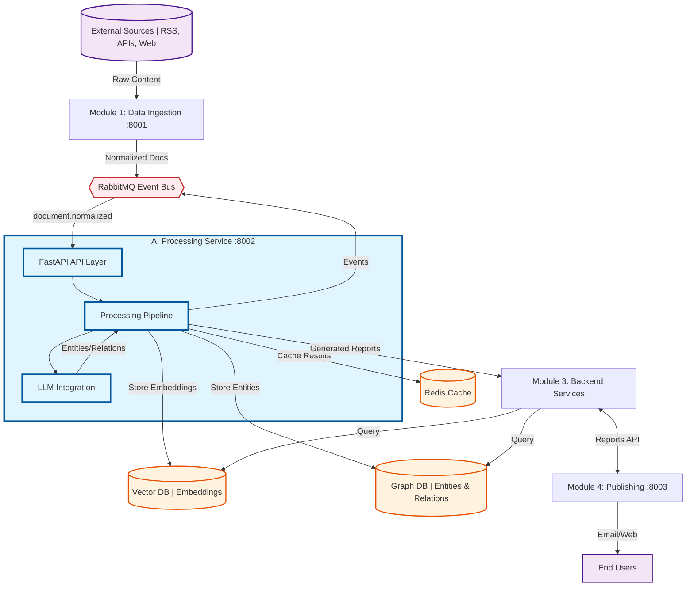
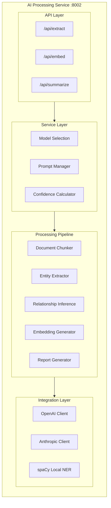

# AI Module Discovery Report

**Module:** AI Development Module
**Date:** 2025-10-10
**Confidence:** 9/10

This report consolidates all discovery findings into one document. Detailed source files are in `00-intake/`, `01-distilled/`, and `02-discovery/` directories.

---

# 1. Technology Decisions

## Decision 1: Python 3.11 + FastAPI + Docker

**Chosen Stack:**
- Python 3.11 (runtime)
- FastAPI (web framework)
- spaCy (local NER)
- OpenAI API (LLM)
- Docker (containerization)

**Why:**
- **Python 3.11:** Best AI/ML library ecosystem (transformers, langchain, spaCy, etc.). Latest stable version with async improvements.
- **FastAPI:** Modern async framework, automatic OpenAPI docs, excellent performance, type hints support.
- **spaCy:** Free local NER for cost-sensitive operations, fast inference (<100ms).
- **Docker:** Ensures consistent deployment across dev/staging/production.

**Alternatives Rejected:**
- Node.js + TypeScript: Weaker AI/ML ecosystem
- Django: Too heavy, FastAPI lighter and faster
- No containerization: Deployment inconsistencies unacceptable

---

## Decision 2: Mock-First Implementation

**Approach:**
- **Phase 1 (Weeks 1-6):** Build API with hardcoded mock responses
- **Phase 2 (Weeks 7-10):** Replace mocks with real AI (OpenAI API)

**Why:**
- Saves $5,000+ in API costs during development
- Enables Backend team to integrate in parallel (5-week time savings)
- Validates architecture before expensive operations
- Allows rapid iteration without API delays
- Reduces risk of cost overruns

**Alternative Rejected:**
- Real AI from Day 1: Too expensive during development, can't test infrastructure without costs

**Example Mock:**
```python
def mock_extract_entities(text):
    entities = []
    if "youtube" in text.lower():
        entities.append({"name": "YouTube", "type": "platform", "confidence": 95})
    return {"entities": entities}
```

---

## Decision 3: Microservices Architecture

**System Structure:**
5 independent services with AI Processing as Module 2

**Why:**
- **Parallel Development:** 4 teams work independently (4x speed)
- **Service Isolation:** Failures don't cascade
- **Independent Scaling:** Scale AI (2-20 replicas) without scaling ingestion
- **Technology Flexibility:** Each service uses optimal stack

**Alternative Rejected:**
- Monolithic: All-or-nothing deployment, single point of failure, no parallel development

**Impact:**
- AI module can scale independently based on queue depth
- Deploy AI updates without touching other services
- Failures contained to single service

---

## Decision 4: Event-Driven Communication (RabbitMQ)

**Pattern:** Asynchronous pub/sub via RabbitMQ event bus

**AI Module Events:**
- **Publishes:** `entity.extracted`, `relationship.discovered`, `report.generated`, `processing.failed`
- **Subscribes:** `document.normalized`, `extraction.requested`, `feedback.received`

**Why:**
- **Async Processing:** Non-blocking operations, better performance
- **Retry Mechanisms:** Automatic handling of transient failures
- **Audit Trails:** Complete event history for compliance
- **Loose Coupling:** Services don't directly depend on each other
- **Resilience:** Dead letter queues capture failed messages

**Alternatives Rejected:**
- Synchronous REST: Tight coupling, cascading failures, poor performance
- gRPC: Still synchronous, more complex than needed

---

## Decision 5: Separation of Concerns

**Responsibility Split:**
- **AI Module:** Generates standalone reports with URLs
- **Backend:** Stores reports, provides query API
- **Publishing:** Queries reports, personalizes, distributes

**Why:**
- **Loose Coupling:** AI doesn't know about subscribers or email
- **Independent Scaling:** Each module scales based on own load
- **Multiple Channels:** Publishing can add Slack/Discord without AI changes
- **Testability:** Can test AI report generation without Publishing

**Integration:**
```
AI → POST /api/reports → Backend Storage → GET /api/reports → Publishing → Email/Web
```

**Alternative Rejected:**
- AI sends directly to Publishing: Tight coupling, single channel, can't query historical reports

---

## Decision 6: Multi-Model Strategy

**Model Portfolio:**

| Model | Use Case | Cost | Accuracy |
|-------|----------|------|----------|
| GPT-4 | Complex extraction, synthesis | High ($0.03/1k tokens) | Highest |
| GPT-3.5 | Standard extraction | Medium ($0.001/1k tokens) | High |
| Claude | Long documents (100k context) | High | High |
| spaCy | Simple NER, cost-sensitive | Free | Medium |

**Selection Logic:**
```python
if document_length > 10000:
    return "claude"  # Large context
elif task_type == "simple_ner" and budget_remaining < threshold:
    return "spacy"   # Cost-sensitive
elif task_type == "complex_extraction":
    return "gpt-4"   # Highest accuracy
else:
    return "gpt-3.5" # Good balance
```

**Fallback Chain:** GPT-4 → Claude → GPT-3.5 → spaCy

**Why:**
- **No Vendor Lock-in:** Not dependent on single provider
- **Cost Optimization:** Use cheaper models for 60% of tasks (saves ~$6,000/month)
- **Resilience:** Fallback if primary unavailable
- **A/B Testing:** Compare models objectively

**Alternative Rejected:**
- Single provider (OpenAI only): Vendor lock-in, no fallback, miss cost optimization

---

## Decision 7: Confidence Scoring (0-100 Scale)

**Formula:**
```
confidence = (source_score * 0.3) + (context_score * 0.4) + (model_confidence * 0.3)
```

**Components:**
- **Source Score (30%):** Official sites = 95-100, social media = 70-85
- **Context Score (40%):** Multiple mentions = +20, contradictions = -30
- **Model Confidence (30%):** LLM self-reported, calibrated against ground truth

**Thresholds:**
- High: ≥85 (90%+ accurate)
- Medium: 70-84 (75-85% accurate)
- Low: <70 (requires review)

**Why:**
- Users understand certainty of information
- Can filter low-confidence extractions
- Focus human review on uncertain results
- Learn from feedback to calibrate scores

**Alternative Rejected:**
- Binary (high/low): Lacks granularity for nuanced decision-making

---

## Decision 8: Phased Rollout (3 → 4 → 5)

**Phase Targets:**

| Phase | Accuracy | Throughput | Cost/Doc | Features |
|-------|----------|------------|----------|----------|
| 3 (MVP) | 80% | 100/hr | $0.10 | 5 entity types, basic confidence |
| 4 (Enhanced) | 90% | 500/hr | $0.07 | Relationships, multi-model, fine-tuning |
| 5 (Production) | 95% | 1000/hr | $0.05 | 10+ entities, self-improving, feedback loops |

**Why:**
- **Incremental Value:** Deliver value in 12 weeks, not 6+ months
- **Risk Management:** Validate before full investment
- **Learning:** Each phase informs next priorities
- **Budget:** Spread costs over time

**Milestone Gates:**
- Phase 3→4: Must achieve 80% accuracy
- Phase 4→5: Must achieve 90% accuracy + positive ROI

**Alternative Rejected:**
- Big Bang (all features Phase 1): High risk, longer time to value, harder to course-correct

---

## Decision 9: 8-Stage Processing Pipeline

**Pipeline:**
1. Input Reception (receive from queue)
2. Document Chunking (1000-2000 tokens)
3. Entity Extraction (select model, apply prompts)
4. Relationship Inference (analyze co-occurrence)
5. Confidence Scoring (apply formula)
6. Embedding Generation (768/1536 dims)
7. Validation (check formats, consistency)
8. Output (send to Backend, publish events)

**Error Handling:** Retry with exponential backoff (max 3 attempts), fallback to simpler model, dead letter queue for failures

**Why:**
- **Modularity:** Optimize each stage independently
- **Testability:** Test stages in isolation
- **Observability:** Track metrics at each stage
- **Resilience:** Errors contained to single stage

**Alternative Rejected:**
- Single-stage: Hard to debug, all-or-nothing, poor observability

---

## Decision 10: REST API with JSON

**Endpoints:**
```
POST /api/extract    - Entity extraction
POST /api/embed      - Embedding generation
POST /api/summarize  - Content summarization
```

**Why:**
- **Simplicity:** REST widely understood
- **Tooling:** Excellent client libraries for all languages
- **Documentation:** OpenAPI/Swagger auto-generated by FastAPI
- **Compatibility:** Works with any HTTP client
- **Caching:** Standard HTTP caching headers

**Alternatives Rejected:**
- GraphQL: Overkill for simple API, more complex
- gRPC: Binary protocol harder to debug, less browser support

---

# 2. Component List

## Critical Path (Must Have for MVP)

### 1. Programming Language Runtime
**Component:** Python 3.11
**Purpose:** Execute AI/ML code
**Why:** Rich AI/ML ecosystem, async support, strong typing
**Status:** ✅ Decided

### 2. Web Framework
**Component:** FastAPI
**Purpose:** API endpoints
**Why:** Async, auto-docs, high performance (10k+ req/sec)
**Status:** ✅ Decided

### 3. Entity Extraction (Local)
**Component:** spaCy
**Purpose:** Basic NER without API costs
**Why:** Pre-trained models, fast (<100ms), offline capable
**Status:** ✅ Decided

### 4. LLM API (Primary)
**Component:** OpenAI API (GPT-4)
**Purpose:** Complex extraction, synthesis
**Why:** Highest accuracy, structured output, 8k+ context
**Status:** ✅ Decided

### 5. LLM API (Fallback)
**Component:** Anthropic API (Claude)
**Purpose:** Long documents, fallback
**Why:** 100k context window, different provider (resilience)
**Status:** ✅ Decided

### 6. Embedding Model
**Component:** OpenAI text-embedding-ada-002
**Purpose:** Generate semantic vectors (1536 dims)
**Why:** Consistent, batch processing, multi-language
**Status:** ✅ Decided

### 7. Message Queue
**Component:** RabbitMQ
**Purpose:** Async job processing, events
**Why:** Durable, pub/sub + queue, dead letter queues, 10k+ msg/sec
**Status:** ✅ Decided

### 8. Caching Layer
**Component:** Redis
**Purpose:** Cache entities, responses, embeddings
**Why:** Sub-ms latency, TTL support, pub/sub, cluster support
**Status:** ✅ Decided

### 9. Containerization
**Component:** Docker
**Purpose:** Consistent deployment
**Why:** Multi-stage builds, health checks, standard
**Status:** ✅ Decided

### 10. Data Validation
**Component:** Pydantic (Python)
**Purpose:** Validate API requests/responses
**Why:** Schema definition, auto-parsing, clear errors
**Status:** ✅ Decided

### 11. Testing Framework
**Component:** pytest (Python)
**Purpose:** Unit, integration, API tests
**Why:** Fixtures, mocking, async support, coverage
**Status:** ✅ Decided

---

## Important (Phase 4)

### 12. Container Orchestration
**Component:** Kubernetes
**Purpose:** Deploy, scale, manage containers
**Why:** Auto-scaling, rolling updates, service discovery
**Status:** ⚠️ Standard choice

### 13. Metrics Collection
**Component:** Prometheus
**Purpose:** Track metrics (accuracy, cost, errors)
**Why:** Time-series, PromQL, alerting, 90-day retention
**Status:** ⚠️ Standard choice

### 14. Metrics Visualization
**Component:** Grafana
**Purpose:** Monitoring dashboards
**Why:** Prometheus integration, custom dashboards, real-time
**Status:** ⚠️ Standard choice

### 15. Structured Logging
**Component:** structlog (Python)
**Purpose:** JSON logs with context
**Why:** Contextual fields (job_id), log levels, low overhead
**Status:** ⚠️ Standard choice

### 16. HTTP Client
**Component:** httpx or aiohttp (Python)
**Purpose:** Call LLM APIs, Backend APIs
**Why:** Async, connection pooling, timeouts, retries
**Status:** ⚠️ Research needed

### 17. Prompt Template Engine
**Component:** LangChain or custom
**Purpose:** Manage prompt templates
**Why:** Variable substitution, versioning, chaining
**Status:** 🔬 Research Brief #1

---

## Nice to Have (Phase 5+)

### 18. Local LLM
**Component:** Llama 3 or Mistral
**Purpose:** Cost-sensitive operations
**Why:** Self-hosted, $50k+/year potential savings
**Status:** 🔬 Research Brief #3

### 19. Log Aggregation
**Component:** Elasticsearch + Kibana (ELK)
**Purpose:** Centralized log search
**Why:** Full-text search, 30-day retention
**Status:** ⚠️ Optional

### 20. Error Tracking
**Component:** Sentry
**Purpose:** Exception capture, stack traces
**Why:** Auto-capture, breadcrumbs, issue grouping
**Status:** ⚠️ Optional

---

## External Services (Backend-Provided)

### 21. Graph Database
**Component:** Neo4j (Backend owns)
**Purpose:** Store entities and relationships
**Why:** Cypher queries, relationship traversal
**Note:** AI writes to it, Backend owns it

### 22. Vector Database
**Component:** Pinecone, Qdrant, or Weaviate
**Purpose:** Store embeddings (768/1536 dims)
**Why:** ANN search, cosine similarity, 1000+ QPS
**Status:** 🔬 Research Brief #2 (CRITICAL PATH)

### 23. Report Storage
**Component:** Backend API (implementation TBD)
**Purpose:** Store generated news reports
**Why:** Document storage, metadata query, URL generation
**Note:** Backend provides API

---

## Development Tools

### 24. Package Manager
**Component:** pip + requirements.txt (or Poetry)
**Purpose:** Dependency management
**Status:** ✅ Standard

### 25. Code Formatter
**Component:** black (Python)
**Purpose:** Consistent style
**Status:** ⚠️ Recommended

### 26. Linter
**Component:** pylint or flake8 + mypy
**Purpose:** Static analysis, type checking
**Status:** ⚠️ Recommended

---

**Component Status Legend:**
- ✅ Decided and firm
- ⚠️ Standard choice or recommended
- 🔬 Requires research (see Research Roadmap)

---

# 3. Architecture

## System Context

AI Module is **Module 2** in a 4-module microservices architecture:

1. **Data Ingestion** (:8001) - Collects and normalizes content
2. **AI Processing** (:8002) - **OUR MODULE** - Extracts intelligence
3. **Backend Services** - Stores and serves data
4. **Publishing** (:8003) - Distributes to users

## Top-Level Architecture



**Node Count:** 14 (within ≤15 limit)

## Internal Architecture



## Data Flow

**Input:** Normalized document from Module 1
```json
{
  "job_id": "uuid",
  "document_id": "doc-123",
  "content": "YouTube announces $100M creator fund...",
  "metadata": {"source": "TechCrunch", "published": "2025-10-10"}
}
```

**Processing:** 8-stage pipeline (chunking → extraction → validation → output)

**Output:** Structured entities and relationships
```json
{
  "entities": [
    {"name": "YouTube", "type": "platform", "confidence": 95},
    {"name": "$100M", "type": "amount", "confidence": 92}
  ],
  "relationships": [
    {"from": "YouTube", "to": "creator fund", "type": "offers", "confidence": 88}
  ],
  "embeddings": [0.012, -0.023, ...],
  "processing_time_ms": 1523
}
```

## Communication Patterns

**Event-Driven (Primary):**
- Async processing via RabbitMQ
- AI subscribes to: `document.normalized`, `extraction.requested`, `feedback.received`
- AI publishes: `entity.extracted`, `relationship.discovered`, `report.generated`

**REST API (Secondary):**
- Synchronous requests for real-time extraction
- Used by Frontend for interactive features

## Scaling Strategy

**Horizontal Auto-Scaling:**
- Min replicas: 2 (HA)
- Max replicas: 20
- Scale up when: Queue depth > 1000 OR CPU > 70%
- Scale down when: Queue depth < 100 AND CPU < 30%

**Load Distribution:**
- Round-robin across replicas
- Each replica pulls from shared queue (competing consumers)
- Stateless design (no session affinity needed)

## Resilience Patterns

**Circuit Breakers:** Open after 5 consecutive LLM API failures, use fallback model

**Retry Logic:** Exponential backoff (1s, 2s, 4s), max 3 attempts

**Dead Letter Queue:** Non-recoverable errors go to DLQ for manual review

---

# 4. Requirements

## Core Functional Requirements

### 1. Entity Extraction

**Types:** Organizations, people, amounts, dates, locations, grants, partnerships, events

**Accuracy Targets:**
- Phase 3: 80% precision, 75% recall
- Phase 4: 90% precision, 85% recall
- Phase 5: 95% precision, 85% recall

**Methods:** NER with spaCy (simple), GPT-4 (complex), custom extractors (domain-specific)

### 2. Relationship Mapping

**Types:** Fund, partner, acquire, compete, collaborate, mention

**Discovery:**
- Explicit: Stated in text ("Google owns YouTube")
- Implicit: Inferred from patterns
- Temporal: Time-based connections

**Accuracy Targets:**
- Phase 4: 80% precision
- Phase 5: 85% precision

### 3. Confidence Scoring

**Scale:** 0-100
**Formula:** `(source*0.3) + (context*0.4) + (model*0.3)`
**Thresholds:** High ≥85, Medium 70-84, Low <70

### 4. Data Pipeline

**Stages:** Input → Chunking (1000-2000 tokens) → Extraction → Validation → Error Handling → Output

**Throughput:**
- Phase 3: 100 docs/hour
- Phase 4: 500 docs/hour
- Phase 5: 1000 docs/hour

### 5. News Report Generation

**Types:** Breaking news, analysis, market updates, research summaries

**Structure:**
```json
{
  "report_id": "uuid",
  "url": "/reports/2025-10-10/slug",
  "headline": "...",
  "lead": "...",
  "body": [...],
  "metadata": {
    "topics": ["AI", "funding"],
    "entities": ["OpenAI"],
    "priority": "breaking",
    "relevance_scores": {"ai_industry": 0.98}
  }
}
```

### 6. Quality Assurance

**Validation:** Check formats (dates, amounts), detect duplicates, handle edge cases

**Feedback:** Learn from user corrections, adjust confidence scores

**Accuracy Tracking:** Monitor precision/recall by entity type

## Module Boundaries

**AI Owns:**
- Entity extraction and relationship mapping
- Confidence scoring
- AI/ML pipeline
- News report generation

**AI Does NOT Own:**
- Data fetching (Backend)
- Database storage (Backend)
- User interface (Frontend)
- Content distribution (Publishing)
- Infrastructure deployment (Backend)

## Integration Requirements

**From Backend:** Raw documents in queue, vector DB connection, storage API endpoints

**To Backend:** Entities, relationships, embeddings, reports, status updates

**To Publishing:** Reports queryable via Backend API (AI has no knowledge of subscribers)

**To Frontend:** Entities for visualization, confidence scores for display

---

# 5. Constraints

## Performance Constraints

**Accuracy:**
- Phase 3: 80% minimum (gate for Phase 4)
- Phase 4: 90% minimum (gate for Phase 5)
- Phase 5: 95% target

**Throughput:**
- Phase 3: 100 docs/hour minimum
- Phase 4: 500 docs/hour target
- Phase 5: 1000 docs/hour target

**Latency:**
- Sync extraction: <2 seconds per document
- Batch processing: <5 minutes per 100 documents
- Report generation: <10 minutes per report

## Cost Constraints

**Budget Targets:**
- Phase 3: $0.10/document
- Phase 4: $0.07/document (30% reduction)
- Phase 5: $0.05/document (50% reduction)

**Daily Caps:**
- Development: $50/day
- Staging: $200/day
- Production: $1000/day (scales with usage)

**Optimization:** Use cheaper models for simple tasks, aggressive caching, batch API calls

## Timeline Constraints

**Total Effort:** 100 hours (12 weeks)
- Weeks 1-6: Mock implementation
- Weeks 7-10: Real AI integration
- Weeks 11-12: Demo prep, optimization

**Milestone Gates:**
- Week 6: Mock API complete, Backend can integrate
- Week 10: Real AI working, 80% accuracy achieved
- Week 12: Demo ready, integration tested

## Scope Constraints

**In Scope:**
- Entity extraction, relationships, confidence, pipeline, reports

**Out of Scope:**
- Infrastructure (Backend owns)
- Storage (Backend owns)
- UI (Frontend owns)
- Distribution (Publishing owns)

**No Scope Creep:** Clear boundaries prevent overlap

## Resource Constraints

**Development:** Local Docker, limited CPU/memory, no GPU

**Staging:** 2 replicas, 4 CPU, 16GB RAM per pod

**Production:** 2-20 replicas (auto-scale), 8 CPU, 32GB RAM per pod

**API Rate Limits:**
- OpenAI: 60-200 req/min (tier-dependent)
- Anthropic: 50-100 req/min

## Data Constraints

**Formats:** HTML (primary), PDF (secondary), plain text (tertiary)

**Languages:** English (primary, 95% accuracy), Spanish (85%), French (85%)

**Size Limits:** Max 100k tokens (chunking required above 2k)

**Quality:** UTF-8 encoded, valid HTML, extractable PDF text

---

# 6. Research Roadmap

## Research Brief #1: Prompt Engineering Framework
**Priority:** Medium
**Phase:** 4
**Effort:** 2 days

**Candidates:**
- LangChain (comprehensive, large community, complex)
- Semantic Kernel (Microsoft, enterprise support, newer)
- Custom implementation (full control, maintenance burden)

**Evaluation Criteria:**
- Python compatibility (required)
- Runtime overhead (<50ms acceptable)
- Learning curve (<1 week preferred)
- Token tracking (built-in preferred)

**Deliverables:** Comparison matrix, proof-of-concept, performance benchmarks, recommendation

---

## Research Brief #2: Vector Database Selection ⭐
**Priority:** High (CRITICAL PATH)
**Phase:** 3
**Effort:** 4 days

**Candidates:**
- Pinecone (managed, easy, $70+/month, vendor lock-in)
- Qdrant (open source, Rust-based, self-hosted)
- Weaviate (open source, GraphQL, hybrid search)
- pgvector (Postgres extension, simpler ops, slower at scale)
- Milvus (very scalable, GPU support, complex setup)

**Evaluation Criteria:**
- Latency: <100ms @ p95 (required)
- Throughput: 1000+ QPS (required)
- Cost: <$1000/month for 10M vectors (target)
- Scalability: 100M+ vectors (future-proof)

**Research Method:**
1. Benchmark: 1M test vectors, measure latency/throughput
2. Cost analysis: TCO for 10M, 50M, 100M vectors
3. Integration test: Async Python client

**Blocking:** Must complete before Phase 3 implementation starts

---

## Research Brief #3: Self-Hosted LLM Deployment
**Priority:** Low
**Phase:** 5
**Effort:** 11 days

**Candidates:**
- Llama 3 70B (open weights, strong performance, 140GB)
- Mistral 7B (smaller, faster, lower accuracy)
- Mixtral 8x7B (Mixture of Experts, good accuracy)

**Evaluation Criteria:**
- Accuracy: ≥80% of GPT-4 (required)
- Latency: <2 seconds (required)
- Cost: Must save >$50k/year (GO/NO-GO threshold)

**Research Method:**
1. Accuracy benchmark: Test on 100 creator economy docs vs. GPT-4 baseline
2. Performance test: Different GPU tiers (A10, A100)
3. Cost analysis: TCO vs. GPT-4 at 10k docs/day
4. Fine-tuning: Create 1000-example dataset, measure improvement

**GO/NO-GO Decision:**
- GO if: >$50k/year savings, <10% accuracy gap, team has GPU ops expertise
- NO-GO if: <$20k/year savings, >15% accuracy gap, operational burden >8 hrs/week

---

## Research Brief #4: Knowledge Graph Query Optimization
**Priority:** Medium
**Phase:** 4
**Effort:** 4 days

**Focus Areas:**
- Index strategy (which properties to index)
- Query patterns (most common shapes)
- Caching strategy (Redis, application-level)
- Denormalization (when to denormalize for performance)

**Research Method:**
1. Analyze top 10 most frequent queries
2. Profile current performance
3. Test different index strategies
4. Benchmark optimizations

**Success Criteria:** Reduce p95 latency by 50%+, <1 second for 95% of queries

---

## Research Brief #5: Entity Resolution Strategy ⭐
**Priority:** High
**Phase:** 4
**Effort:** 4 days

**Problem:** "YouTube" vs. "Youtube" vs. "YT" must resolve to same entity

**Algorithms to Evaluate:**
- Levenshtein distance (edit distance)
- Jaro-Winkler similarity (string matching)
- Token-based (Jaccard, Cosine)
- Soundex/Metaphone (phonetic)
- Embeddings (vector similarity)

**Research Method:**
1. Create test dataset (500 entity pairs, labeled)
2. Test each algorithm
3. Measure precision, recall, F1 score
4. Tune thresholds (precision-recall curve)

**Success Criteria:** 90%+ precision (few false merges), 85%+ recall (catches most duplicates), <100ms per resolution

---

**Total Research Effort:** ~25 days (5 weeks)

**Critical Path:** Vector Database (#2) → Entity Resolution (#5)

---

# 7. File Reference

Detailed documentation available in:

- `00-intake/intake.md` - Source document index
- `01-distilled/vision-statement.md` - Why we exist
- `01-distilled/requirements-notes.md` - Full requirements
- `01-distilled/technical-context.md` - Technical details
- `01-distilled/constraints.md` - All constraints
- `01-distilled/decisions-made.md` - Decision rationale
- `02-discovery/component-map.md` - All components
- `02-discovery/architecture.md` - Detailed architecture
- `02-discovery/research-briefs.md` - Full research briefs

**This report:** All-in-one reference
**Detailed files:** For deep dives into specific areas
