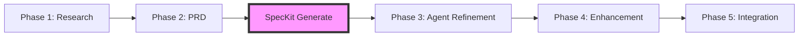

# SpecKit Implementation Guide for Knowledge Graph Lab

## What is SpecKit?

SpecKit is GitHub's open-source toolkit for Spec-Driven Development (SDD) that transforms comprehensive Product Requirements Documents (PRDs) into working code. It provides a CLI, templates, and prompts to help AI coding agents generate implementation from specifications. In SpecKit's philosophy, "specifications don't serve code—code serves specifications."

### Why SpecKit for Knowledge Graph Lab?

1. **Perfect for our team structure** - 4 team members who can write requirements but need help with implementation
2. **Module independence** - Each module can generate its own codebase
3. **AI tool flexibility** - Works with GitHub Copilot, Claude, CodeGemini, and other AI coding agents
4. **Consistency** - Ensures all modules follow the same patterns
5. **Learning tool** - Team members see how specs translate to code
6. **Continuous validation** - AI analyzes specs for ambiguity, contradictions, and gaps

---

> Note: This guide is for Phase 2 PRD writing. SpecKit commands (`/specify`, `/plan`, `/tasks`) run in Phase 3.

## Phase 2 PRD Requirements for SpecKit

### Core Structure for SpecKit Compatibility

Your PRD must include these sections for SpecKit to generate optimal code:

```markdown
# Product Requirements Document - [Module Name]

## 1. System Overview
- **Purpose**: One paragraph describing what this module does
- **Users**: Who will use this module (other modules, end users, APIs)
- **Integration Points**: How this connects to other modules

## 2. Functional Requirements
### Feature Name
- **Description**: What it does
- **Input**: What data/parameters it accepts
- **Output**: What it returns/produces
- **Business Rules**: Constraints and validations

## 3. Data Models
### Entity Name
- **Fields**: List each field with type and constraints
- **Relationships**: How it relates to other entities
- **Validations**: Required fields, formats, ranges

## 4. API Specifications (if applicable)
### Endpoint: METHOD /path
- **Purpose**: What this endpoint does
- **Request Body**: JSON schema or description
- **Response**: Expected response format
- **Error Codes**: Possible error responses

## 5. User Interface (Frontend only)
### Component/Page Name
- **Purpose**: What the user accomplishes here
- **User Actions**: List of things users can do
- **Data Display**: What information is shown
- **State Changes**: How the UI responds to actions

## 6. Integration Requirements
- **Dependencies**: Other modules this depends on
- **Events**: Events this module publishes/subscribes to
- **Shared Resources**: Databases, caches, queues used

## 7. Acceptance Criteria
- Specific, testable conditions that must be met
- Use "GIVEN-WHEN-THEN" format when possible

## 8. Technical Constraints
- **Performance**: Response time, throughput requirements
- **Security**: Authentication, authorization, data protection
- **Scalability**: Expected load and growth
- **Compatibility**: Browser, device, API version requirements
```

### Data typing conventions
- **Strings**: specify max length (e.g., "string, max 200")
- **IDs**: use `uuid` unless otherwise required
- **Enums**: list all allowed values
- **Arrays**: element type + max items (e.g., "array<string>, max 10")
- **Numbers**: specify range and units where applicable (e.g., "number, 0–1")
- **Datetime**: ISO 8601 (UTC)

### What Makes a Good SpecKit PRD?

#### DO ✅
- **Be specific about data types** - "string, max 255 chars" not just "text"
- **Define all states** - Loading, empty, error, success
- **List all validations** - Required fields, formats, ranges
- **Specify exact endpoints** - `/api/v1/users/{id}` not "user endpoint"
- **Include error scenarios** - What happens when things fail
- **Use consistent naming** - `userId` everywhere, not sometimes `user_id`
- **Mark uncertainties** - `[NEEDS CLARIFICATION: Should this cache?]`
- **Use GIVEN–WHEN–THEN** - for acceptance criteria

#### DON'T ❌
- **Include implementation details** - No code, algorithms, or specific libraries
- **Assume technical decisions** - "Use PostgreSQL" unless already decided
- **Mix concerns** - Keep frontend, backend, database specs separate
- **Leave sections empty** - Write "Not applicable" if truly not needed
- **Over-specify internals** - Focus on behavior, not how it works
- **Define libraries or frameworks in PRD** - belongs in `/plan`

### Module-Specific Focus

#### Backend Architecture PRD
```markdown
Focus on:
- API endpoints (REST/GraphQL)
- Request/response schemas
- Database entities and relationships
- Authentication/authorization rules
- Background job specifications
- Caching strategies
```
Template: `.dev/tools/templates/backend-prd-template.md`

#### Frontend Design PRD
```markdown
Focus on:
- Page layouts and navigation
- Component hierarchy
- User interactions and flows
- Form validations
- State management needs
- Real-time update requirements
```
Template: `.dev/tools/templates/frontend-prd-template.md`

#### AI Development PRD
```markdown
Focus on:
- Data input formats
- Processing pipeline stages
- Output formats and schemas
- Accuracy requirements
- Performance constraints
- Fallback behaviors
```
Template: `.dev/tools/templates/ai-prd-template.md`

#### Publishing Tools PRD
```markdown
Focus on:
- Content formats (input/output)
- Distribution channel specs
- Scheduling requirements
- Template systems
- Personalization rules
- Analytics tracking
```
Template: `.dev/tools/templates/publishing-prd-template.md`

---

## How SpecKit Will Use Your PRD

### Phase 2 → Phase 3 Workflow

Within our project, PRDs (Phase 2) feed into SpecKit steps executed in Phase 3:

1. **Specify** (Phase 3 step)
   - Use `/specify` informed by your Phase 2 PRD
   - Define features and scope (WHAT and WHY)
   - Identify edge cases and acceptance criteria

2. **Plan** (Start of Phase 3)
   - SpecKit analyzes PRD for technical requirements
   - Maps requirements to architectural decisions
   - Identifies tech stack needs

3. **Tasks** (Phase 3 breakdown)
   - SpecKit breaks PRD into actionable tasks
   - Creates testable work items
   - Generates implementation roadmap

4. **Implement** (Phase 3 execution)
   - AI agents generate code from specs
   - Domain concepts → data models
   - User stories → API endpoints
   - Acceptance scenarios → tests

### What SpecKit Typically Generates

Typical outputs (vary by plan/agent):
```
generated/
├── backend/
│   ├── src/
│   │   ├── models/      # From your data models
│   │   ├── routes/      # From your API specs
│   │   ├── services/    # From your business rules
│   │   └── validators/  # From your constraints
│   ├── tests/
│   └── Dockerfile
├── frontend/
│   ├── src/
│   │   ├── components/  # From your UI specs
│   │   ├── pages/       # From your page definitions
│   │   ├── hooks/       # From your state needs
│   │   └── api/         # From your integration points
│   └── package.json
├── database/
│   └── schema.sql       # From your data models
└── docker-compose.yml   # Complete local environment
```

---

## PRD Completeness Checklist

Before submitting your Phase 2 PRD, verify:

### Data Completeness
- [ ] All entities have complete field definitions
- [ ] Data types are specific (int, varchar(255), datetime)
- [ ] Relationships between entities are defined
- [ ] Required vs optional fields are marked
- [ ] Validation rules are explicit

### API Completeness (Backend)
- [ ] All endpoints have paths and methods
- [ ] Request bodies have schemas or examples
- [ ] Response formats are defined
- [ ] Error responses are specified
- [ ] Authentication requirements are clear

### UI Completeness (Frontend)
- [ ] All pages/views are described
- [ ] User actions are enumerated
- [ ] Form fields and validations are defined
- [ ] Navigation flow is clear
- [ ] State changes are specified

### Integration Completeness
- [ ] Dependencies on other modules listed
- [ ] Shared data formats defined
- [ ] Event specifications included
- [ ] API contracts documented

### Business Logic Completeness
- [ ] All rules have clear conditions
- [ ] Edge cases are considered
- [ ] Error handling is specified
- [ ] Performance requirements stated

---

## Implementation Guide for Agents (Phase 3 Only)

### For AI Agents Processing SpecKit Output

Note: For team members in Phase 2, skip this section. It applies in Phase 3.
When an AI agent receives SpecKit-generated code in Phase 3:

1. **Initial Assessment**
   ```python
   # Check what was generated
   - Review project structure
   - Identify compilation/syntax errors
   - Map generated code to PRD sections
   - Note missing implementations
   ```

2. **Priority Order**
   ```
   1. Fix compilation errors
   2. Implement missing CRUD operations
   3. Add validation logic
   4. Connect to database/external services
   5. Implement business rules
   6. Add error handling
   7. Write tests
   8. Add logging/monitoring
   ```

3. **Module Integration**
   ```javascript
   // Check integration points from PRD
   - Identify shared interfaces
   - Implement API clients for other modules
   - Set up event publishing/subscribing
   - Configure shared resources
   ```

4. **Quality Checks**
   ```
   - Does it match PRD requirements?
   - Are all acceptance criteria met?
   - Do tests cover the functionality?
   - Is error handling comprehensive?
   ```

### Agent Commands for SpecKit

```bash
# One-time install (from project root)
cd .dev/tools/spec-kit && pip install -e . && cd -

# Initialize Specify project in current repo (optional)
specify init knowledge-graph-lab --here --ai claude

# In your AI agent chat (Phase 3):
/specify [WHAT & WHY from your PRD]
/plan [HOW: tech stack and architecture choices]
/tasks
```

---

## Common Issues and Solutions

### Issue: SpecKit generates incomplete code
**Cause**: PRD missing details
**Solution**: Add missing sections, be more specific about requirements

### Issue: Generated code doesn't compile
**Cause**: Conflicting requirements or ambiguous specs
**Solution**: Review PRD for contradictions, clarify ambiguous points

### Issue: Integration points don't match
**Cause**: Modules have different assumptions
**Solution**: Create shared integration spec document

### Issue: Business logic is wrong
**Cause**: Rules not clearly specified
**Solution**: Use GIVEN-WHEN-THEN format for all rules

---

## SpecKit in Knowledge Graph Lab Context

### Our Specific Use Cases

1. **Backend Module**
   - Generate FastAPI routes from API specs
   - Create SQLAlchemy models from data definitions
   - Set up Docker container configuration

2. **Frontend Module**
   - Generate React components from UI specs
   - Create Redux/Context setup from state needs
   - Build D3.js visualizations from data requirements

3. **AI Module**
   - Generate data pipeline from processing specs
   - Create model integration code from AI requirements
   - Set up vector database schemas

4. **Publishing Module**
   - Generate content templates from format specs
   - Create distribution adapters from channel requirements
   - Build scheduling system from timing specs

### Integration with Our Workflow



---

## Examples from Our Project

### Good PRD Section Example

```markdown
## API Specifications

### Endpoint: POST /api/v1/knowledge-nodes
**Purpose**: Create a new knowledge node in the graph

**Request Body**:
```json
{
  "title": "string, required, max 200 chars",
  "content": "string, required, max 5000 chars",
  "type": "enum: ['concept', 'fact', 'question'], required",
  "tags": "array of strings, optional, max 10 tags",
  "parentNodeId": "uuid, optional",
  "metadata": {
    "source": "string, optional, max 500 chars",
    "confidence": "number, optional, range 0-1"
  }
}
```

**Response**: 201 Created
```json
{
  "id": "uuid",
  "title": "string",
  "content": "string",
  "type": "string",
  "tags": ["string"],
  "parentNodeId": "uuid or null",
  "metadata": {},
  "createdAt": "ISO 8601 datetime",
  "updatedAt": "ISO 8601 datetime"
}
```

**Error Responses**:
- 400: Invalid request body
- 401: Unauthorized
- 409: Duplicate node exists
- 500: Server error
```

### What SpecKit Will Generate:

```python
# Generated by SpecKit from the above PRD section

from fastapi import APIRouter, HTTPException, Depends
from pydantic import BaseModel, Field, validator
from typing import Optional, List, Literal
from datetime import datetime
from uuid import UUID, uuid4

class KnowledgeNodeCreate(BaseModel):
    title: str = Field(..., max_length=200)
    content: str = Field(..., max_length=5000)
    type: Literal['concept', 'fact', 'question']
    tags: Optional[List[str]] = Field(None, max_items=10)
    parentNodeId: Optional[UUID] = None
    metadata: Optional[dict] = None

    @validator('metadata')
    def validate_metadata(cls, v):
        if v:
            if 'confidence' in v and not 0 <= v['confidence'] <= 1:
                raise ValueError('Confidence must be between 0 and 1')
        return v

router = APIRouter()

@router.post("/api/v1/knowledge-nodes", status_code=201)
async def create_knowledge_node(node: KnowledgeNodeCreate):
    # TODO: Implement business logic
    # TODO: Add database persistence
    # TODO: Add authorization check

    return {
        "id": str(uuid4()),
        "title": node.title,
        "content": node.content,
        "type": node.type,
        "tags": node.tags or [],
        "parentNodeId": str(node.parentNodeId) if node.parentNodeId else None,
        "metadata": node.metadata or {},
        "createdAt": datetime.now().isoformat(),
        "updatedAt": datetime.now().isoformat()
    }
```

---

## Next Steps

1. **Review** this guide before starting your Phase 2 PRD
2. **Use** the checklist to ensure completeness
3. **Reference** the examples for your module type
4. **Mark** uncertainties with `[NEEDS CLARIFICATION]`
5. **Submit** PRD following the git workflow
6. **Prepare** for SpecKit generation in Phase 3

## Submission Checklist

- [ ] Save to: `docs/team/module-assignments/[your-module]/deliverables/phase-2-planning/PRD.md`
- [ ] Create PR from your `[github-username]/work` branch
- [ ] PR title: "Phase 2 PRD: [Your Module]"
- [ ] Validate with the PRD Completeness Checklist

---

## Resources

- **Official SpecKit Repository**: [github.com/github/spec-kit](https://github.com/github/spec-kit)
- **Spec-Driven Development Guide**: [GitHub Blog on SDD](https://github.blog/ai-and-ml/generative-ai/spec-driven-development-with-ai-get-started-with-a-new-open-source-toolkit/)
- **SpecKit user guide**: `.dev/tools/speckit-user-guide.md`
- **SpecKit templates**: `.dev/tools/spec-kit/templates/`
- **PRD Template**: Copy structure from "PRD Requirements" section above
- **Example PRDs**: See `docs/team/module-assignments/*/deliverables/phase-2-planning/examples/`
- **Integration points**: See `docs/team/project-plan/phase-2-guide.md#integration-points`

---

**Remember**: SpecKit is a tool to accelerate development, not replace thinking. Your PRD quality directly determines code quality. Be thorough, be specific, be clear.