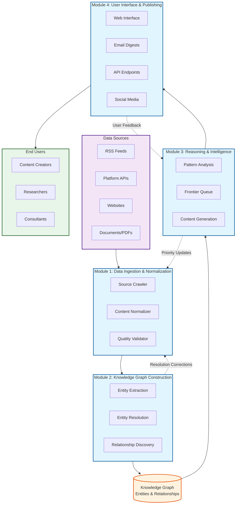
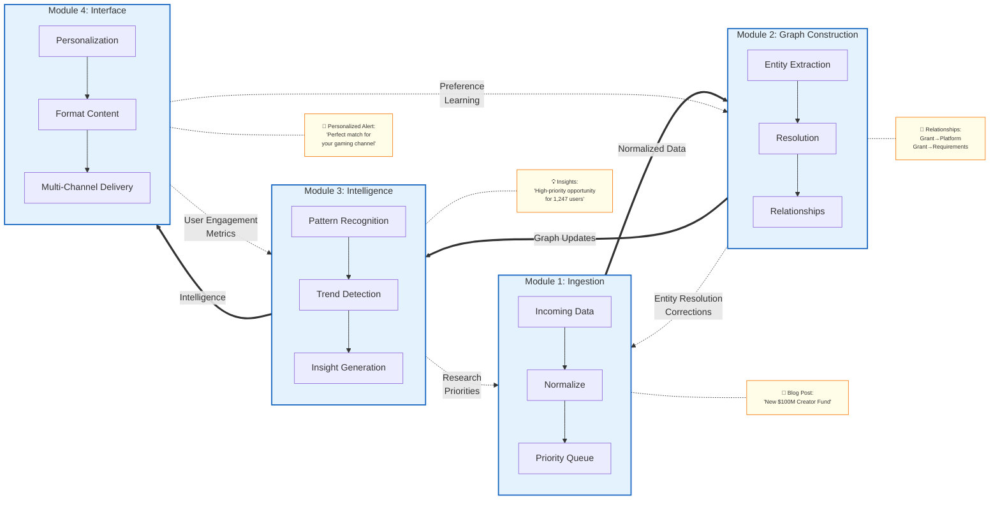
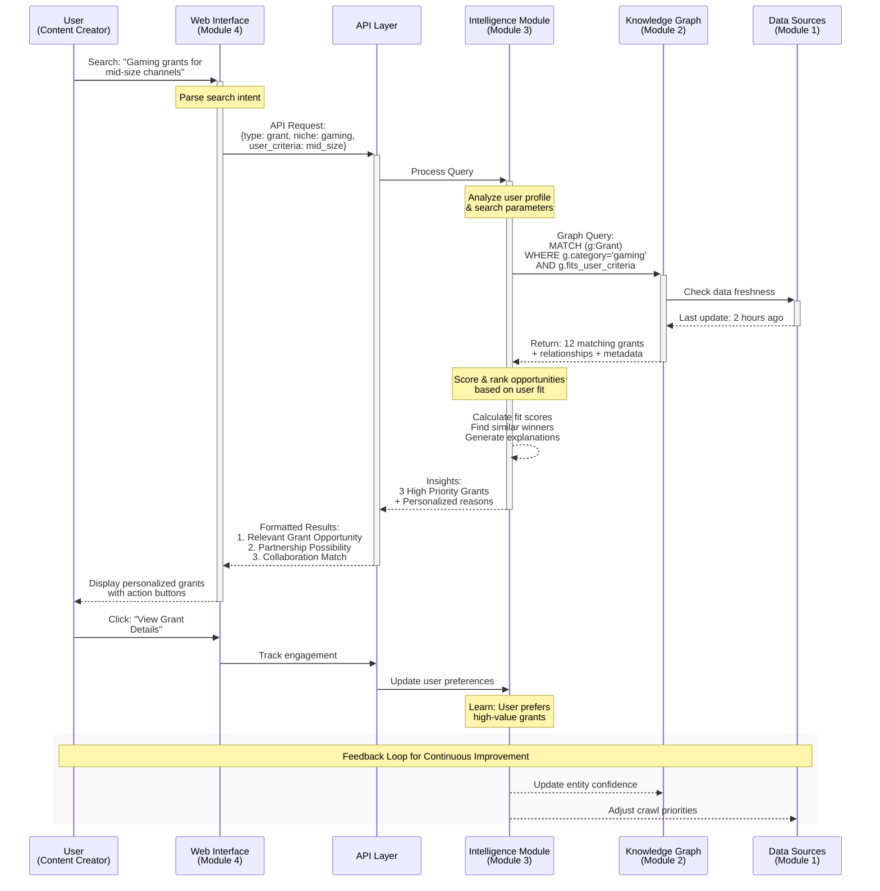

# Project Overview: What We're Building

This document explains the Knowledge Graph Lab system architecture, its four core modules, and how different users will interact with the platform to derive value.

---

## Table of Contents

- [Universal Platform Architecture](#universal-platform-architecture)
- [System Overview](#system-overview)
- [The Four Modules](#the-four-modules)
- [How Modules Work Together](#how-modules-work-together)
- [User Journeys](#user-journeys)
- [Integration Points](#integration-points)
- [Next Steps](#next-steps)

---

## Universal Platform Architecture

Knowledge Graph Lab is built as a **domain-agnostic knowledge platform** that can be configured for any field or industry. The architecture supports:

- **Configurable Data Sources**: Connect to any RSS feeds, APIs, websites, or databases relevant to your domain
- **Custom Ontologies**: Define entities and relationships specific to your field
- **Flexible Reasoning**: Apply domain-specific logic and intelligence patterns
- **Adaptable Distribution**: Deliver insights through channels appropriate for your users

While our initial implementation focuses on the creator economy (matching our team's research focus), the same platform can serve healthcare researchers, legal professionals, data analysts, educators, or any knowledge-intensive field.

## System Overview

Knowledge Graph Lab is an end-to-end intelligent research platform that discovers, understands, and synthesizes information. Think of it as having a team of expert researchers working 24/7 to find opportunities specifically relevant to each user, regardless of their domain.

### The Core Concept: Knowledge Graphs

A **knowledge graph** is a way of storing information that emphasizes relationships between things rather than just listing facts. If traditional databases are like filing cabinets (organized but isolated), knowledge graphs are like mind maps (interconnected and revealing patterns).

**Traditional Database Approach:**
Information is stored in isolated tables with limited connections between different types of data. Platforms, grants, and organizations exist as separate records with minimal relationship mapping.

**Knowledge Graph Approach:**
Information is stored as interconnected entities with explicit relationships. Platforms connect to their competitors, grants link to their funding organizations, and ownership structures create deeper relationship webs.

These relationships reveal non-obvious insights. For instance, when a major tech company increases funding for creator programs, the system can predict related platform changes and identify cascade opportunities across the ecosystem.

### The Intelligence Layer

Above the knowledge graph sits an intelligence layer that continuously analyzes patterns, identifies opportunities, and generates insights. This isn't just storage—it's active reasoning about the data.

When a new platform launches, the system:
1. **Identifies** its category and features
2. **Compares** it to existing platforms
3. **Predicts** which creators might benefit
4. **Alerts** relevant users about the opportunity
5. **Monitors** adoption and success patterns

This happens automatically, continuously, without human intervention.

### Multi-Channel Delivery

Users interact with this intelligence through channels optimized for different needs:

| Channel | Purpose | Update Frequency | Best For |
| :------ | :------ | :--------------: | :------- |
| **Web Interface** | Exploration & Discovery | Real-time | Deep research sessions |
| **Email Digests** | Curated Updates | Daily/Weekly | Staying informed |
| **API Endpoints** | Programmatic Access | Real-time | Integration & Analysis |
| **Social Media** | Broad Awareness | As needed | Community engagement |

*Table 1: Multi-channel delivery system for different user needs*

<!-- DAB
id: system-overview
title: Knowledge Graph Lab System Architecture
type: architecture
show: data-sources, four-modules, knowledge-graph, intelligence-layer, delivery-channels
notes: Show data flow from raw sources through processing to user value
-->



*Figure 1: High-level system architecture showing data flow*

---

## The Four Modules

Each module is a complete subsystem that provides value independently while contributing to the larger platform. This modular design enables parallel development and maintains system resilience.

### Module 1: Data Ingestion & Normalization

**Purpose**: Connect to the outside world and transform chaos into structure.

The ingestion module is like a multilingual translator at the United Nations. Information arrives in dozens of formats and languages (RSS, JSON, HTML, PDF), and this module translates everything into a common language the system understands.

**Key Capabilities:**

**1. Intelligent Source Management**

The module doesn't blindly scrape everything. It maintains a priority queue of sources based on:
- Historical value (sources that provided good information before)
- User interest (sources relevant to active users)
- Freshness requirements (time-sensitive information gets priority)
- Rate limits (respecting source constraints)

The system prioritizes sources based on multiple factors including historical value, user relevance, information freshness, and content uniqueness. This ensures important sources receive attention while maintaining comprehensive coverage.

**2. Content Normalization Pipeline**

Raw content goes through a sophisticated pipeline:

1. **Format Detection**: Identify content type (article, video metadata, JSON API)
2. **Content Extraction**: Pull relevant information from noise
3. **Schema Mapping**: Convert to our standard format
4. **Quality Validation**: Ensure required fields are present
5. **Metadata Enrichment**: Add processing timestamp, confidence scores

**3. Provenance Preservation**

Every piece of information maintains its ancestry:
- Original source URL
- Fetch timestamp
- Processing version
- Transformation applied
- Confidence score

This audit trail enables trust, debugging, and continuous improvement.

**Why This Module Matters:**

Without quality ingestion, the entire system fails. This module must handle:
- **Volume**: Thousands of sources daily
- **Variety**: APIs, feeds, websites, documents
- **Velocity**: Real-time processing for time-sensitive data
- **Veracity**: Detecting and handling bad data

### Module 2: Knowledge Graph Construction

**Purpose**: Transform normalized data into structured knowledge with rich relationships.

This module is like an expert librarian who not only catalogs books but understands how they relate to each other, which authors influenced whom, and which topics connect across disciplines.

**Key Capabilities:**

**1. Entity Extraction and Recognition**

Using Natural Language Processing (NLP), the module identifies important entities in text. When processing announcements about grants or opportunities, the system extracts platforms, funding details, eligibility requirements, and associated metadata with confidence scores.

**2. Entity Resolution (The Hard Problem)**

The same entity often appears with different names. The module must determine when different mentions refer to the same thing:

- "YouTube Creator Fund" vs "YouTube's Creator Fund" vs "YT Creator Fund"
- "Meta" vs "Facebook Inc." vs "Facebook"
- "MrBeast" vs "Jimmy Donaldson" vs "Beast Philanthropy"

Resolution uses multiple signals including name similarity, temporal overlap, shared relationships, and attribute matching. The system weighs these factors to determine when different mentions refer to the same entity.

**3. Relationship Discovery**

Beyond identifying entities, the module discovers how they connect:

- **Explicit relationships**: Stated directly in text ("Google owns YouTube")
- **Implicit relationships**: Inferred from patterns ("Creators who use TubeBuddy often mention VidIQ" suggests competition)
- **Temporal relationships**: Time-based connections ("Grant X launched after Platform Y's policy change")

**4. Ontology Management**

The ontology defines what types of entities and relationships exist. While the core remains stable, the system can propose extensions when new patterns emerge. For example, platforms have attributes like category and launch date, with relationships including competition and ownership. Grants connect to funding organizations and specify creator requirements.

### Module 3: Reasoning & Intelligence

**Purpose**: Transform static knowledge into dynamic intelligence through analysis and summarization.

This module is like having a team of expert analysts who continuously study the knowledge graph, identify patterns, and generate insights. It's where information becomes intelligence.

**Key Capabilities:**

**1. The Frontier Queue (What to Research Next)**

The system can't research everything simultaneously. The frontier queue determines priorities based on user interest, knowledge uncertainty, information volatility, and potential impact. This ensures the system focuses on the most valuable research opportunities.

**2. Pattern Recognition and Trend Detection**

The module identifies emerging patterns before they become obvious:

- **Platform adoption curves**: Recognizing when a platform hits exponential growth
- **Grant seasonality**: Identifying when certain grants typically open
- **Creator migration patterns**: Detecting platform switching trends
- **Content format evolution**: Spotting new content types gaining traction

**3. Content Generation (Beyond Templates)**

Rather than filling in blanks, the module synthesizes genuine insights by analyzing user-opportunity fit, finding similar success cases, identifying unique advantages, and generating coherent narratives that explain relevance and potential value.

**4. Temporal Reasoning (Understanding Time)**

Time isn't just a timestamp—it's a critical dimension for intelligence:

- **Deadline awareness**: Increasing priority as deadlines approach
- **Trend velocity**: Measuring how fast things change
- **Seasonal patterns**: Recognizing cyclical opportunities
- **Decay functions**: Reducing confidence in aging information

### Module 4: User Interface & Publishing

**Purpose**: Make intelligence accessible, actionable, and personalized for each user.

This module is like a personal assistant who knows your preferences, understands your goals, and delivers exactly what you need when you need it.

**Key Capabilities:**

**1. Adaptive Web Interface**

The interface adapts to user behavior and preferences by prioritizing frequently accessed content, customizing views based on user platforms, and providing appropriate guidance for new users versus experienced users.

**2. Multi-Channel Publishing Engine**

Different channels require different approaches:

**Email Digests:**
- Personalized subject lines based on content
- Scannable format with clear sections
- Progressive disclosure (summary → details)
- One-click actions for opportunities

**API Responses:**
- RESTful design for predictability
- GraphQL for flexible queries
- Webhooks for real-time updates
- Rate limiting for fairness

**Social Media:**
- Platform-optimized formatting
- Hashtag intelligence
- Engagement tracking
- Community interaction

**3. Personalization Engine**

The system learns from every interaction by tracking user clicks, dismissals, and shares to adjust topic weights and preferences over time, while applying temporal decay to keep preferences current.

**4. Feedback Integration**

User feedback directly improves the system:

- **Explicit feedback**: Ratings, reports, corrections
- **Implicit feedback**: Clicks, time spent, shares
- **Aggregate patterns**: What similar users find valuable
- **System learning**: Adjusting algorithms based on outcomes

<!-- DAB
id: module-interaction
title: Module Interaction and Data Flow
type: flowchart
show: module-connections, data-transformation, feedback-loops
notes: Show how modules work together with example data flowing through
-->



*Figure 2: Module interaction showing data flow and feedback loops*

---

## How Modules Work Together

While each module provides independent value, their integration creates emergent intelligence greater than the sum of parts.

### Example: Discovering a New Opportunity

Let's trace how the system processes a new grant announcement:

**Step 1: Ingestion (Module 1)**
```
Source: Blog post on platformxyz.com
Raw text: "We're excited to announce our Creator Accelerator..."
Output: Normalized JSON with structured fields
```

**Step 2: Knowledge Graph Update (Module 2)**
```
New entities created:
- Grant: "Platform XYZ Creator Accelerator"
- Organization: "Platform XYZ"

New relationships:
- Grant --[OFFERED_BY]--> Platform XYZ
- Grant --[REQUIRES]--> 50K followers
- Grant --[DEADLINE]--> 2024-03-15
```

**Step 3: Intelligence Analysis (Module 3)**
```
Analysis results:
- Similar to YouTube NextUp (70% similarity)
- Fits 1,247 users in our database
- Higher value than 85% of current grants
- Deadline in 10 days (HIGH PRIORITY)
```

**Step 4: User Notification (Module 4)**
```
For eligible creators:
- Priority assessment based on fit
- Appropriate notification timing
- Personalized relevance explanations
- Dashboard priority placement
```

This entire process happens automatically within minutes of the announcement.

---

## User Journeys

To understand the system's value, let's follow three distinct users through their complete experiences.

### Example User Journey: Content Creator

**Background**: Content creators often struggle with the business aspects of content creation while focusing on their creative work.

**Onboarding Experience**

Users connect their accounts and the system:
- Analyzes content niche and focus areas
- Identifies audience demographics
- Benchmarks metrics against similar creators
- Generates initial recommendations

**Value Demonstration**

Weekly digest example structure:

```
Subject: New opportunities matched to your profile

1. Relevant Grant Opportunity
   ✓ Qualification criteria met
   ✓ Application deadline information
   ✓ Success examples from similar creators
   → Application assistance tools

2. Partnership Opportunity
   ✓ Audience fit analysis
   ✓ Program structure details
   ✓ Value proposition summary
   → Contact facilitation

3. Collaboration Possibility
   ✓ Creator compatibility analysis
   ✓ Audience overlap metrics
   ✓ Historical collaboration outcomes
   → Connection facilitation
```

**Learning and Adaptation**

As users interact with recommendations, the system learns:
- Content and opportunity preferences
- Timing and communication preferences
- Success criteria and priorities
- Engagement patterns

The recommendations evolve accordingly.

**Expected Outcomes**

System aims to help users:
- Reduce time spent on opportunity research
- Increase discovery of relevant opportunities
- Improve application success rates
- Build valuable professional connections

**Key Success Factors:**
- Personalization makes opportunities relevant
- Timing alerts prevent missed deadlines
- Social proof builds confidence in opportunities
- Automation handles tedious research tasks

### Example User Journey: Academic Researcher

**Background**: Academic researchers need comprehensive, citable data for studying creator economy platforms and their impact on traditional media.

**Initial Setup**

Researchers configure their research parameters including focus areas, relevant platforms, time periods of interest, and data quality requirements for citations and confidence scoring.

**Research Workflow**

Using the API, researchers run complex queries to analyze patterns like platform switching behavior, creator migration trends, and audience demographics. Results reveal patterns invisible in traditional research approaches.

**Data Quality Features**

The system provides academic-grade data quality:

1. **Source Attribution**: Every fact links to original source
2. **Confidence Scoring**: Statistical confidence for inferred data
3. **Version History**: Track how information changed over time
4. **Conflict Resolution**: When sources disagree, all versions preserved

**Research Acceleration**

What previously took weeks now takes hours:
- **Before**: Manual collection from numerous sources
- **After**: Single API query with comprehensive results
- **Time saved**: Significant reduction in research time
- **Data completeness**: Much more comprehensive data access

**Contribution Back**

Researchers can identify data quality issues and suggest improvements:
- Correct misclassified platform categories
- Propose new relationship types for the ontology
- Validate entity resolution accuracy
- Contribute academic papers as new sources

### Example User Journey: Strategic Consultant

**Background**: Strategic consultants advise media companies on creator economy strategy and need comprehensive market intelligence.

**Example Project: Creator Fund Strategy**

A streaming platform wants to launch a creator fund. Consultants can use Knowledge Graph Lab to develop strategy recommendations.

**Competitive Analysis Query:**
```
Analyze all creator funds launched since 2022:
- Funding amounts and structures
- Eligibility requirements
- Success metrics
- Creator satisfaction scores
- Platform retention impact
```

**System Insights:**

The analysis reveals non-obvious patterns:

1. **Funding Patterns**: Analysis reveals optimal grant ranges and structures
   - Different funding levels show varying effectiveness
   - Platform loyalty correlates with funding amount and structure

2. **Success Factors**: Non-monetary elements significantly impact outcomes
   - Programs with mentorship show higher satisfaction
   - Support structures matter as much as funding amounts

3. **Timing Patterns**: Launch timing affects application volumes
   - Seasonal trends in creator applications
   - Competition landscape varies by timing
   - Financial planning cycles influence participation

**Strategic Recommendations:**

Based on system analysis, consultants can provide data-driven recommendations including structure considerations, differentiation opportunities, and success metrics frameworks informed by historical program data and market analysis.

**Value Delivered:**

- Accelerated strategy development timeline
- Comprehensive analysis of similar programs
- Identification of market opportunities
- Data-driven outcome projections

<!-- DAB
id: user-interaction-flow
title: User Interaction Sequence
type: sequence
actors: User, WebUI, API, IntelligenceModule, KnowledgeGraph
show: query-flow, processing, response-generation
notes: Show complete interaction from user query to insight delivery
-->



*Figure 3: Complete user interaction flow from query to results*

---

## Integration Points

Understanding how modules connect is crucial for development success. Each integration point has clear contracts and failure handling.

### Module 1 → Module 2: Raw to Normalized

**Data Contract:**
Normalized data includes source identification, timestamps, content type classification, structured content extraction, entity mentions, and metadata preservation.

**Error Handling:**
- Malformed data: Log and skip
- Source unavailable: Retry with backoff
- Rate limited: Queue for later

### Module 2 → Module 3: Knowledge to Intelligence

**Graph Query Interface:**
The intelligence module queries the knowledge graph using pattern matching to find grants that match user platforms, follower requirements, and timing constraints, returning results ordered by relevance and deadline proximity.

### Module 3 → Module 4: Intelligence to Users

**Content Delivery Format:**
Insights are delivered with user identification, opportunity classification, priority levels, descriptive titles, summaries, available actions, and personalization explanations.

### Feedback Loops

Each module sends signals back to improve the system:

- **Module 4 → Module 3**: User engagement metrics
- **Module 3 → Module 1**: Research priority updates
- **Module 2 → Module 1**: Entity resolution corrections

---

## Next Steps

Now that you understand what we're building, explore:

- [Project Architecture](./architecture.md) - Technical implementation details
- [Module Documentation](../../modules/) - Your specific module guide
- [User Journeys](../user-journeys/) - 61 comprehensive user journeys across 6 domains
- [Deployment Strategy](./deployment.md) - Production deployment approach

## For Team Members
- [Module Ownership](../../team/module-ownership.md) - Find your module's requirements

Remember: This system will help thousands of creators succeed. Your contribution matters. Your code will make a difference. Your learning will launch your career.

Let's build something incredible together.